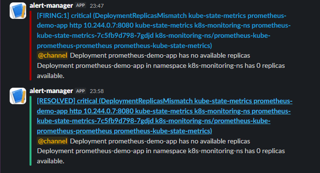
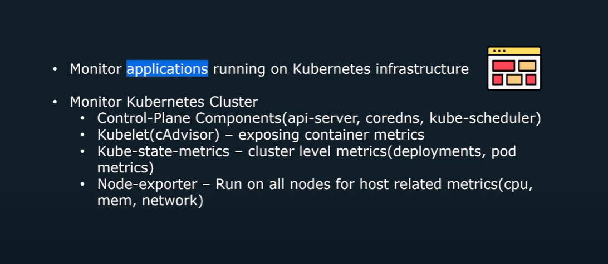

<div align="center">

  <!-- Row of icons -->
  <p>
    
    &nbsp;&nbsp;
    
    &nbsp;&nbsp;
    
    &nbsp;&nbsp;
    
  </p>

  <h1>Kubernetes Monitoring & Observability Project</h1>

  <p>
    A hands-on DevOps project showcasing end-to-end monitoring, alerting, and observability for modern infrastructure and applications. This project demonstrates how to design, deploy, and manage a production-grade monitoring stack using tools like Prometheus, Grafana, Helm integrated with CI/CD pipelines and cloud-native environments (Kubernetes).
  </p>

  <p>
    <a href="https://github.com/sean-njela/k8s_monitoring/graphs/contributors">
    
  </a>
  <a href="">
    
  </a>
  <a href="https://github.com/sean-njela/k8s_monitoring/network/members">
    
  </a>
  <a href="https://github.com/sean-njela/k8s_monitoring/stargazers">
    
  </a>
  <a href="https://github.com/sean-njela/k8s_monitoring/issues/">
    
  </a>
  <a href="https://github.com/sean-njela/k8s_monitoring/blob/master/LICENSE">
    
  </a>
  </p>

</div>

## Table of Contents

  * [Screenshots](#screenshots)
  * [Tech Stack](#tech-stack)
  * [Prerequisites](#prerequisites)
  * [Quick Start](#quick-start)
  * [Documentation](#documentation)
  * [Features](#features)
  * [Tasks (automation)](#tasks)
  * [Roadmap](#roadmap)
  * [License](#license)
  * [Contributing](#contributing)
  * [Contact](#contact)

## Screenshots

<div align="center"> 
  
  
  
  
</div>

<!-- 
## Demo
<a href="https://www.example.com/">
<div align="center"> 
  
  
</div>
</a>


[](https://www.example.com/)
 -->

<!--  -->

## Tech Stack

> List of tools used in the project


## Prerequisites

> This project uses [Devbox](https://www.jetify.com/devbox/) to manage the development environment. Devbox provides a consistent, isolated environment with all the necessary CLI tools pre-installed.

0. **Install Docker**

   - Follow the [installation instructions](https://docs.docker.com/get-docker/) for your operating system.

> The rest of the tools are already installed in the devbox environment

1. **Install Devbox**

   - Follow the [installation instructions](https://www.jetify.com/devbox/docs/installing_devbox/) for your operating system.

2. **Clone the Repository**

   ```bash
   git clone https://github.com/sean-njela/k8s_monitoring.git
   cd k8s_monitoring
   ```

3. **Start the Devbox Environment and poetry environment**

   ```bash
   devbox shell # Start the devbox environment (this will also start the poetry environment)
   poetry install # Install dependencies
   poetry env activate # use the output to activate the poetry environment ( ONLY IF DEVBOX DOES NOT ACTIVATE THE ENVIRONMENT)
   ```
> Note - The first time you run `devbox shell`, it will take a few minutes to install the necessary tools. But after that it will be much faster.

## Quick Start

```bash
task setup

task status # check if everything is running

# GIVE EVERYTHING A MINUTE TO SETUP THEN
task dev # prints garafana password and port forwards the service
```

Everything ran well if you see the following output:

```bash
> task status
task: [status] kubectl get all -n k8s-monitoring-ns
[status] NAME                                                         READY   STATUS    RESTARTS       AGE
[status] pod/alertmanager-prometheus-kube-prometheus-alertmanager-0   2/2     Running   0          
    6h26m
[status] pod/log-generator-7d6d496f9-8jkkg                            1/1     Running   0          
    107m
[status] pod/loki-0                                                   2/2     Running   0          
    4h30m
[status] pod/loki-canary-bcplv                                        1/1     Running   0          
    4h53m
[status] pod/loki-gateway-59548bddcd-w24bt                            1/1     Running   0          
    4h53m
[status] pod/prometheus-demo-app-f5d79d7f5-2v4rk                      1/1     Running   0          
    6h27m
[status] pod/prometheus-grafana-674cf8cb44-48pnf                      3/3     Running   0          
    6h27m
[status] pod/prometheus-kube-prometheus-operator-5cdddd9b5-xqnmg      1/1     Running   1 (150m ago)   6h27m
[status] pod/prometheus-kube-state-metrics-7c5fb9d798-xnhhg           1/1     Running   1 (150m ago)   6h27m
[status] pod/prometheus-prometheus-kube-prometheus-prometheus-0       2/2     Running   1 (149m ago)   6h26m
[status] pod/prometheus-prometheus-node-exporter-d5hz6                1/1     Running   0          
    6h27m
[status] pod/promtail-75845fb6f9-bhwdk                                1/1     Running   0          
    107m
```

Then visit [localhost:3002]() to access the Grafana UI.

## Documentation

For full documentation, setup instructions, and architecture details, visit the [docs](docs/index.md) or run:

```bash
task docs
```

Docs available at: [http://127.0.0.1:8000/](http://127.0.0.1:8000/)

## Features

* Metrics Collection & Visualization – real-time system, application, and container insights
* Reliability & Scalability – designing a monitoring stack built for production
* AlertManager Alerting & Incident Response – proactive notifications via Slack/Email/PagerDuty

## Tasks (Automation)

> This project is designed for a simple, one-command setup. All necessary actions are orchestrated through `Taskfile.yaml`.

```bash
task setup # setup the environment
task dev # automated local provisioning
task cleanup-dev # cleanup the dev environment
```

### Git Workflow with Git Flow

The `Taskfile.gitflow.yaml` provides a structured Git workflow using Git Flow. This helps in managing features, releases, and hotfixes in a standardized way. To run these tasks just its the same as running any other task. Using gitflow is optional.

```bash
task init                 # Initialize Git Flow with 'main', gh-pages and 'develop'
task sync                 # Sync current branch with latest 'develop' and handle main updates
task release:finish       # Finishes and publishes a release (merges, tags, pushes). e.g task release:finish version="1.2.0"
```

To see all tasks:

```bash
task --list-all
```

If you do not want the gitflow tasks, you can remove the `Taskfile.gitflow.yaml` file and unlink it from the `Taskfile.yaml` file (remove the `includes` section). If you cannot find the section use CTRL + F to search for `Taskfile.gitflow.yaml`.

## NOTES

> Important notes to remember whilst using the project

These are the current versions of the charts we used in this tutorial:

```bash
NAME           CHART                            APP VERSION
loki           loki-6.41.1                      3.5.5
prometheus     kube-prometheus-stack-77.11.1    v0.85.0
```

## Troubleshooting

For comprehensive troubleshooting, refer to the [Troubleshooting](docs/3-troubleshooting/overview.md) section. Or open the github pages [here](https://sean-njela.github.io/docs/3-troubleshooting/overview.md) and use the search bar to search your issue (USE INDIVIDUAL KEYWORDS NOT THE ISSUE NAME).

## Roadmap

* [x] Metrics Collection & Visualization – real-time system, application, and container insights
* [x] Alerting & Incident Response – proactive notifications via Slack/Email/PagerDuty
* [ ] App instrumentation
* [ ] Add Terraform

## Contributing

<a href="https://github.com/sean-njela/k8s_monitoring/graphs/contributors">
  
</a>

> Contributions are welcome! Open an issue or submit a PR.

## License

Distributed under the MIT License. See `LICENSE` for more info.

## Contact

Your Name – [@linkedin](https://linkedin.com/in/sean-njela) – [@twitter/x](https://x.com/devopssean) – [seannjela@outlook.com](mailto:seannjela@outlook.com)

Project Link: [https://github.com/sean-njela/k8s_monitoring](https://github.com/sean-njela/k8s_monitoring)

About Me - [About Me](docs/4-about/about.md)