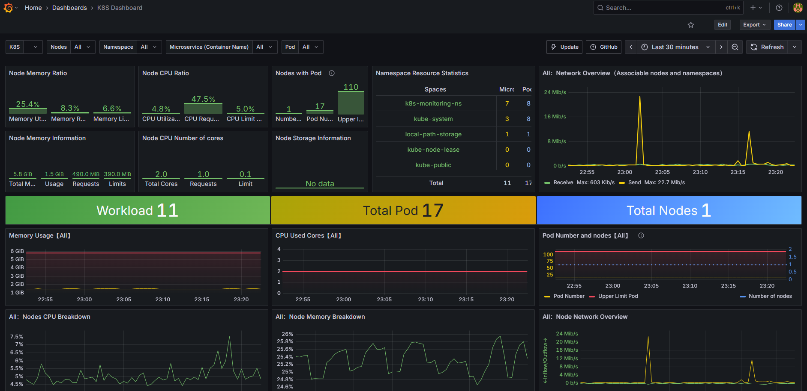

<div align="center">

  <!-- Row of icons -->
  <p>
    
    &nbsp;&nbsp;
    
    &nbsp;&nbsp;
    
    &nbsp;&nbsp;
    
  </p>

  <h1>🔍 Monitoring & Observability Project</h1>

  <p>
    A hands-on DevOps project showcasing end-to-end monitoring, alerting, and observability for modern infrastructure and applications. This project demonstrates how to design, deploy, and manage a production-grade monitoring stack using tools like Prometheus, Grafana, Helm integrated with CI/CD pipelines and cloud-native environments (Kubernetes).
  </p>

  <p>
    <a href="https://github.com/sean-njela/docs/graphs/contributors">
    
  </a>
  <a href="">
    
  </a>
  <a href="https://github.com/sean-njela/docs/network/members">
    
  </a>
  <a href="https://github.com/sean-njela/docs/stargazers">
    
  </a>
  <a href="https://github.com/sean-njela/docs/issues/">
    
  </a>
  <a href="https://github.com/sean-njela/docs/blob/master/LICENSE">
    
  </a>
  </p>

</div>

## 📚 Table of Contents

  * [Screenshots](#screenshots)
  * [Tech Stack](#tech-stack)
  * [Prerequisites](#prerequisites)
  * [Quick Start](#quick-start)
  * [Documentation](#documentation)
  * [Features](#features)
  * [Tasks (automation)](#tasks)
  * [Roadmap](#roadmap)
  * [License](#license)
  * [Contributing](#contributing)
  * [Contact](#contact)


## 📸 Screenshots

<div align="center"> 
  
  
  
  
</div>

<!-- 
## 📸 Demo
<a href="https://www.example.com/">
<div align="center"> 
  
  
</div>
</a>


[](https://www.example.com/)
 -->

<!--  -->


## 🛠️ Tech Stack

> List of tools used in the project


## 📋 Prerequisites

> This project uses [Devbox](https://www.jetify.com/devbox/) to manage the development environment. Devbox provides a consistent, isolated environment with all the necessary CLI tools pre-installed.

0. **Install Docker**

   - Follow the [installation instructions](https://docs.docker.com/get-docker/) for your operating system.

> The rest of the tools are already installed in the devbox environment

1. **Install Devbox**

   - Follow the [installation instructions](https://www.jetify.com/devbox/docs/installing_devbox/) for your operating system.

2. **Clone the Repository**

   ```bash
   git clone https://github.com/sean-njela/demo_monitoring.git
   cd demo_monitoring
   ```

3. **Start the Devbox Environment and poetry environment**

   ```bash
   devbox shell # Start the devbox environment (this will also start the poetry environment)
   poetry install # Install dependencies
   poetry env activate # use the output to activate the poetry environment ( ONLY IF DEVBOX DOES NOT ACTIVATE THE ENVIRONMENT)
   ```
> Note - The first time you run `devbox shell`, it will take a few minutes to install the necessary tools. But after that it will be much faster.


## 🚀 Quick Start

```bash
task dev # this one command will run all commands necessary to setup the environment. yes, really.

# GIVE EVERYTHING A MINUTE TO SETUP THEN
task status # check if all containers are running (should be 6 services)
```

Everything ran well if you see the following output:

```bash
task: [status] docker stack ls
[status] NAME         SERVICES
[status] monitoring   6
[status] portainer    2
task: [status] docker service ls
[status] ID             NAME                        MODE         REPLICAS   IMAGE             
                       PORTS
[status] mwlzgz7v5yr8   monitoring_cadvisor         global       1/1        gcr.io/cadvisor/cadvisor:v0.47.2         *:8080->8080/tcp
[status] yvf13xmyw1gx   monitoring_grafana          replicated   1/1        grafana/grafana:10.0.3                   *:3000->3000/tcp
[status] bg08vgtsdo1k   monitoring_nginx-app        replicated   1/1        nginx:alpine                             *:8081->80/tcp
[status] w3wivuzmohvg   monitoring_nginx-exporter   replicated   1/1        nginx/nginx-prometheus-exporter:0.11.0   *:9113->9113/tcp
[status] r9i5x9gkc9wv   monitoring_node-exporter    global       1/1        prom/node-exporter:v1.5.0                *:9100->9100/tcp
[status] ymbf3o7ksmha   monitoring_prometheus       replicated   1/1        prom/prometheus:v2.47.0                  *:9090->9090/tcp
[status] yktdcwwswder   portainer_agent             global       1/1        portainer/agent:lts
[status] ny2dcmtg4pqw   portainer_portainer         replicated   1/1        portainer/portainer-ee:lts               *:9000->9000/tcp, *:9443->9443/tcp
```

Then run the following to expose the urls:

```bash
task info
```

As you make changes you can run the following command to refresh/redeploy the stack:

```bash
task deploy
# and as a follow up run:
task status
```
For more info on redeployments, consult the docs, under [safe-workflow-for-updating-a-swarm-stack](http://sean-njela.github.io/demo_monitoring/latest/2-project/swarm/#safe-workflow-for-updating-a-swarm-stack)


## 📚 Documentation

For full documentation, setup instructions, and architecture details, visit the [docs](docs/0-index.md) or run:

```bash
task docs
```

Docs available at: [http://127.0.0.1:8000/](http://127.0.0.1:8000/)


## 📂 Features

* 📈 Metrics Collection & Visualization – real-time system, application, and container insights
* 🔒 Reliability & Scalability – designing a monitoring stack built for production


## ✅ Tasks (Automation)

> This project is designed for a simple, one-command setup. All necessary actions are orchestrated through `Taskfile.yaml`.

```bash
task setup # setup the environment
task dev # automated local provisioning
task cleanup-dev # cleanup the dev environment
```

### Git Workflow with Git Flow

The `Taskfile.gitflow.yaml` provides a structured Git workflow using Git Flow. This helps in managing features, releases, and hotfixes in a standardized way. To run these tasks just its the same as running any other task. Using gitflow is optional.

```bash
task init                 # Initialize Git Flow with 'main', gh-pages and 'develop'
task sync                 # Sync current branch with latest 'develop' and handle main updates
task release:finish       # Finishes and publishes a release (merges, tags, pushes). e.g task release:finish version="1.2.0"
```

To see all tasks:

```bash
task --list-all
```

If you do not want the gitflow tasks, you can remove the `Taskfile.gitflow.yaml` file and unlink it from the `Taskfile.yaml` file (remove the `includes` section). If you cannot find the section use CTRL + F to search for Taskfile.yaml.


## 📝 NOTES

> Important notes to remember whilst using the project


## 📚 Troubleshooting

For comprehensive troubleshooting, refer to the [Troubleshooting](docs/3-troubleshooting/overview.md) section. Or open the github pages [here](https://sean-njela.github.io/docs/3-troubleshooting/overview.md) and use the search bar to search your issue (USE INDIVIDUAL KEYWORDS NOT THE ISSUE NAME). 


## 🛣️ Roadmap

* [x] 📈 Metrics Collection & Visualization – real-time system, application, and container insights
* [ ] 🚨 Alerting & Incident Response – proactive notifications via Slack/Email/PagerDuty

## 🤝 Contributing

<a href="https://github.com/sean-njela/demo_monitoring/graphs/contributors">
  
</a>

> Contributions welcome! Open an issue or submit a PR.


## 📄 License

Distributed under the MIT License. See `LICENSE` for more info.


## 📬 Contact

Your Name – [@linkedin](https://linkedin.com/in/sean-njela) – [@twitter/x](https://x.com/devopssean) – [seannjela@outlook.com](mailto:seannjela@outlook.com)

Project Link: [https://github.com/sean-njela/demo_monitoring](https://github.com/sean-njela/demo_monitoring)

About Me - [About Me](docs/4-about/about.md)


