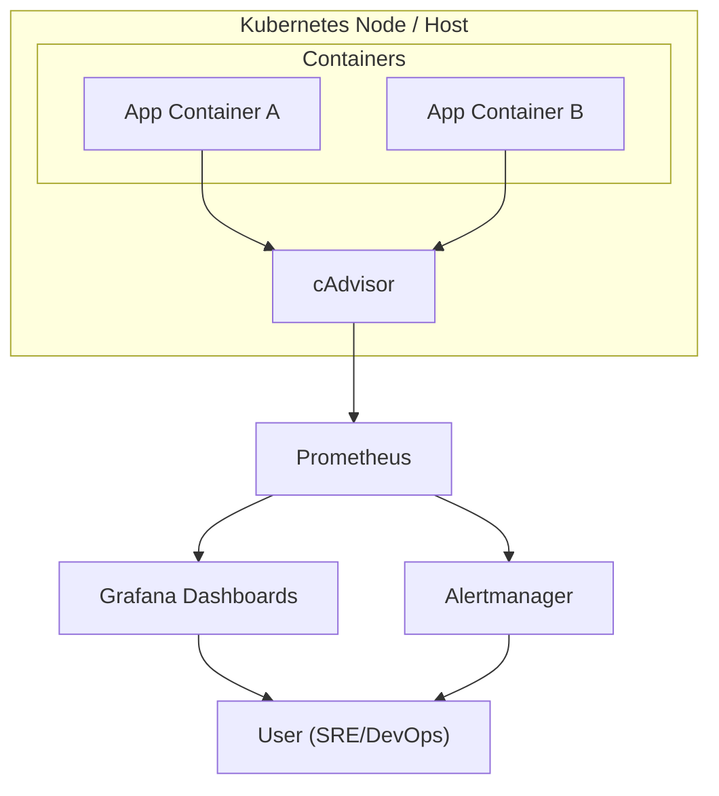

# 🧱 System Architecture Overview

This section provides a **high-level overview of the monitoring and observability stack** used in this project. It highlights the **core components**, their responsibilities, and how they work together to provide **end-to-end monitoring, alerting, and visualization** for modern infrastructure and applications.

---

## 📐 Design Philosophy

Our monitoring stack is built around a few guiding principles:

* **Modular and Composable** → Each tool has a clear responsibility (metrics, alerts, visualization).
* **Cloud-Native** → Runs seamlessly in containerized/Kubernetes environments.
* **Automation-First** → Designed for IaC and CI/CD pipelines.
* **Production-Ready** → Secure defaults, scalable, and extensible.
* **Developer-Friendly** → Easy to run locally (e.g., with Docker Compose or Kind).

---

## 🧩 Core Components

### 1. Metrics Collection (cAdvisor)

* **cAdvisor** runs on each node to collect **container-level resource usage** (CPU, memory, disk, network).
* Integrated with Kubernetes via the **kubelet**.
* Exposes metrics at `/metrics` in **Prometheus format**.

### 2. Monitoring & Storage (Prometheus)

* **Prometheus** scrapes metrics from cAdvisor, node exporters, and other exporters.
* Stores data in its **time-series database (TSDB)**.
* Provides the **PromQL query language** for powerful analysis.

### 3. Visualization (Grafana)

* **Grafana** connects to Prometheus and displays metrics in **dashboards**.
* Includes **pre-built dashboards** for containers, nodes, and Kubernetes clusters.
* Enables engineers to explore, visualize, and share insights.

### 4. Alerting (Alertmanager)

* **Alertmanager** receives alerts from Prometheus.
* Handles **deduplication, grouping, and routing** of alerts.
* Sends notifications via **Slack, Email, PagerDuty**, etc.

---

## 🔀 Architecture Diagram

---

## 🔄 Data / Control Flow

1. **Containers** run applications and consume resources.
2. **cAdvisor** collects resource usage metrics from the kernel (cgroups).
3. **Prometheus** scrapes metrics from cAdvisor (and other exporters).
4. **Prometheus TSDB** stores time-series data.
5. **Grafana** queries Prometheus to render dashboards and visualizations.
6. **Prometheus rules** evaluate alert conditions (e.g., CPU > 90%).
7. **Alertmanager** routes alerts to Slack/email.
8. **Users (SRE/DevOps)** view dashboards and respond to alerts.

---

## 🧭 Related Pages

* [Quickstart: Getting Started](../0-quickstart/1-getting-started.md)
* [Prometheus Notes](../2-project/prometheus.md)
* [cAdvisor Notes](../2-project/cadvisor.md)
* [Grafana Notes](../2-project/grafana.md)
* [Alertmanager Notes](../2-project/alertmanager.md)

---