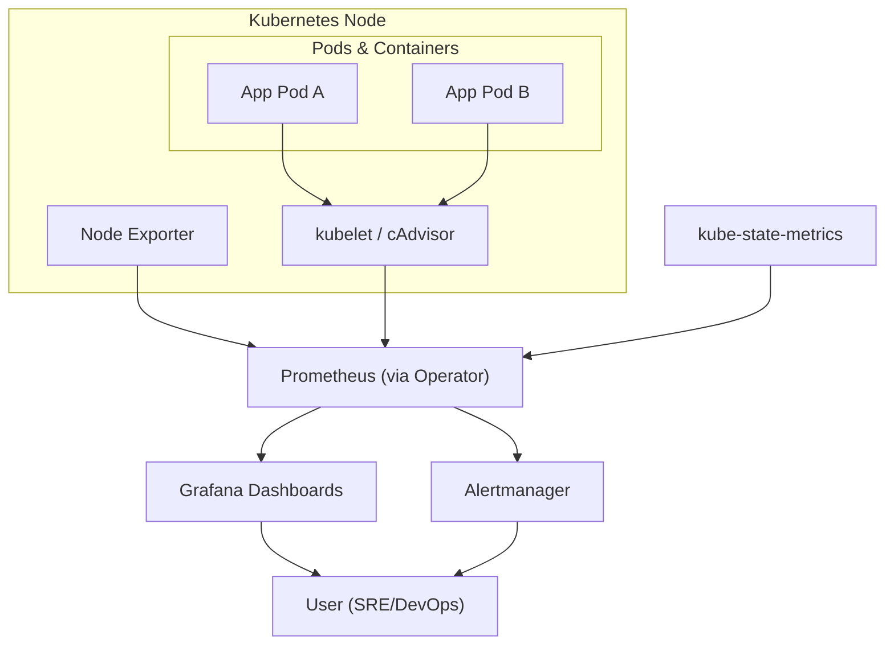

# Kubernetes Monitoring Architecture Overview

This section provides a **high-level overview of the monitoring and observability stack for Kubernetes**. It highlights the **core components**, their responsibilities, and how they work together to deliver **end-to-end monitoring, alerting, and visualization** for clusters and workloads.

---

## Design Philosophy

Our Kubernetes monitoring stack follows these principles:

* **Modular and Composable** → Exporters, Prometheus, Grafana, and Alertmanager each serve a focused role.
* **Kubernetes-Native** → Uses service discovery, ConfigMaps, and the Prometheus Operator for automation.
* **Automation-First** → Deployed and managed via Helm charts, Operators, and GitOps pipelines.
* **Production-Ready** → High-availability Prometheus, RBAC-enabled, and scalable with Thanos/Cortex.
* **Developer-Friendly** → Can be run locally with **Kind** or Minikube for experimentation.

---

## Core Components

### 1. Metrics Collection (Exporters & Kube-State-Metrics)

* **kubelet / cAdvisor** → Collects **container and pod-level resource usage** (CPU, memory, disk, network).
* **kube-state-metrics** → Exposes the **state of Kubernetes objects** (deployments, pods, nodes, jobs).
* **Node Exporter** → Provides **node-level OS metrics**.
* All expose metrics at `/metrics` in **Prometheus format**.

### 2. Monitoring & Storage (Prometheus / Prometheus Operator)

* **Prometheus** scrapes metrics automatically via **Kubernetes service discovery**.
* Stores data in a **time-series database (TSDB)**.
* **Prometheus Operator** manages Prometheus, Alertmanager, and scrape configurations declaratively with CRDs (`ServiceMonitor`, `PodMonitor`, `PrometheusRule`).
* **PromQL** enables deep querying of cluster and application metrics.

### 3. Visualization (Grafana)

* **Grafana** connects to Prometheus and provides **pre-built dashboards** for Kubernetes clusters, nodes, pods, and workloads.
* Developers and SREs can explore, visualize, and share insights from cluster metrics.

### 4. Alerting (Alertmanager)

* **Alertmanager** receives alerts from Prometheus.
* Handles **deduplication, grouping, and routing** of alerts.
* Sends notifications via **Slack, Email, PagerDuty**, or other integrations.
* Rules are defined in **PrometheusRule CRDs** for Kubernetes-native configuration.

---

## Kubernetes Monitoring Architecture Diagram

---

## Data / Control Flow

1. **Pods and nodes** run applications and workloads.
2. **kubelet/cAdvisor** collect container and pod-level metrics.
3. **kube-state-metrics** exposes cluster object states (deployments, pods, jobs, etc.).
4. **Node Exporter** collects host-level metrics (CPU, memory, disk).
5. **Prometheus** scrapes all metrics via Kubernetes service discovery.
6. **TSDB** stores the metrics for querying.
7. **Grafana** queries Prometheus and renders dashboards.
8. **Prometheus Rules** (via CRDs) define alert conditions.
9. **Alertmanager** routes alerts to notification channels.
10. **Users (SRE/DevOps)** observe dashboards and respond to incidents.

---

## Related Pages

* [Quickstart: Getting Started](../0-quickstart/1-getting-started.md)
* [Prometheus Notes](../2-project/prometheus.md)
* [Grafana Notes](../2-project/grafana.md)
* [Alertmanager Notes](../2-project/alertmanager.md)

---
