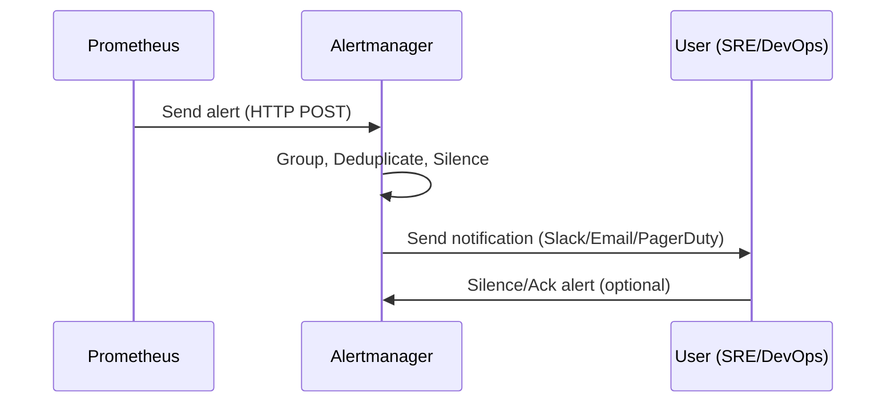
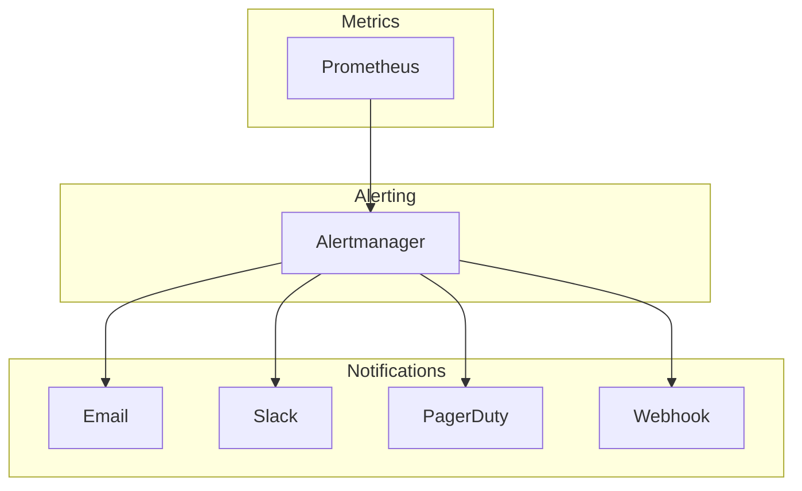

# What is Alertmanager?

**Alertmanager** is the **alerting component** of the Prometheus ecosystem.
It is responsible for **handling alerts** generated by Prometheus servers and **sending notifications** to external systems.

It provides:

* **Routing** → decide where alerts go (Slack, Email, PagerDuty, etc.)
* **Grouping** → combine related alerts into a single notification
* **Silencing** → temporarily mute alerts during maintenance
* **Deduplication** → avoid spamming users with repeated alerts

Prometheus **detects the problem**, but Alertmanager **tells humans (or systems) about it**.


## Why Do We Need Alertmanager?

Without Alertmanager:

* Prometheus can **trigger alerts**, but it doesn’t know how to notify people.
* Each alert would generate **raw, unorganised messages**.

Challenges Alertmanager solves:

* **Too many alerts** → group and deduplicate.
* **Wrong people notified** → route to the right team.
* **Alert fatigue** → silence during maintenance.

It’s the **traffic controller** for alerts.


## How Alertmanager Works

1. **Prometheus evaluates alert rules** (`.rules` or `.yml` files).

2. If a rule fires, Prometheus sends an **alert** to Alertmanager via HTTP.

3. Alertmanager:

   * Groups related alerts.
   * Applies **routing rules** (e.g., critical → PagerDuty, warnings → Slack).
   * Sends notifications.

4. Users acknowledge alerts, silence them if needed, or take action.


### Architecture Overview

```text
+-+
| Prometheus Server |  -->  Fires alerts
+++
          |
          v
+++
| Alertmanager      |
| - Grouping        |
| - Routing         |
| - Silencing       |
| - Deduplication   |
+++
   |   |   |   |
   v   v   v   v
 Email Slack PagerDuty Webhook
```


## Alert Flow: From Prometheus → Alertmanager → User




## Example Alert Rule in Prometheus

```yaml
groups:
  - name: node.rules
    rules:
      - alert: HighCPUUsage
        expr: rate(node_cpu_seconds_total{mode="user"}[1m]) > 0.9
        for: 2m
        labels:
          severity: critical
        annotations:
          summary: "High CPU usage on {{ $labels.instance }}"
          description: "CPU usage > 90% for more than 2 minutes."
```

When this condition is true, Prometheus sends an **alert** to Alertmanager.


## Alertmanager Configuration

Alertmanager is configured using a **YAML file** (`alertmanager.yml`).

### Example Config

```yaml
global:
  resolve_timeout: 5m

route:
  receiver: 'slack-notifications'
  group_by: ['alertname', 'cluster']
  group_wait: 30s
  group_interval: 5m
  repeat_interval: 3h

receivers:
  - name: 'slack-notifications'
    slack_configs:
      - channel: '#alerts'
        send_resolved: true
        text: "Alert: {{ .CommonAnnotations.summary }}"

inhibit_rules:
  - source_match:
      severity: 'critical'
    target_match:
      severity: 'warning'
    equal: ['alertname', 'cluster']
```


### Explanation of Key Fields

* **global** → default settings (timeouts, SMTP server, Slack API URL).
* **route** → defines alert routing rules.

  * `group_by` → group alerts by label.
  * `group_wait` → wait before sending to group alerts.
  * `repeat_interval` → resend alert if still firing.
* **receivers** → list of destinations (Slack, email, PagerDuty).
* **inhibit\_rules** → suppress lower-priority alerts if a higher one is firing.


## Notification Integrations

Alertmanager supports many integrations out of the box:

* **Email**
* **Slack, Microsoft Teams, Discord**
* **PagerDuty, OpsGenie, VictorOps**
* **Webhook receivers** → integrate with any custom system
* **Custom receivers** via webhooks


## Features of Alertmanager

### Grouping

* Combine alerts into a single message.
* Example: instead of 100 pod alerts, one grouped “PodCrashLoopBackOff” alert.

### Routing

* Send alerts to different teams.
* Example: Database alerts → DBA team, Node alerts → Infra team.

### Deduplication

* If an alert is firing repeatedly, only **send once** until it’s resolved.

### Silences

* Mute alerts temporarily (e.g., during maintenance).
* Configured via API/UI/CLI.

### Inhibition

* Suppress less severe alerts when a higher severity alert is active.
* Example: Hide “disk usage warning” if “disk full critical” is active.


## Alertmanager UI

Alertmanager provides a simple web UI (default port `:9093`) where you can:

* View active alerts
* Add silences
* Manage alert history
* Debug routing


## Security Best Practices

* Don’t expose Alertmanager directly to the internet.
* Put it behind a **reverse proxy** (Nginx/Traefik).
* Use **authentication** if exposed.
* Secure communication between Prometheus and Alertmanager with TLS.


## Key Strengths of Alertmanager

* **Deep Prometheus integration** → native in the ecosystem.
* **Powerful routing** → fine-grained alert delivery.
* **Extensible** → webhooks for custom workflows.
* **Silences & inhibition** → reduce noise & alert fatigue.
* **Open-source & widely adopted** → large community.


## Limitations & Watch Outs

* **Limited UI** (mostly config-driven).
* **No built-in escalation policies** (PagerDuty is better for escalation chains).
* **Single binary** → HA requires running multiple instances with a gossip protocol.
* **Alert storming** still possible if rules aren’t well-tuned.


## Alertmanager in the Observability Stack



Prometheus **detects**, Alertmanager **notifies**.


## Alertmanager Cheat Sheet

### Core Concepts

| Term           | Meaning                                           |
| -- | - |
| **Alert**      | Condition defined in Prometheus that triggers     |
| **Receiver**   | Where alerts are sent (Slack, Email, etc.)        |
| **Route**      | Rules that decide which receiver gets the alert   |
| **Silence**    | Temporary mute for alerts                         |
| **Inhibition** | Suppression of lower alerts when higher ones fire |
| **Grouping**   | Bundling multiple alerts into one notification    |


### Example Silence Command

```bash
amtool silence add alertname=HighCPUUsage --duration=2h --comment="Maintenance window"
```


### Example Routing Rule

```yaml
route:
  receiver: 'team-A'
  routes:
    - match:
        team: 'database'
      receiver: 'dba-team'
    - match:
        team: 'infra'
      receiver: 'infra-team'
```


## Final Takeaway

Alertmanager is:

* The **alert distribution hub** for Prometheus.
* Provides **routing, grouping, silencing, inhibition**.
* Supports **many integrations** (Slack, PagerDuty, Email).
* **Essential** for production-grade monitoring.

Think of Prometheus as the **doctor detecting the illness**, and Alertmanager as the **nurse paging the right specialist**.


