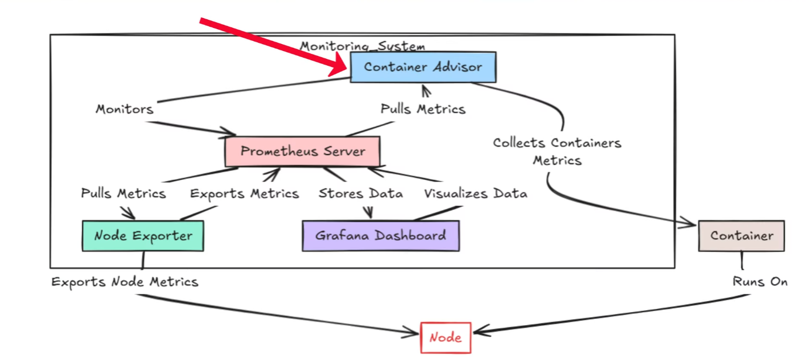
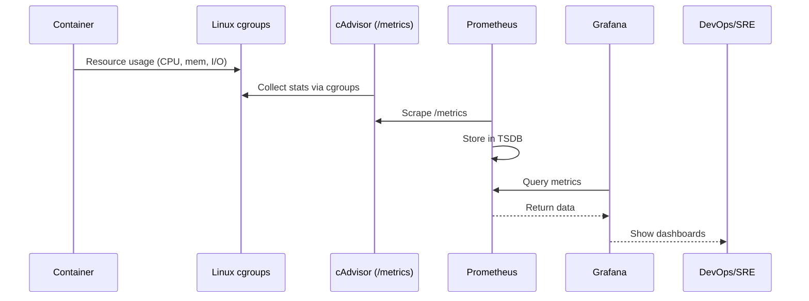
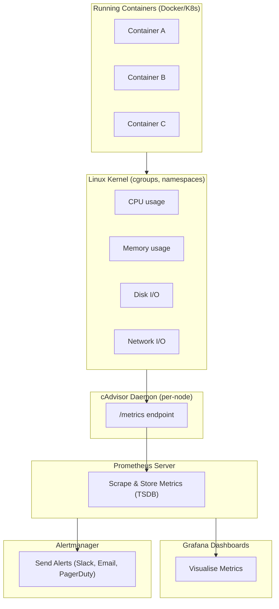
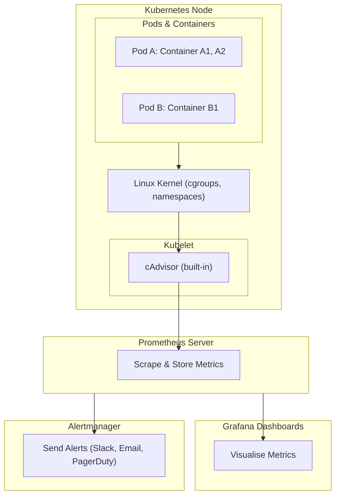

# cAdvisor



# What is cAdvisor?

**cAdvisor (Container Advisor)** is an **open-source container monitoring tool** developed by Google.
It runs as a **daemon** on a host and provides insights into:

* **Resource usage** (CPU, memory, network, disk I/O)
* **Performance characteristics** of running containers
* **Per-container statistics** in real time

cAdvisor is often used as a **metrics source** for **Prometheus** in Kubernetes and Docker environments.

It’s lightweight, designed to run inside a container, and exposes metrics at an **HTTP endpoint** (`/metrics`) in Prometheus format.

---

## Why Do We Need cAdvisor?

In modern **containerised environments** (Docker, Kubernetes):

* Containers are **ephemeral** (come and go quickly).
* Multiple containers share the same host.
* We need visibility into **resource consumption per container** (not just at the host level).

Without cAdvisor:

* You can see **host metrics** (via `node_exporter`) but not **per-container usage**.
* Hard to debug issues like “which container is consuming all the CPU?”

cAdvisor provides **fine-grained container-level metrics**, making it critical for **container monitoring**.

---

## What Does cAdvisor Monitor?

cAdvisor collects and exposes:

* **CPU usage** (total, per core, throttling).
* **Memory usage** (working set, cache, limits).
* **Filesystem usage** (per container).
* **Network stats** (bytes sent/received, packets).
* **Container lifecycle stats** (start, stop, restart).
* **Custom labels** (Kubernetes adds pod, namespace, container name).

---

## How cAdvisor Works

1. Runs as a **daemon** (usually a Docker container).
2. Reads metrics from the **Linux kernel cgroups** and **container runtime** (Docker, containerd, CRI-O).
3. Exposes metrics on an **HTTP endpoint**:

   * JSON API → `/api/v1.3/subcontainers` (legacy).
   * Prometheus format → `/metrics`.
4. Tools like **Prometheus** scrape these metrics.
5. **Grafana** visualises them in dashboards.

---

### Architecture Overview

```text
+-------------------+
|   Linux Kernel    |
| (cgroups, stats)  |
+---------+---------+
          |
          v
+---------+---------+
|   cAdvisor        |  (container metrics daemon)
+---------+---------+
          |
          v
+-------------------+
| /metrics endpoint |  --> Scraped by Prometheus
+---------+---------+
          |
     +----v-----+
     | Grafana  |   (visualisation)
     +----------+
```

---

## Metric Flow: From Container → cAdvisor → Prometheus → Grafana



---

## Prometheus + cAdvisor Architecture



---

### Explanation of the Flow

1. **Containers** → generate resource usage.
2. **Linux Kernel (cgroups)** → tracks CPU, memory, disk, and network per container.
3. **cAdvisor** → collects these stats and exposes them at `/metrics`.
4. **Prometheus** → scrapes cAdvisor metrics regularly and stores them in its TSDB.
5. **Grafana** → queries Prometheus for dashboards (per-container CPU/memory, etc.).
6. **Alertmanager** → triggers alerts if rules match (e.g., container using >90% memory).

This stack gives **complete visibility** into container performance.

---

## Kubernetes + cAdvisor + Prometheus Architecture



---

### Explanation of the Kubernetes Flow

1. **Pods (containers)** run on each **node**.
2. **Linux kernel (cgroups)** tracks per-container resource usage (CPU, memory, I/O).
3. **Kubelet** runs on every node and **integrates cAdvisor internally**.

   * Exposes metrics at:

     * `/metrics/cadvisor` → container-level
     * `/metrics` → node & kubelet metrics
4. **Prometheus** scrapes kubelet endpoints across all nodes.
5. **Grafana** builds dashboards (per-pod, per-container, per-namespace).
6. **Alertmanager** notifies when resource thresholds are breached.

In Kubernetes, you **don’t usually run standalone cAdvisor**. Instead, kubelet already provides cAdvisor-powered metrics.

---

## Example Metrics from cAdvisor

### CPU

* `container_cpu_usage_seconds_total` → Total CPU time consumed.
* `container_cpu_cfs_throttled_seconds_total` → Time container spent throttled.

### Memory

* `container_memory_usage_bytes` → Total memory usage.
* `container_memory_working_set_bytes` → Memory actively used.

### Network

* `container_network_receive_bytes_total`
* `container_network_transmit_bytes_total`

### Filesystem

* `container_fs_usage_bytes`
* `container_fs_reads_bytes_total`

---

## Running cAdvisor

### Docker Example

```bash
docker run \
  --volume=/:/rootfs:ro \
  --volume=/var/run:/var/run:rw \
  --volume=/sys:/sys:ro \
  --volume=/var/lib/docker/:/var/lib/docker:ro \
  --publish=8080:8080 \
  --detach=true \
  --name=cadvisor \
  gcr.io/cadvisor/cadvisor:latest
```

Access metrics at:

* **UI**: `http://localhost:8080`
* **Prometheus metrics**: `http://localhost:8080/metrics`

---

## cAdvisor in Kubernetes

In **Kubernetes**, cAdvisor is **built into the kubelet**:

* Every node’s kubelet runs cAdvisor.
* Metrics are exposed at `:4194/metrics/cadvisor`.
* Prometheus scrapes these endpoints.

Many Kubernetes setups use **kubelet’s cAdvisor integration** rather than running cAdvisor as a separate container.

---

## Key Strengths of cAdvisor

* **Container-native**: built specifically for container monitoring.
* **Lightweight**: low resource overhead.
* **Rich metrics**: CPU, memory, disk, network at per-container level.
* **Easy integration**: works out-of-the-box with Prometheus.
* **UI dashboard**: basic real-time web UI included.

---

## Limitations & Watch Outs

* **Short-term storage only** → cAdvisor itself doesn’t persist data (only in-memory).
  → Must use **Prometheus** or other TSDB for historical metrics.

* **Scalability** → Standalone cAdvisor isn’t meant for very large clusters.

* **Limited security** → Exposes metrics unauthenticated (protect behind reverse proxy).

* **Deprecation concern** → Standalone cAdvisor development has slowed since metrics are now integrated into Kubernetes kubelet.

---

## Example Prometheus Scrape Config for cAdvisor

```yaml
scrape_configs:
  - job_name: 'cadvisor'
    static_configs:
      - targets: ['localhost:8080']
```

---

## Grafana Dashboards for cAdvisor

Grafana has many **pre-built dashboards** (via Grafana.com) for cAdvisor metrics:

* Container CPU & memory usage
* Disk & network performance
* Top N containers by resource consumption
* Per-pod or per-namespace breakdown

Example dashboard ID: **893** (Google cAdvisor).

---

## Alternatives to cAdvisor

| Tool                   | Focus                          | Notes                                   |
| ---------------------- | ------------------------------ | --------------------------------------- |
| **node\_exporter**     | Host-level metrics             | No per-container visibility             |
| **kubelet /metrics**   | Node & pod metrics in k8s      | Already includes cAdvisor functionality |
| **Docker stats API**   | Docker container metrics       | Limited, less Prometheus-friendly       |
| **Datadog/ELK/others** | SaaS full observability stacks | More features, but paid solutions       |

In Kubernetes, **cAdvisor + kubelet** is usually enough.

---

## Security Best Practices

* Don’t expose cAdvisor directly to the internet.
* Run behind a **reverse proxy** (Nginx, Traefik).
* Scrape metrics only from **trusted networks**.
* Use Kubernetes RBAC with kubelet metrics proxying.

---

## cAdvisor Cheat Sheet

### Core Concepts

| Term         | Meaning                                  |
| ------------ | ---------------------------------------- |
| **cAdvisor** | Container metrics daemon (by Google)     |
| **Source**   | Linux kernel cgroups + container runtime |
| **Metrics**  | CPU, memory, disk, network per container |
| **Endpoint** | `/metrics` (Prometheus format)           |

### Example PromQL

```promql
rate(container_cpu_usage_seconds_total[1m])   # CPU usage per second
container_memory_usage_bytes                  # Current memory usage
container_network_receive_bytes_total         # Network RX bytes
```

---

## Final Takeaway

cAdvisor is:

* **Essential** for per-container resource monitoring.
* **Lightweight** and easy to deploy.
* **Integrated** into Kubernetes via kubelet.
* **Best used with Prometheus + Grafana** for long-term monitoring.

Think of cAdvisor as the **container-level metrics engine** that feeds Prometheus, while node\_exporter gives you host-level metrics.

---