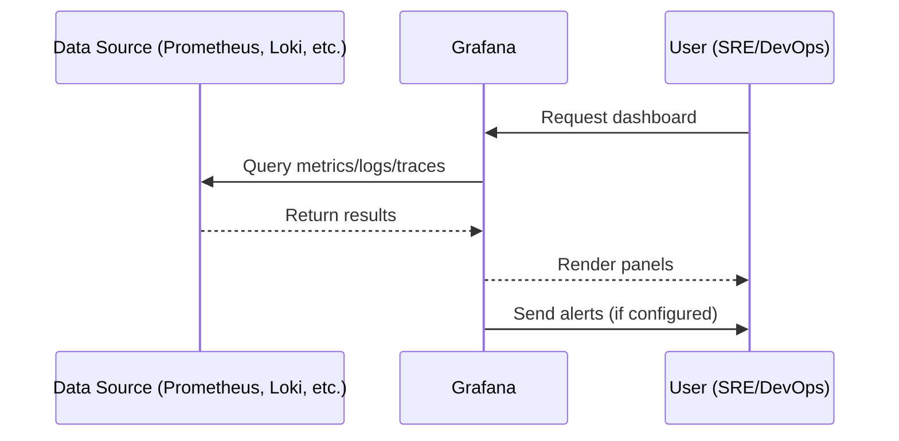
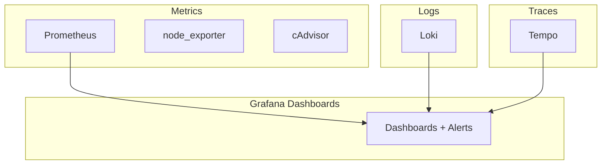

# Grafana

## 📊 What is Grafana?

Grafana is an **open-source observability and visualization platform**.
It lets you **query, visualize, alert, and explore** metrics, logs, and traces from multiple data sources.

Originally created by Torkel Ödegaard, Grafana has grown into a **CNCF incubating project** and is now the **de facto dashboarding tool** in cloud-native monitoring stacks.

👉 If Prometheus is the “brain” of monitoring (data collection & querying), Grafana is the **eyes** (dashboards & visualizations).

---

## 🧐 Why Do We Need Grafana?

Modern systems generate **huge amounts of telemetry data**:

* **Metrics** (from Prometheus, InfluxDB, Graphite, etc.)
* **Logs** (from Loki, Elasticsearch, Splunk, etc.)
* **Traces** (from Jaeger, Tempo, Zipkin, etc.)

Without **visualization**, raw metrics are hard to interpret.
Grafana solves this by:

* Turning metrics into **interactive dashboards**
* Providing **alerting** when thresholds are crossed
* Enabling **multi-source observability** (metrics + logs + traces in one UI)

👉 Grafana = **single pane of glass for observability**.

---

## 🔧 How Grafana Works

Grafana itself does **not collect data**. Instead, it:

1. Connects to **data sources** (Prometheus, Loki, Elasticsearch, etc.)
2. Executes queries against them
3. Renders results in **panels** (graphs, gauges, tables, heatmaps, etc.)
4. Organizes panels into **dashboards**
5. Provides **alerting & notifications** based on panel queries

---

### 🔗 Architecture Overview

```text
+------------------+
| Data Sources     |   (Prometheus, Loki, Tempo, etc.)
+---------+--------+
          |
          v
+---------+---------+
|  Grafana Server   |
|  - Query engine   |
|  - Panels         |
|  - Alerting       |
+---------+---------+
          |
   +------+------+
   | Dashboards |
   +------+------+
          |
      End Users
```

---

## 🔄 Data Flow: From Metrics → Grafana → User



---

## 📊 Example Grafana Panels

Grafana supports **many visualization types**:

* **Time series graph** → CPU usage over time
* **Gauge / SingleStat** → current memory usage
* **Heatmap** → latency distribution
* **Table** → list of failing pods
* **Pie chart** → % of requests per region

👉 Panels can be grouped into **dashboards** (e.g., “Kubernetes Cluster Health”).

---

## 🛠 Common Data Sources

Grafana supports **dozens of backends**. Most common:

| Type          | Example                                       | Purpose                 |
| ------------- | --------------------------------------------- | ----------------------- |
| **Metrics**   | Prometheus, InfluxDB, Graphite                | Time-series metrics     |
| **Logs**      | Loki, Elasticsearch, Splunk                   | Centralized logging     |
| **Traces**    | Tempo, Jaeger, Zipkin                         | Distributed tracing     |
| **Databases** | MySQL, PostgreSQL                             | Custom queries          |
| **Cloud**     | AWS CloudWatch, GCP Monitoring, Azure Monitor | Cloud-native monitoring |

👉 Grafana turns it into a **multi-source observability platform**.

---

## 🔔 Alerting in Grafana

Grafana provides a **unified alerting system** (since v8):

* **Create alerts** directly from panels.
* Alerts are evaluated on the **Grafana server**.
* Notifications are sent via **channels**:

  * Slack
  * Email
  * PagerDuty
  * Microsoft Teams
  * Webhooks

### Example Alert Flow

1. Define a threshold (e.g., CPU usage > 80%).
2. Grafana runs the query periodically.
3. If condition matches, an **alert fires**.
4. Notification goes to configured channel.

---

## ⚙️ Installing Grafana

### Docker

```bash
docker run -d -p 3000:3000 grafana/grafana
```

* UI: `http://localhost:3000`
* Default credentials: `admin/admin`

### Kubernetes (Helm)

```bash
helm repo add grafana https://grafana.github.io/helm-charts
helm install grafana grafana/grafana
```

---

## 🛡️ Security Best Practices

* ✅ Always set **admin password** (default is insecure).
* ✅ Enable **TLS** if exposed publicly.
* ✅ Use **OAuth/SAML/LDAP** for authentication.
* ✅ Use **folders & permissions** to restrict dashboard access.
* ✅ Enable **audit logs** for compliance.

---

## 🔍 Key Strengths of Grafana

* 🌐 **Multi-data-source** (metrics, logs, traces, SQL, cloud).
* 🎨 **Rich visualizations** (100+ panel types, plugins).
* 📦 **Pre-built dashboards** (Grafana.com library).
* ⚡ **Fast querying & exploration** (great with Prometheus).
* 📢 **Unified alerting** with many integrations.
* 🔌 **Extensible** (plugins for panels, datasources, apps).

---

## ⚠️ Limitations & Watch Outs

* ❌ **No storage** → relies on external data sources.
* ❌ **Query-heavy dashboards** → can overload Prometheus/DB.
* ❌ **High availability setup** requires external DB (MySQL/Postgres).
* ❌ **User management** is limited in OSS (Grafana Enterprise adds RBAC, reporting).

---

## 📦 Grafana in the Observability Stack



👉 Grafana = **central observability frontend** for metrics, logs, and traces.

---

## 🧾 Grafana Cheat Sheet

### ✅ Core Concepts

| Term             | Meaning                                                 |
| ---------------- | ------------------------------------------------------- |
| **Data source**  | External system providing data (Prometheus, Loki, etc.) |
| **Panel**        | Single visualization (graph, table, etc.)               |
| **Dashboard**    | Collection of panels                                    |
| **Alert**        | Rule based on a query, triggers notification            |
| **Organization** | Multi-tenant separation in Grafana                      |
| **Folder**       | Logical grouping of dashboards                          |

---

### 📊 Common Use Cases

* **System monitoring** (CPU, memory, disk usage).
* **Kubernetes monitoring** (pods, nodes, namespaces).
* **Business metrics** (orders per minute, revenue trends).
* **Application performance monitoring (APM)**.
* **Log exploration** (with Loki/Elasticsearch).

---

## 🎯 Final Takeaway

Grafana is:

* The **visualization + alerting layer** of modern monitoring stacks.
* **Datasource-agnostic** (works with metrics, logs, traces, SQL).
* **Essential** for Kubernetes, microservices, and cloud-native setups.

👉 Think of Grafana as the **dashboard and control room** where DevOps, SREs, and engineers get their insights.

---