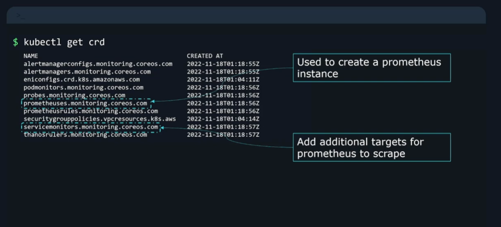

# General notes before we begin

There are 3 Ways to Monitor Your App in Kubernetes

### 1. **Basic container & node monitoring (built-in)**

Kubernetes already integrates with:

* **kubelet/cAdvisor** → container & pod-level resource usage (CPU, memory, network, filesystem).
* **Node Exporter** → node-level OS metrics.

If you deploy Prometheus (via Helm or the Operator), these metrics are automatically discovered and scraped — no extra setup required.

---

### 2. **App-specific exporters (most common in K8s)**

Many apps expose metrics directly, or you deploy an **exporter sidecar or Service**:

* **Nginx** → [nginx-prometheus-exporter](https://github.com/nginxinc/nginx-prometheus-exporter)
* **Postgres** → [postgres\_exporter](https://github.com/prometheus-community/postgres_exporter)
* **MySQL** → [mysqld\_exporter](https://github.com/prometheus/mysqld_exporter)
* **Redis** → [redis\_exporter](https://github.com/oliver006/redis_exporter)

Example: **Nginx Exporter Deployment**

```yaml
apiVersion: apps/v1
kind: Deployment
metadata:
  name: nginx
spec:
  replicas: 1
  selector:
    matchLabels:
      app: nginx
  template:
    metadata:
      labels:
        app: nginx
    spec:
      containers:
      - name: nginx
        image: nginx:latest
        ports:
        - containerPort: 80
      - name: nginx-exporter
        image: nginx/nginx-prometheus-exporter:0.11.0
        args:
          - -nginx.scrape-uri=http://127.0.0.1:80/stub_status
        ports:
        - containerPort: 9113
---
apiVersion: monitoring.coreos.com/v1
kind: ServiceMonitor
metadata:
  name: nginx-exporter
spec:
  selector:
    matchLabels:
      app: nginx
  endpoints:
  - port: 9113
```

The `ServiceMonitor` CRD (from the Prometheus Operator) ensures Prometheus automatically discovers and scrapes the exporter.

To list all available CRDs use:

```bash
kubectl get crd
```


---

### 3. **Custom metrics (for apps you write)**

If you’re building your own application, you can instrument it with OpenTelemetry or a Prometheus client library:

* Go → [prometheus/client\_golang](https://github.com/prometheus/client_golang)
* Python → [prometheus\_client](https://github.com/prometheus/client_python)
* Node.js → [prom-client](https://github.com/siimon/prom-client)

Example: Python Flask app exposing `/metrics`

```python
from flask import Flask
from prometheus_client import Counter, generate_latest

app = Flask(__name__)
requests_total = Counter('app_requests_total', 'Total requests')

@app.route('/')
def hello():
    requests_total.inc()
    return "Hello, Kubernetes!"

@app.route('/metrics')
def metrics():
    return generate_latest(), 200, {'Content-Type': 'text/plain'}
```

Deploy the app with a Kubernetes `Deployment` and expose `/metrics`. Then define a `ServiceMonitor` to let Prometheus scrape it.

---

## Summary

* **Infra metrics** → kubelet/cAdvisor + Node Exporter.
* **App metrics** → Exporters (Nginx, DBs, etc.) or custom instrumentation.
* Prometheus scrapes everything; Grafana dashboards visualize it.

---

## What OpenTelemetry Adds

* **Instrumentation SDKs** → for Go, Python, Java, Node.js, .NET, etc.
* Collects **application metrics**, **traces**, and optionally **logs**.
* Works via an **OpenTelemetry Collector** deployed as:

  * A **sidecar** (per pod)
  * A **DaemonSet** (per node)
  * A **Deployment** (central collector)

Backends supported:

* Prometheus (metrics)
* Jaeger / Tempo (traces)
* Loki / ELK (logs)
* Grafana Cloud or OTLP-compatible vendors

---

## 🛠 How It Works in Kubernetes

Right now you likely have:

* **Prometheus + Grafana** → metrics + visualization
* **kubelet/cAdvisor + Node Exporter** → infra metrics

If you add **OpenTelemetry for your app**:

1. Instrument your code with the OTel SDK.
2. Deploy an **OpenTelemetry Collector** (Deployment or DaemonSet).
3. Configure it to export metrics in Prometheus format (scrapable endpoint).

---

## Example: OTel Collector in Kubernetes

Deploy the collector:

```yaml
apiVersion: apps/v1
kind: Deployment
metadata:
  name: otel-collector
spec:
  replicas: 1
  selector:
    matchLabels:
      app: otel-collector
  template:
    metadata:
      labels:
        app: otel-collector
    spec:
      containers:
      - name: otel-collector
        image: otel/opentelemetry-collector-contrib:0.95.0
        args: ["--config=/etc/otel/otel-collector-config.yaml"]
        volumeMounts:
        - name: config
          mountPath: /etc/otel
      volumes:
      - name: config
        configMap:
          name: otel-collector-config
---
apiVersion: v1
kind: ConfigMap
metadata:
  name: otel-collector-config
data:
  otel-collector-config.yaml: |
    receivers:
      otlp:
        protocols:
          grpc:
          http:

    exporters:
      prometheus:
        endpoint: "0.0.0.0:9464"

    service:
      pipelines:
        metrics:
          receivers: [otlp]
          exporters: [prometheus]
---
apiVersion: monitoring.coreos.com/v1
kind: ServiceMonitor
metadata:
  name: otel-collector
spec:
  selector:
    matchLabels:
      app: otel-collector
  endpoints:
  - port: 9464
```

Now:

* Your app sends OTLP data to the Collector (`4317/4318`).
* The Collector exposes Prometheus metrics on `:9464`.
* Prometheus scrapes them via the `ServiceMonitor`.

---

## Why OTel is a Good Idea in Kubernetes

* **Cloud-native standard** → portable across Prometheus, Grafana, Jaeger, Tempo, etc.
* **Future-proof** → works with managed observability platforms (Datadog, New Relic, Grafana Cloud, etc.).
* **Full observability** → unifies **metrics, traces, and logs**, not just CPU/memory.

---
