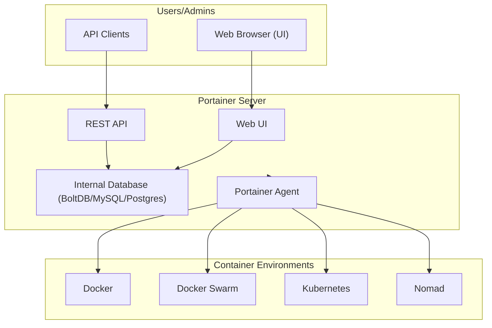
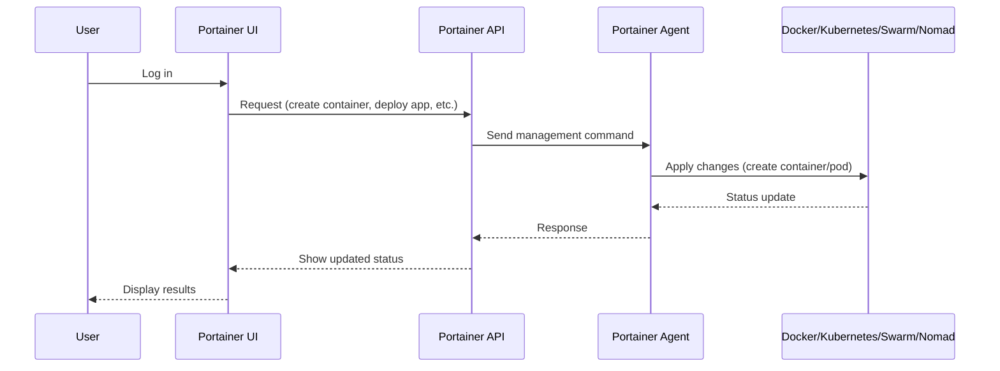

# Portainer

## 🐳 What is Portainer?

Portainer is an **open-source container management platform** that provides a **graphical user interface (GUI)** and API for managing:

* **Docker**
* **Kubernetes**
* **Docker Swarm**
* **Nomad**

It simplifies **container lifecycle management**, making it easy for both beginners and experienced DevOps engineers to manage infrastructure without deep CLI expertise.

👉 Think of Portainer as the **"control panel" for containers and clusters**.

---

## 🧐 Why Do We Need Portainer?

Modern container platforms (Docker/Kubernetes) are:

* **Powerful but complex** → require CLI + YAML configs.
* **Time-consuming** → repetitive management tasks.
* **Multi-cluster** → managing different environments is hard.

Portainer solves this by:

* Giving a **web-based UI**.
* Managing **apps, networks, volumes, configs, secrets** in one place.
* Enabling **role-based access control (RBAC)**.
* Supporting **multi-environment setups** (Docker, K8s, Swarm, Nomad).

---

## ⚙️ Core Features of Portainer

1. **Universal Platform Support**

   * Docker Standalone
   * Docker Swarm
   * Kubernetes
   * Nomad

2. **Application Deployment**

   * Deploy apps via **UI forms** or **YAML manifests**.
   * Built-in **App Templates** for one-click deployments.

3. **Cluster Management**

   * Node/Pod/Container monitoring.
   * Scaling services (add/remove replicas).
   * Network + volume management.

4. **User Management & RBAC**

   * Fine-grained access controls.
   * Teams, roles, namespaces.

5. **Security**

   * Centralized secrets management.
   * Registry credentials management.

6. **Multi-Cluster / Multi-Environment**

   * Manage multiple clusters from one dashboard.

---

## 🏗️ Portainer Architecture



---

### 🔎 Explanation of the Flow

1. **Users** interact via **browser UI** or **API clients**.
2. **Portainer Server** handles UI, API, authentication, and persistence.
3. **Portainer Agent** runs inside the cluster, gathering environment data.
4. **Environments (Docker/K8s/etc.)** are managed through the agent.

---

## 🖥️ User Flow in Portainer



---

## 🔍 Key Strengths of Portainer

* **Ease of Use** → GUI + templates for beginners.
* **Multi-platform** → Manage Docker, Swarm, Kubernetes, Nomad.
* **RBAC** → Role-based access control for teams.
* **Security** → Secrets, registries, LDAP integration.
* **Centralized** → Manage multiple clusters/environments in one place.
* **Quick Learning Curve** → Great for onboarding DevOps teams.

---

## ⚠️ Limitations & Watch Outs

* **Abstracts Complexity** → advanced Kubernetes users may find it restrictive.
* **Enterprise Features** (RBAC, registry management, OAuth) → only in **Portainer Business Edition**.
* **Not a Monitoring Tool** → needs to integrate with Prometheus/Grafana for observability.
* **Scaling** → UI may become less efficient for very large clusters (>1k nodes).

---

## 🚀 Portainer Editions

| Edition                    | Use Case              | Key Features                                                        |
| -------------------------- | --------------------- | ------------------------------------------------------------------- |
| **Community Edition (CE)** | Free, for small teams | Manage Docker, Swarm, K8s; UI; templates                            |
| **Business Edition (BE)**  | Enterprise setups     | RBAC, SSO (LDAP, OAuth, AD), support, audit logs, advanced security |

---

## 🛠️ Common Use Cases

* **Learning Kubernetes/Docker** with less CLI hassle.
* **SMBs** running Docker/Swarm with limited DevOps expertise.
* **Enterprises** using BE for governance + RBAC.
* **CI/CD pipelines** → quick visual deployment + rollback.

---

## 🐳 Deployment Examples

### 1. Deploy Portainer in Docker

```bash
docker volume create portainer_data

docker run -d \
  -p 8000:8000 \
  -p 9443:9443 \
  --name portainer \
  --restart=always \
  -v /var/run/docker.sock:/var/run/docker.sock \
  -v portainer_data:/data \
  portainer/portainer-ce:latest
```

* Runs Portainer CE.
* Accessible at `https://localhost:9443`.

---

### 2. Deploy Portainer in Kubernetes

```yaml
apiVersion: apps/v1
kind: Deployment
metadata:
  name: portainer
  namespace: portainer
spec:
  replicas: 1
  selector:
    matchLabels:
      app: portainer
  template:
    metadata:
      labels:
        app: portainer
    spec:
      containers:
        - name: portainer
          image: portainer/portainer-ce:latest
          ports:
            - containerPort: 9443
          volumeMounts:
            - name: portainer-data
              mountPath: /data
      volumes:
        - name: portainer-data
          persistentVolumeClaim:
            claimName: portainer-pvc
```

---

## 🔐 Security Best Practices

* ✅ Restrict access to the Portainer UI with **TLS + strong auth**.
* ✅ Use **RBAC** to enforce least privilege.
* ✅ Integrate with LDAP/OAuth/AD (BE only).
* ✅ Don’t expose Docker socket (`/var/run/docker.sock`) publicly.
* ✅ Apply **network policies** in Kubernetes.

---

## 🔄 Portainer vs Alternatives

| Tool               | Focus                 | Strengths                        | Weaknesses                    |
| ------------------ | --------------------- | -------------------------------- | ----------------------------- |
| **Portainer**      | UI for container mgmt | Easy, multi-platform, RBAC       | Limited advanced K8s features |
| **Rancher**        | Full K8s management   | Multi-cluster, monitoring, CI/CD | More complex, heavier         |
| **Lens IDE**       | K8s desktop client    | Dev-friendly, visual dashboards  | No Docker/Swarm support       |
| **Docker Desktop** | Local Docker dev      | Simple local setup               | Not for production            |

---

## 🧾 Portainer Cheat Sheet

### ✅ Key Concepts

| Term             | Meaning                                                   |
| ---------------- | --------------------------------------------------------- |
| **Environment**  | Cluster or Docker endpoint managed by Portainer           |
| **Agent**        | Lightweight connector between Portainer and environments  |
| **Stack**        | Group of services deployed together (like Docker Compose) |
| **App Template** | Predefined configuration for quick app deployment         |
| **RBAC**         | Role-based access control for multi-user environments     |

---

### 🔧 Useful Commands

**Deploy Portainer on Docker**

```bash
docker run -d -p 9443:9443 -v /var/run/docker.sock:/var/run/docker.sock -v portainer_data:/data portainer/portainer-ce
```

**Add Kubernetes Environment (via CLI)**

```bash
kubectl create namespace portainer
kubectl apply -n portainer -f https://downloads.portainer.io/portainer-agent-k8s.yaml
```

---

## 🎯 Final Takeaway

Portainer is:

* **Beginner-friendly** → perfect for teams learning Docker/K8s.
* **Multi-platform** → one UI for Docker, Swarm, Kubernetes, Nomad.
* **Secure & Enterprise-ready** (in BE) → RBAC, SSO, auditing.
* **Not a replacement for monitoring/logging** → should be paired with Prometheus, Grafana, Loki, etc.

👉 If you want a **centralized, easy-to-use container management dashboard**, Portainer is an excellent choice.

---

## 🔎 How Portainer Works in Swarm

You **don’t need to attach your application containers (Grafana, Prometheus, nginx, etc.) to the `agent_network`** that Portainer uses.

* **Portainer Server** talks to the **Portainer Agent(s)** over the `agent_network` only.
* The **Agent** runs on every node (mode: global) and connects to the local Docker API (`/var/run/docker.sock`).
* Through the Agent, Portainer can **see all containers, networks, and volumes**, regardless of which network your app services are attached to.

So, even if your app containers are only on the `monitoring` network, Portainer will still discover and manage them because the agent queries the Docker API on that node.

---

## ✅ When to Use `agent_network`

* Only the **Portainer server** and **Portainer agents** need to be on `agent_network`.
* Other stacks/services (Grafana, Prometheus, nginx, etc.) stay on their own networks (`monitoring`, etc.).
* Portainer will still list them in the UI because it talks to Docker/Swarm, not directly over the app network.

---

## 🚫 When NOT to Add to `agent_network`

* You don’t want all your app services unnecessarily exposed to the Portainer service network.
* It can clutter the DNS namespace and increase security exposure.

---

✅ **Best Practice Setup**:

* **Portainer/Agent** → use `agent_network`.
* **Your app stack** (Prometheus, Grafana, etc.) → use their own networks (`monitoring`, etc.).
* No need to mix them.

---

## 🔎 How Swarm Stacks Work

You **can (and usually should)** keep **Portainer** in its **own stack**, separate from your monitoring stack.

* Each `docker stack deploy` creates a **namespace** in Swarm.

  * Example:

    ```bash
    docker stack deploy -c monitoring.yml monitoring
    docker stack deploy -c portainer.yml portainer
    ```
  * Services in stack `monitoring` are prefixed like:

    ```
    monitoring_grafana
    monitoring_prometheus
    ```
  * Services in stack `portainer` are prefixed like:

    ```
    portainer_portainer
    portainer_agent
    ```

* **Networks are also namespaced** unless you create them externally.

  * `monitoring` network → `monitoring_monitoring`
  * `agent_network` → `portainer_agent_network`

---

## ✅ Portainer Stack (Standalone)

Portainer only needs:

* `agent_network` (overlay) for **server ↔ agents** communication.
* `portainer_data` volume.

It does **not** need the `monitoring` network.

---

## ✅ Monitoring Stack (Standalone)

Prometheus, Grafana, exporters, etc. only need:

* `monitoring` network.
* Their own volumes/configs.

They do **not** need the `agent_network`.

---

## 🔗 How Portainer Sees Other Stacks

* The **Portainer Agent** talks to the **Docker API socket** on each node.
* That API knows about **all stacks, services, volumes, networks, and tasks** in the Swarm.
* So Portainer will display your **monitoring stack** in the UI automatically, even though it’s on a completely different network.

👉 No need to manually connect `monitoring` stack services to the `agent_network`.

---

## ⚡ Best Practice

* ✅ Deploy **Portainer stack separately** (`docker stack deploy -c portainer.yml portainer`).
* ✅ Deploy **Monitoring stack separately** (`docker stack deploy -c monitoring.yml monitoring`).
* ✅ Keep **networks isolated per stack**, unless you explicitly need inter-stack communication.
* ✅ Only use **external overlay networks** if two stacks need to talk to each other.

---

⭐ **Analogy**:
Think of **Portainer** as a **control tower**.

* It doesn’t sit on the same runway as planes (your apps).
* It just talks to the airport radar (Docker API) to know what planes are out there and manage them.

---
