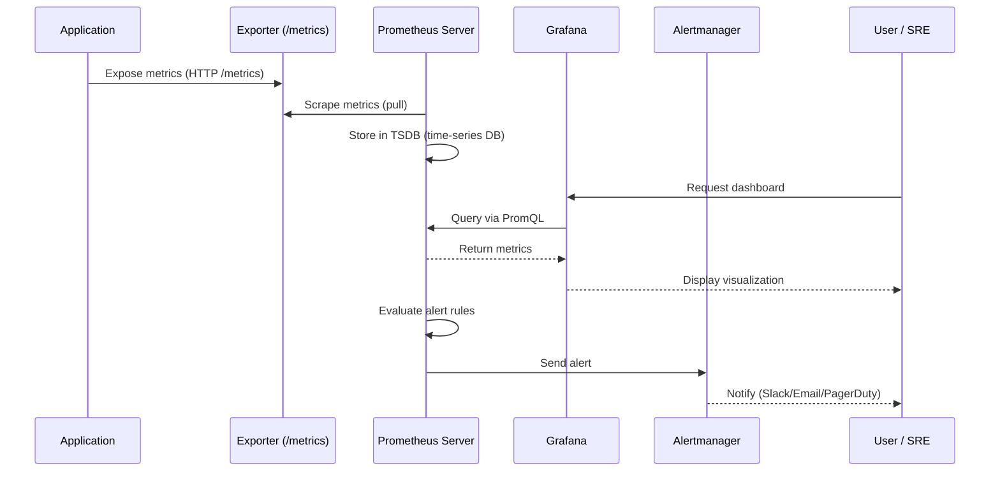
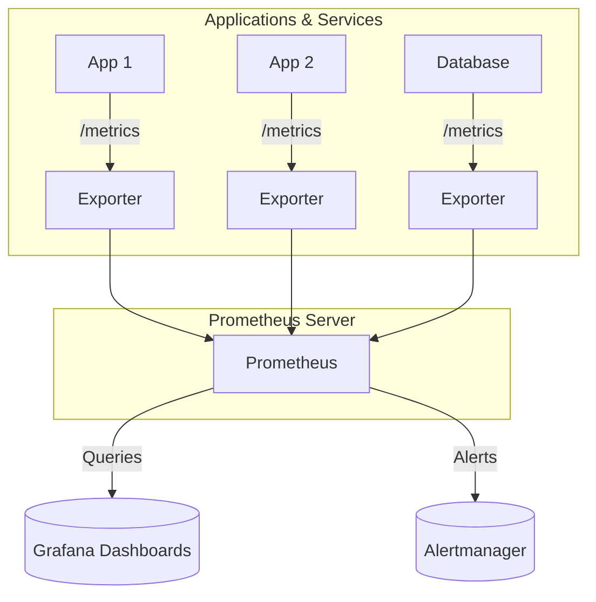
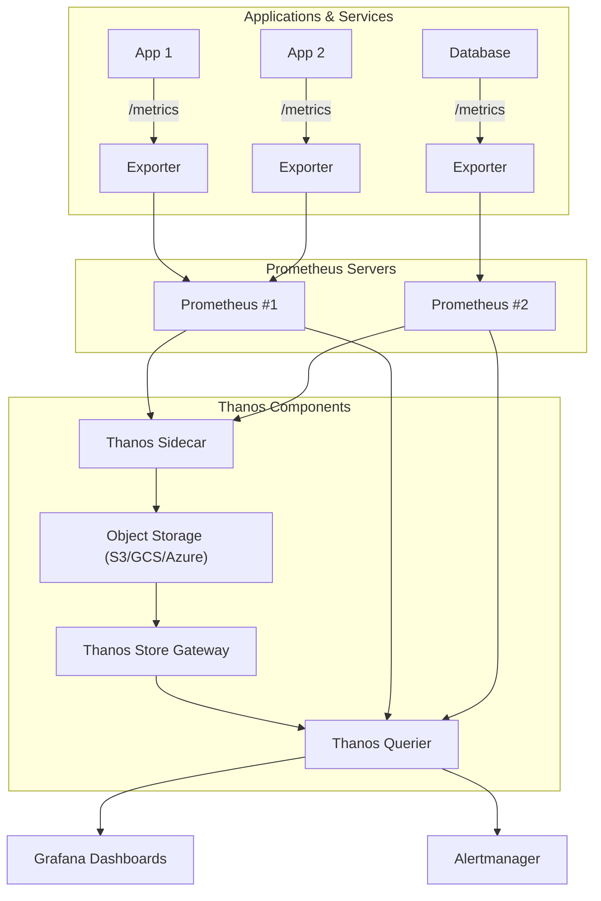

# 📊 What is Prometheus?

Prometheus is an **open-source monitoring and alerting toolkit** designed for **time-series data** (metrics with timestamps).  
It was created at SoundCloud and is now a **CNCF graduated project** (same foundation as Kubernetes).  

Prometheus has become the **de facto standard for monitoring in cloud-native environments**, especially with Kubernetes, due to its **scalability, flexibility, and ecosystem**.

---

## 🧐 Why Do We Need Monitoring?

Modern systems are:

- **Distributed** (many services, microservices, containers).
- **Dynamic** (instances scale up and down).
- **Complex** (multiple dependencies, networks, storage).

Without monitoring, failures remain invisible until users complain.  

Monitoring answers:

- Is my service **up**?
- How much **traffic** am I serving?
- Are we running into **errors, bottlenecks, or slowdowns**?
- When should we **scale**?

Monitoring data comes in three main forms (the “**three pillars of observability**”):

1. **Logs** → Event-based, detailed messages.  
2. **Metrics** → Numeric measurements over time (cheap, efficient).  
3. **Traces** → End-to-end request tracking.  

👉 Prometheus focuses on **metrics**.

---

## 🕒 Time-Series Basics

A **time series** is a sequence of values recorded at successive points in time.  
Example:  

| Time | Metric | Value |
|------|--------|-------|
| 10:00 | CPU usage | 30% |
| 10:01 | CPU usage | 32% |
| 10:02 | CPU usage | 31% |

Each metric in Prometheus is:

- **Metric name** → `http_requests_total`  
- **Labels** (key-value pairs for context) → `{method="GET", status="200"}`  
- **Timestamp + value**  

This allows very powerful queries like:  
👉 “How many `GET` requests per second returned a `500` error in the last 5 minutes?”

---

## 🎥 Video Introduction

<iframe width="7000" height="415" src="https://www.youtube-nocookie.com/embed/h4Sl21AKiDg?si=tg4ScT6Eq4yArrdx" title="YouTube video player" frameborder="0" allow="accelerometer; autoplay; clipboard-write; encrypted-media; gyroscope; picture-in-picture; web-share" referrerpolicy="strict-origin-when-cross-origin" allowfullscreen></iframe>

---

## 🔧 How Prometheus Works

Prometheus is built around a **pull-based model**:

1. **Targets expose metrics** via HTTP (usually at `/metrics`).
2. Prometheus **scrapes metrics** at regular intervals.
3. Data is stored in its **own time-series database (TSDB)**.
4. Metrics can be queried using **PromQL (Prometheus Query Language)**.
5. **Alerting rules** can trigger alerts via **Alertmanager**.
6. For short-lived jobs, metrics can be pushed via **Pushgateway**.

---

### 🔗 Architecture Overview

```text
          +-------------------+
          |    Applications   |
          |  Export metrics   |
          +---------+---------+
                    |
                    v
          +---------+---------+
          |  Exporters        |   (e.g. node_exporter, redis_exporter)
          +---------+---------+
                    |
                    v
          +---------+---------+
          | Prometheus Server |   (scrapes, stores, queries data)
          +---------+---------+
               |          |
         (alerts)    (queries)
               |          |
          +----v----+ +---v---+
          |Alertmgr | | Grafana|
          +---------+ +--------+
```

## 🔄 Metric Flow: From App → Prometheus → User

Below is a **user flow diagram** that explains *how a single metric travels through the system*.



---

### 🔎 Explanation of the Flow
1. **App** → exposes metrics (or uses an **exporter**).  
2. **Prometheus** → regularly scrapes metrics via HTTP pull.  
3. **Prometheus TSDB** → stores the metrics with timestamps.  
4. **Grafana** → users query metrics with **PromQL** and visualize them.  
5. **Alertmanager** → gets triggered if rules match (CPU > 90%, target down, etc.).  
6. **User (SRE/DevOps)** → gets notified and investigates.  


---

## 🔍 Key Strengths of Prometheus

* **Standalone**: no external database required.
* **PromQL**: powerful and flexible query language for metrics.
* **Kubernetes-native**: integrates seamlessly with service discovery.
* **Ecosystem**: works with Grafana, Alertmanager, Pushgateway, Thanos, Cortex.
* **Scalable**: handles thousands of metrics and targets efficiently.

---

## ⚠️ Limitations & Watch Outs

* **Not ideal for long-term storage** → data retention is limited (usually weeks).
  → Solution: use **Thanos**, **Cortex**, or **Mimir** for long-term.

* **High cardinality** → too many unique label combinations can overwhelm memory.
  → Example: `user_id` as a label → ❌ (millions of unique values).

* **Pull model challenges** → doesn’t fit well with:

  * Short-lived jobs (use Pushgateway).
  * Firewalled environments.

* **No built-in dashboards** → always paired with Grafana.

---

## 🔍 PromQL — The Query Language

Prometheus comes with **PromQL (Prometheus Query Language)**, which lets you slice, dice, and aggregate metrics.  
Think of it as SQL for time-series data.

---

### 📊 Selectors

```promql
http_requests_total
```

➡️ Selects all values of `http_requests_total`.

```promql
http_requests_total{job="api"}
```

➡️ Selects only metrics where the label `job="api"`.

```promql
up == 0
```

➡️ Shows targets that are **down**.

---

### 🔢 Aggregations

```promql
sum(http_requests_total)
```

➡️ Total across all series.

```promql
avg(http_requests_total)
max(http_requests_total)
min(http_requests_total)
count(http_requests_total)
```

With labels:

```promql
sum by (job)(http_requests_total)   # Sum per job
avg by (instance)(up)               # Average per instance
```

---

### 🧮 Rate & Increase

Counters (monotonically increasing metrics) should not be summed directly; instead use rates:

```promql
rate(http_requests_total[1m])
```

➡️ Average per-second increase over the last 1 minute.

```promql
increase(http_requests_total[5m])
```

➡️ Total increase in the last 5 minutes.

---

### 💥 Common Alert Conditions

```promql
rate(http_requests_total[5m]) > 100
```

➡️ High request rate.

```promql
node_memory_Active_bytes / node_memory_MemTotal_bytes > 0.9
```

➡️ Memory usage above 90%.

```promql
up == 0
```

➡️ Target is down.

---

## 🔔 Alerting with Prometheus + Alertmanager

Prometheus can **define alert rules**. When triggered, alerts are sent to **Alertmanager**, which handles:

* **Routing** (who should be notified?).
* **Silencing** (ignore alerts during maintenance).
* **Grouping** (combine related alerts).
* **Delivery** (email, Slack, PagerDuty, etc.).

---

### Example Alert Rule (YAML)

```yaml
groups:
  - name: example.rules
    rules:
      - alert: HighCPUUsage
        expr: rate(process_cpu_seconds_total[1m]) > 0.85
        for: 2m
        labels:
          severity: critical
        annotations:
          summary: "High CPU usage on {{ $labels.instance }}"
          description: "CPU > 85% for 2 minutes."
```

---

## 📈 Metric Types in Prometheus

Prometheus supports four primary metric types:

| Type        | Use For                                 | Example                                |
| ----------- | --------------------------------------- | -------------------------------------- |
| `counter`   | Monotonically increasing values         | `http_requests_total` (total requests) |
| `gauge`     | Arbitrary values (up & down)            | `memory_usage_bytes`, `temperature_c`  |
| `histogram` | Buckets of observations (distribution)  | Request latency buckets                |
| `summary`   | Similar to histogram, client-calculated | Percentiles of request durations       |

---

## 🛠 Common Exporters

Prometheus itself doesn’t know about your apps — exporters bridge the gap.
They **expose metrics in Prometheus format**.

| Exporter             | Purpose                                  |
| -------------------- | ---------------------------------------- |
| `node_exporter`      | Host/system metrics (CPU, memory, disk)  |
| `blackbox_exporter`  | Probes HTTP, TCP, DNS endpoints          |
| `postgres_exporter`  | PostgreSQL database metrics              |
| `redis_exporter`     | Redis performance metrics                |
| `nginx_exporter`     | Nginx server stats                       |
| `cadvisor`           | Container runtime (Docker, Kubernetes)   |
| `kube-state-metrics` | Kubernetes object states (Pods, Deploys) |

👉 Exporters make Prometheus flexible: if it speaks HTTP, you can monitor it.

---

## ⚙️ Prometheus Configuration

Prometheus is configured using a **YAML file** (`prometheus.yml`).  
The most important part is `scrape_configs`, which tells Prometheus what to scrape.

### Example: Scraping a Django App

```yaml
scrape_configs:
  - job_name: 'django-app'
    static_configs:
      - targets: ['localhost:8001']
```

* `job_name`: Logical name for the service.
* `targets`: List of endpoints exposing `/metrics`.

In Kubernetes, this is usually handled with **ServiceMonitor** or **PodMonitor** (via the Prometheus Operator).

---

## 🛡️ Security Best Practices

Prometheus itself has minimal security features — you must secure it.

* ❌ Don’t expose Prometheus directly to the public internet.
* ✅ Put it behind a **reverse proxy** (Nginx/Traefik) with auth.
* ✅ Enable TLS if exposing metrics across networks.
* ✅ Sanitize metrics: avoid sensitive labels (`user_id`, `token`, etc.).
* ✅ Monitor Prometheus itself: it exposes `/metrics` too.

---

## 📦 Scaling & Long-Term Storage

Prometheus by itself is **single-node** and best for **short to medium retention**.
For enterprise or multi-cluster setups:

* **Thanos** → Adds **object storage (S3, GCS)** for long-term retention + global query view.
* **Cortex** / **Mimir** → Horizontal scaling of Prometheus for multi-tenant setups.
* **Federation** → One Prometheus scrapes another to aggregate metrics.

👉 Rule of thumb:

* Small teams → Single Prometheus.
* Medium-large → Prometheus + Thanos.
* Very large / SaaS → Cortex/Mimir.

---

## 🔀 Best Practical Approach

* Use the **Prometheus + Grafana + Alertmanager** stack.
* For long-term, add **Thanos** or **Cortex**.
* For high-cardinality metrics, **aggregate early** or pre-process with **OpenTelemetry**.
* Always **monitor Prometheus itself** (`up`, `scrape_duration_seconds`, etc.).

---

## 🔍 Comparison with Alternatives

| Tool           | Type           | Strengths                                  | Weaknesses                      |
| -------------- | -------------- | ------------------------------------------ | ------------------------------- |
| **Prometheus** | Open-source    | Powerful, CNCF standard, Kubernetes-native | Not built for long-term storage |
| **InfluxDB**   | Time-series DB | SQL-like query (Flux), good dashboards     | Less Kubernetes-native          |
| **Datadog**    | SaaS           | Turnkey, integrations, great UI            | Expensive, vendor lock-in       |
| **New Relic**  | SaaS APM       | Tracing + metrics + logs in one            | Cost, complexity                |
| **Graphite**   | Legacy OSS     | Simple, widely used historically           | Weak ecosystem, aging           |

---

## 🧾 Prometheus Cheat Sheet

### ✅ Core Concepts

| Term            | Meaning                                             |
| --------------- | --------------------------------------------------- |
| **Target**      | App exposing metrics at `/metrics`                  |
| **Exporter**    | Adapter exposing metrics in Prometheus format       |
| **Scrape**      | Prometheus pulling metrics from a target            |
| **Time Series** | Metric name + labels + timestamp + value            |
| **Label**       | Key-value metadata (e.g. `job="api"`, `env="prod"`) |

---

### 🔍 PromQL Cheat Sheet

**Selectors**

```promql
http_requests_total
http_requests_total{job="api"}
up == 0
```

**Aggregations**

```promql
sum(http_requests_total)
sum by (job)(http_requests_total)
```

**Rates**

```promql
rate(http_requests_total[1m])
increase(http_requests_total[5m])
```

**Alert Conditions**

```promql
up == 0
rate(http_requests_total[5m]) > 100
```

---

### 🔔 Alerting Rule (YAML)

```yaml
groups:
  - name: example.rules
    rules:
      - alert: HighMemoryUsage
        expr: node_memory_Active_bytes / node_memory_MemTotal_bytes > 0.9
        for: 2m
        labels:
          severity: warning
        annotations:
          summary: "High memory usage on {{ $labels.instance }}"
          description: "Above 90% memory for 2 minutes."
```

---

### 📈 Exporters You Should Know

* `node_exporter` → System metrics.
* `blackbox_exporter` → Probes (HTTP, TCP, DNS).
* `postgres_exporter` → Database stats.
* `redis_exporter` → Redis performance.
* `cadvisor` → Container metrics.
* `kube-state-metrics` → Kubernetes object state.

---

### 🛡️ Security Tips

* Don’t scrape metrics endpoints over the internet.
* Use **auth + TLS** where possible.
* Avoid exposing sensitive data via labels.

---

## 🧾 TL;DR Reference Table

| Task                      | PromQL/Tool                                             |
| ------------------------- | ------------------------------------------------------- |
| Check if a service is up  | `up{job="service"} == 1`                                |
| Request rate (per second) | `rate(http_requests_total[1m])`                         |
| Memory usage %            | `node_memory_Active_bytes / node_memory_MemTotal_bytes` |
| CPU usage alert rule      | `rate(process_cpu_seconds_total[1m]) > 0.85`            |
| Aggregate by label        | `sum by (job)(metric_name)`                             |
| Down targets              | `up == 0`                                               |
| Visualisation             | Grafana                                                 |


## 🏗️ Prometheus + Thanos Architecture

It’s best to first show **core Prometheus architecture**, then later show the **scaled Prometheus + Thanos** setup.

### 🏗️ Core Prometheus Architecture



---

### 🔎 Explanation of the Core Diagram
- **Apps/Databases** → expose metrics via **exporters**.  
- **Prometheus server** → scrapes data, stores it in its TSDB.  
- **Grafana** → queries Prometheus for dashboards.  
- **Alertmanager** → receives alerts when rules trigger.  

This shows the **essential workflow** without the complexity of scaling.  

---

The following **visual diagram** shows how Prometheus scales with **Thanos** (for long-term storage and HA).


---

### 🔎 Explanation of the Diagram
- **Applications/Exporters** → expose metrics at `/metrics`.  
- **Prometheus Servers** → scrape and store metrics locally.  
- **Thanos Sidecar** → connects Prometheus to long-term storage.  
- **Object Storage (S3/GCS)** → stores historical metrics.  
- **Thanos Store Gateway + Querier** → allow querying **all Prometheus + historical data**.  
- **Grafana & Alertmanager** → visualization + alerting, now with global view.  

---

## 🎯 Final Takeaway

Prometheus is:

* **Simple** to start with.
* **Powerful** with PromQL.
* **Scalable** with Thanos/Cortex.
* **Best-in-class** for cloud-native monitoring.

👉 If you’re running **Kubernetes or microservices**, Prometheus should be your **first monitoring tool of choice**.

---
