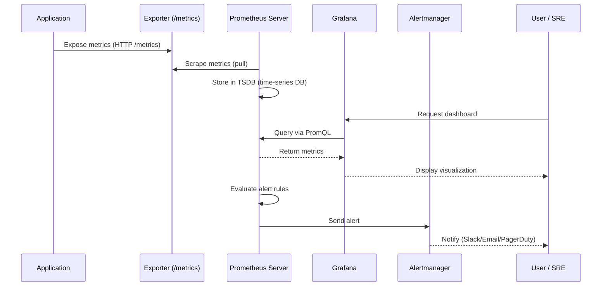
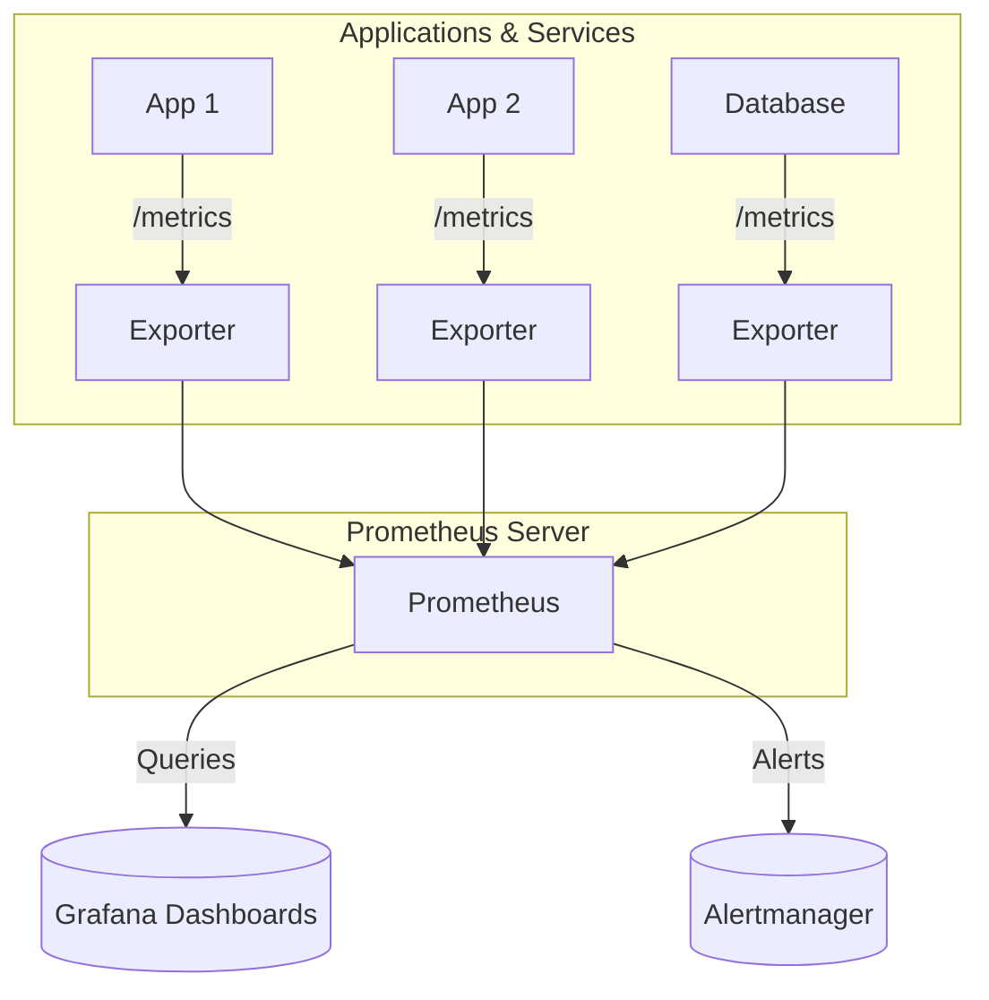
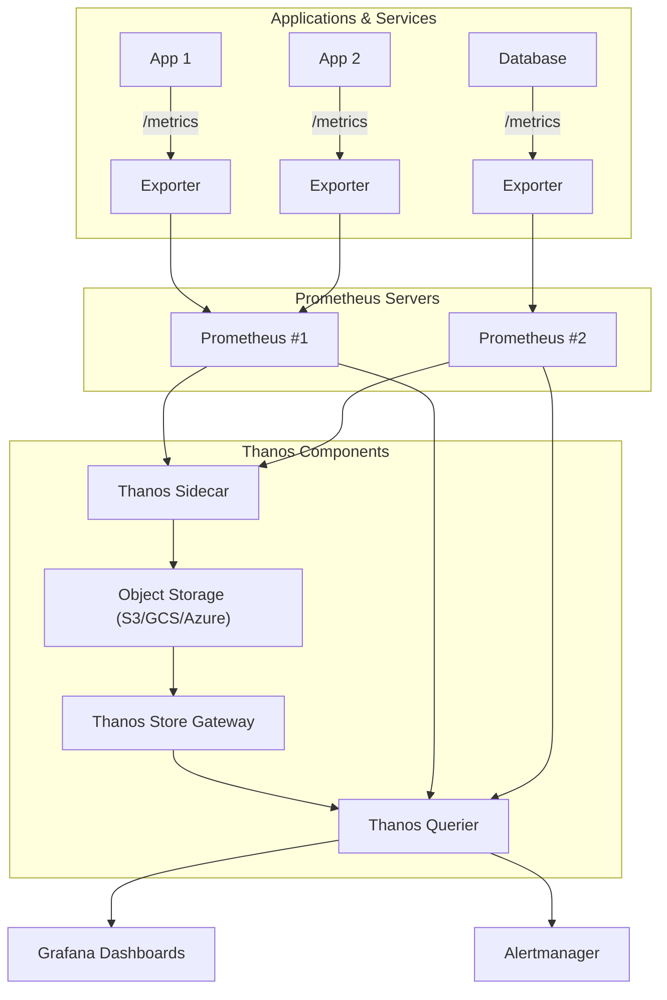

# What is Prometheus?

Prometheus is an **open-source monitoring and alerting toolkit** designed for **time-series data** (metrics with timestamps).
It was created at SoundCloud and is now a **CNCF graduated project** (same foundation as Kubernetes).

Prometheus has become the **de facto standard for monitoring in cloud-native environments**, especially with Kubernetes, due to its **scalability, flexibility, and ecosystem**.


## Why Do We Need Monitoring?

Modern systems are:

* **Distributed** (many services, microservices, containers).
* **Dynamic** (instances scale up and down).
* **Complex** (multiple dependencies, networks, storage).

Without monitoring, failures remain invisible until users complain.

Monitoring answers:

* Is my service **up**?
* How much **traffic** am I serving?
* Are we running into **errors, bottlenecks, or slowdowns**?
* When should we **scale**?

Monitoring data comes in three main forms (the “**three pillars of observability**”):

1. **Logs** → Event-based, detailed messages.
2. **Metrics** → Numeric measurements over time (cheap, efficient).
3. **Traces** → End-to-end request tracking.

Prometheus focuses on **metrics**.


## Time-Series Basics

A **time series** is a sequence of values recorded at successive points in time.
Example:

| Time  | Metric    | Value |
| -- |  | -- |
| 10:00 | CPU usage | 30%   |
| 10:01 | CPU usage | 32%   |
| 10:02 | CPU usage | 31%   |

Each metric in Prometheus is:

* **Metric name** → `http_requests_total`
* **Labels** (key-value pairs for context) → `{method="GET", status="200"}`
* **Timestamp + value**

This allows very powerful queries like:
“How many `GET` requests per second returned a `500` error in the last 5 minutes?”


## Video Introduction

<iframe width="7000" height="415" src="https://www.youtube-nocookie.com/embed/h4Sl21AKiDg?si=tg4ScT6Eq4yArrdx" title="YouTube video player" frameborder="0" allow="accelerometer; autoplay; clipboard-write; encrypted-media; gyroscope; picture-in-picture; web-share" referrerpolicy="strict-origin-when-cross-origin" allowfullscreen></iframe>


## How Prometheus Works

Prometheus is built around a **pull-based model**:

1. **Targets expose metrics** via HTTP (usually at `/metrics`).
2. Prometheus **scrapes metrics** at regular intervals.
3. Data is stored in its **own time-series database (TSDB)**.
4. Metrics can be queried using **PromQL (Prometheus Query Language)**.
5. **Alerting rules** can trigger alerts via **Alertmanager**.
6. For short-lived jobs, metrics can be pushed via **Pushgateway**.


### Architecture Overview

```text
          +-+
          |    Applications   |
          |  Export metrics   |
          +++
                    |
                    v
          +++
          |  Exporters        |   (e.g. node_exporter, redis_exporter)
          +++
                    |
                    v
          +++
          | Prometheus Server |   (scrapes, stores, queries data)
          +++
               |          |
         (alerts)    (queries)
               |          |
          +-v-+ +v+
          |Alertmgr | | Grafana|
          ++ +--+
```


## Metric Flow: From App → Prometheus → User



### Explanation of the Flow

1. **App** → exposes metrics (or uses an **exporter**).
2. **Prometheus** → regularly scrapes metrics via HTTP pull.
3. **Prometheus TSDB** → stores the metrics with timestamps.
4. **Grafana** → users query metrics with **PromQL** and visualise them.
5. **Alertmanager** → gets triggered if rules match (CPU > 90%, target down, etc.).
6. **User (SRE/DevOps)** → gets notified and investigates.


## Key Strengths of Prometheus

* **Standalone**: no external database required.
* **PromQL**: powerful and flexible query language for metrics.
* **Kubernetes-native**: integrates seamlessly with service discovery.
* **Ecosystem**: works with Grafana, Alertmanager, Pushgateway, Thanos, Cortex.
* **Scalable**: handles thousands of metrics and targets efficiently.


## Limitations & Watch Outs

* **Not ideal for long-term storage** → data retention is limited (usually weeks).
  → Solution: use **Thanos**, **Cortex**, or **Mimir**.

* **High cardinality** → too many unique label combinations can overwhelm memory.
  → Example: `user_id` as a label = millions of unique values.

* **Pull model challenges** → doesn’t fit well with:

  * Short-lived jobs (use Pushgateway).
  * Firewalled environments.

* **No built-in dashboards** → always paired with Grafana.


## PromQL — The Query Language

Prometheus comes with **PromQL (Prometheus Query Language)**, which lets you slice, dice, and aggregate metrics.
Think of it as SQL for time-series data.


### Selectors

```promql
http_requests_total
http_requests_total{job="api"}
up == 0
```

### Aggregations

```promql
sum(http_requests_total)
avg(http_requests_total)
max(http_requests_total)
min(http_requests_total)
count(http_requests_total)
sum by (job)(http_requests_total)
avg by (instance)(up)
```

### Rate & Increase

```promql
rate(http_requests_total[1m])
increase(http_requests_total[5m])
```

### Common Alert Conditions

```promql
rate(http_requests_total[5m]) > 100
node_memory_Active_bytes / node_memory_MemTotal_bytes > 0.9
up == 0
```


## Alerting with Prometheus + Alertmanager

Prometheus defines alert rules. When triggered, alerts are sent to **Alertmanager**, which handles:

* **Routing** (who should be notified?).
* **Silencing** (ignore alerts during maintenance).
* **Grouping** (combine related alerts).
* **Delivery** (email, Slack, PagerDuty, etc.).


### Example Alert Rule

```yaml
groups:
  - name: example.rules
    rules:
      - alert: HighCPUUsage
        expr: rate(process_cpu_seconds_total[1m]) > 0.85
        for: 2m
        labels:
          severity: critical
        annotations:
          summary: "High CPU usage on {{ $labels.instance }}"
          description: "CPU > 85% for 2 minutes."
```


## Metric Types in Prometheus

| Type        | Use For                                 | Example                                |
| -- |  | -- |
| `counter`   | Monotonically increasing values         | `http_requests_total` (total requests) |
| `gauge`     | Arbitrary values (up & down)            | `memory_usage_bytes`, `temperature_c`  |
| `histogram` | Buckets of observations (distribution)  | Request latency buckets                |
| `summary`   | Similar to histogram, client-calculated | Percentiles of request durations       |


## Common Exporters

Prometheus itself doesn’t know about your apps — exporters bridge the gap.

| Exporter             | Purpose                                  |
| -- | - |
| `node_exporter`      | Host/system metrics (CPU, memory, disk)  |
| `blackbox_exporter`  | Probes HTTP, TCP, DNS endpoints          |
| `postgres_exporter`  | PostgreSQL database metrics              |
| `redis_exporter`     | Redis performance metrics                |
| `nginx_exporter`     | Nginx server stats                       |
| `cadvisor`           | Container runtime (Docker, Kubernetes)   |
| `kube-state-metrics` | Kubernetes object states (Pods, Deploys) |


## Prometheus Configuration

Prometheus is configured using a **YAML file** (`prometheus.yml`).
The most important part is `scrape_configs`.

```yaml
scrape_configs:
  - job_name: 'django-app'
    static_configs:
      - targets: ['localhost:8001']
```

* `job_name`: Logical name for the service.
* `targets`: Endpoints exposing `/metrics`.


## Security Best Practices

Prometheus itself has minimal security features:

* Don’t expose Prometheus directly to the public internet.
* Put it behind a reverse proxy with authentication.
* Enable TLS for cross-network metrics.
* Avoid sensitive labels (`user_id`, `token`).
* Monitor Prometheus itself (`up`, `scrape_duration_seconds`).


## Scaling & Long-Term Storage

Prometheus is **single-node** by design. For large scale:

* **Thanos** → object storage for long-term retention.
* **Cortex** / **Mimir** → horizontally scalable, multi-tenant.
* **Federation** → aggregate across Prometheus servers.


## Comparison with Alternatives

| Tool       | Type           | Strengths                         | Weaknesses                |
| - | -- |  | - |
| Prometheus | Open-source    | CNCF standard, Kubernetes-native  | No long-term storage      |
| InfluxDB   | Time-series DB | SQL-like query (Flux), dashboards | Less Kubernetes-native    |
| Datadog    | SaaS           | Turnkey, integrations, great UI   | Expensive, vendor lock-in |
| New Relic  | SaaS APM       | Tracing + metrics + logs          | Cost, complexity          |
| Graphite   | Legacy OSS     | Simple, widely used historically  | Aging ecosystem           |


## Prometheus + Thanos Architecture

### Core Prometheus



### Prometheus with Thanos




## Final Takeaway

Prometheus is:

* **Simple** to start.
* **Powerful** with PromQL.
* **Scalable** with Thanos/Cortex.
* **Best choice** for Kubernetes and microservices monitoring.

