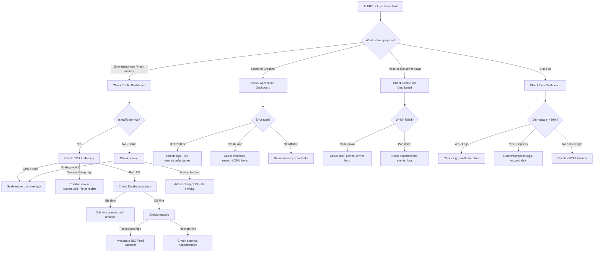

# 🧾 DevOps Dashboard Cheat Sheet

**How to read dashboards & diagnose issues like a pro**

---

## 🧩 The Big Picture — Why Dashboards Matter

Dashboards are not just “pretty graphs” — they answer **3 core questions**:

1. **Is it up?** → availability (can users access it?)
2. **Is it fast?** → performance (is it responsive?)
3. **Is it healthy?** → resource health (can it stay running?)

👉 Always think in terms of **symptoms → cause**.
For example: *“Website is slow” (symptom) → “database CPU 100%” (cause).*

---

## 🟢 Core Areas to Monitor

### 1. **CPU**

* **What to look for:**

  * `% usage` per core and overall.
  * Breakdown: **system**, **user**, **iowait**.
* **Rules of thumb:**

  * <70% sustained → healthy.
  * > 90% sustained → CPU bottleneck.
* **What it means:**

  * **High user CPU** → app code is working hard (expected under load).
  * **High system CPU** → kernel, syscalls, maybe networking overhead.
  * **High iowait** → CPU is waiting on disk/network → possible I/O bottleneck.
* **Actions:**

  * Add replicas / scale service.
  * Profile app (optimize queries, caching).
  * Investigate I/O subsystem if iowait high.

---

### 2. **Memory (RAM)**

* **What to look for:**

  * Total used vs total available.
  * Cache/buffers vs actual application usage.
  * Swap usage.
* **Rules of thumb:**

  * If memory is “full” but mostly cache → not a problem (Linux uses free RAM for caching).
  * If swap is active → real memory pressure.
* **What it means:**

  * **High app usage** → possible memory leak or undersized instance.
  * **High swap usage** → system thrashing, huge slowdown.
* **Actions:**

  * Restart leaking service.
  * Add more RAM.
  * Optimize memory-heavy queries.

---

### 3. **Disk / Storage**

* **Metrics:**

  * Disk usage %.
  * IOPS (reads/writes per second).
  * Latency (avg read/write ms).
* **Rules of thumb:**

  * > 80% disk full → plan cleanup/expansion.
  * Latency >20ms on SSDs → bottleneck.
* **What it means:**

  * High latency + high iowait → storage bottleneck.
  * High disk usage → risk of system crash when full.
* **Actions:**

  * Clear logs / rotate.
  * Scale to larger disks.
  * Use faster storage (NVMe, SSD).

---

### 4. **Network**

* **Metrics:**

  * Bandwidth in/out.
  * Packet drops/errors.
  * Latency / RTT.
* **Rules of thumb:**

  * Bandwidth near link limit (e.g. 1Gbps NIC at 950Mbps) → saturation.
  * Packet drops/errors >0 → network health issue.
* **What it means:**

  * High outbound traffic → app serving lots of data (normal or DDoS).
  * Latency spikes → congestion, routing problems.
* **Actions:**

  * Scale horizontally (more nodes).
  * Throttle heavy clients.
  * Investigate load balancer.

---

### 5. **Containers / Pods**

* **Metrics:**

  * CPU & memory per container.
  * Container restarts (counter).
  * Pod status (running, crashloop).
* **Red flags:**

  * Containers restarting repeatedly → crashloop, misconfiguration.
  * CPU/memory throttling in Kubernetes.
* **What it means:**

  * Misconfigured resource limits.
  * App bugs (OOMKilled, segfaults).
* **Actions:**

  * Check logs for container crash cause.
  * Adjust requests/limits in K8s.
  * Add replicas for load.

---

### 6. **Application Level**

* **Key metrics (the “Golden Signals” from Google SRE):**

  * **Latency** → how long requests take.
  * **Traffic** → requests per second.
  * **Errors** → % of failed requests.
  * **Saturation** → how “full” the system is (queues, memory).
* **Interpretation:**

  * High latency + high errors → app/service bottleneck.
  * High latency + low CPU/memory → external dependency issue.
  * High traffic spikes → expected? or DDoS?
* **Actions:**

  * Scale service horizontally.
  * Add caching layer.
  * Optimize slow queries.

---

### 7. **Databases**

* **Metrics:**

  * Query throughput (QPS).
  * Query latency.
  * Locks, deadlocks.
  * Buffer cache hit ratio.
* **Red flags:**

  * Slow queries → long latency spikes.
  * Lock waits → contention.
* **Actions:**

  * Add indexes.
  * Optimize queries.
  * Add read replicas.

---

### 8. **Logs & Events**

* Dashboards often link to logs (via Loki, ELK, etc.).
* Use them to confirm the *why* behind metrics.

---

## 🚨 Diagnosis by Symptom

| Symptom                  | Likely Cause                                      | Where to Look                   |
| ------------------------ | ------------------------------------------------- | ------------------------------- |
| High latency (slow site) | CPU/memory saturated, DB slow, network congestion | CPU, memory, DB dashboards      |
| Frequent 500 errors      | App crash, DB errors, bad config                  | App logs, DB metrics            |
| Nodes going down         | Out of memory, disk full, network partition       | Node exporter, disk usage       |
| Container restarts       | Misconfig, OOMKilled, bad healthcheck             | Container/pod dashboards        |
| Traffic spike            | Legit user load vs DDoS                           | Network + load balancer metrics |
| Disk full alerts         | Logs, data growth, temp files                     | Disk usage dashboard            |

---

## 🛠️ Method: How to Read a Dashboard Like a Pro

1. **Start broad → drill down**

   * Begin with system overview (CPU/mem/disk).
   * Narrow to container/pod → app → DB.
2. **Look for correlations**

   * High CPU at same time as latency spikes?
   * High iowait + disk latency → storage problem.
3. **Timeline matters**

   * Spikes vs sustained trends tell different stories.
4. **Always check for “innocent victims”**

   * If all pods restart at once → node issue, not app bug.

---

## 🎯 World-Class Habits

* Always correlate **metrics + logs**.
* Watch **rate of change**, not just absolute numbers (e.g., 10GB logs written/hour).
* Build mental models: *Traffic ↑ → CPU ↑ → Latency ↑* is expected. If not, dig deeper.
* Treat dashboards as **hypothesis tools**, not truth — confirm with logs, traces, configs.

---

## 🔑 TL;DR Cheatsheet

* **CPU >90% sustained** → bottleneck.
* **Memory + swap high** → thrashing.
* **Disk >80% full** → expand.
* **Disk latency >20ms (SSD)** → bottleneck.
* **Network drops/errors** → faulty NIC or congestion.
* **Container restarts** → crashloop (logs!).
* **Latency + errors** → app/db issue.
* **Traffic spike** → scale or DDoS check.

---

## 🧭 Troubleshooting Flow — From Alert → Root Cause

---

## 🧩 How to Use This Flow

1. **Start at the Symptom**

   * Alert: high latency, errors, disk full, pod restarts.
   * User complaint: “site is slow” / “app keeps crashing”.

2. **Pick the Path**

   * Latency → traffic → CPU/mem → DB → network.
   * Errors → logs → DB/app configs → containers.
   * Container down → check limits → healthchecks → logs.
   * Disk full → check log growth → cleanup → expand.

3. **Correlate Across Layers**

   * Example: high latency + high CPU = bottleneck.
   * Example: high latency + normal CPU/mem = likely DB or network.

---

## 📊 Key Dashboards to Check Along the Way

| Step          | Dashboard / Metric                       | What It Tells You                |
| ------------- | ---------------------------------------- | -------------------------------- |
| Traffic spike | Prometheus `http_requests_total`         | Is the load abnormal?            |
| CPU usage     | Node exporter `node_cpu_seconds_total`   | Is system CPU bound?             |
| Memory & Swap | Node exporter `node_memory_MemAvailable` | Is system thrashing?             |
| Containers    | cAdvisor / K8s pod metrics               | Is a pod OOMKilled or throttled? |
| DB latency    | postgres\_exporter / mysql\_exporter     | Are queries slow?                |
| Disk usage    | node\_exporter filesystem                | Disk nearly full?                |
| Disk I/O      | node\_disk\_read/write\_time             | Storage bottleneck?              |
| Network       | node\_network\_errors\_total             | NIC drops/retransmits?           |
| Logs          | Loki / ELK / `docker logs`               | The “why” behind the metrics.    |

---

## 🛠️ Example Walkthroughs with Flow

### Example 1: Slow Website

* Latency up → traffic spike.
* CPU at 95% → bottleneck.
* Fix: scale replicas from 3 → 6.

### Example 2: High Error Rate

* Errors are HTTP 500.
* Logs: “DB connection failed”.
* DB connections maxed.
* Fix: increase pool size, optimize queries.

### Example 3: Container Restarting

* Pod in CrashLoop.
* Container OOMKilled.
* Fix: raise memory limit, tune heap size.

### Example 4: Disk Full

* Disk usage 95%.
* `/var/log` growing fast.
* Fix: rotate logs, expand disk.

---

# 🎯 DevOps Mindset

* Always think in **layers**:
  **User → Load Balancer → App → DB → OS → Hardware/Network**.
* Use dashboards to narrow down *which layer is misbehaving*.
* Confirm with logs to know *why*.
* Fix immediate issue → plan long-term solution.

---

## 🛠️ Troubleshooting Examples with Dashboards

## 🔥 Scenario 1: Website is Slow (High Latency)

### Symptom:

* Users report: *“Site feels sluggish”*.
* Grafana shows latency rising above 2s.

### Step 1: Check Traffic

* **Dashboard:** Request rate (Prometheus `http_requests_total`).
* **Observation:** Traffic is 2× higher than normal.
* 👉 Spike in demand.

### Step 2: Check CPU

* **Dashboard:** Node exporter CPU usage.
* **Observation:** CPU at 95%.
* 👉 Server is CPU-bound.

### Step 3: Correlate with App

* **Dashboard:** Container resource usage (cAdvisor).
* **Observation:** The web app container is consuming most CPU.

### Likely Cause:

* Increased load → CPU saturated.

### Fix:

* Scale replicas from 3 → 6.
* Add caching (e.g., Cloudflare / Redis).

---

## 🔥 Scenario 2: High Error Rate (HTTP 500s)

### Symptom:

* Alert: *“5% of requests failing with 500 errors”*.

### Step 1: Check Application Logs

* **Dashboard link:** Loki/ELK.
* **Observation:** “DB connection failed: too many connections”.

### Step 2: Check Database Metrics

* **Dashboard:** PostgreSQL exporter.
* **Observation:** Connection count at max (100).

### Step 3: Check Query Latency

* **Observation:** Queries piling up, high wait time.

### Likely Cause:

* DB connection pool exhausted.

### Fix:

* Increase DB connection pool size.
* Optimize slow queries.
* Add a DB read replica if traffic keeps growing.

---

## 🔥 Scenario 3: Container Keeps Restarting

### Symptom:

* Alert: *“App container restarting repeatedly (CrashLoopBackOff)”*.

### Step 1: Check Container Restarts

* **Dashboard:** cAdvisor / Kubernetes pod metrics.
* **Observation:** Container restarted 12 times in 5 minutes.

### Step 2: Check Memory Usage

* **Observation:** Container hits memory limit (512MB), then OOMKilled.

### Step 3: Check Logs

* **Observation:** Java app error: “OutOfMemoryError: Java heap space”.

### Likely Cause:

* App exceeds container memory limits.

### Fix:

* Increase memory limit to 1GB.
* Tune JVM heap settings.
* Monitor for leaks.

---

## 🔥 Scenario 4: Disk Full

### Symptom:

* Alert: *“Disk usage > 90%”*.

### Step 1: Check Disk Usage

* **Dashboard:** Node exporter filesystem metrics.
* **Observation:** `/var/log` partition at 95%.

### Step 2: Drill Into Log Volume

* **Observation:** App logs growing at 1GB/hour.

### Step 3: Correlate With Traffic

* **Observation:** Error logs spiking with traffic surge.

### Likely Cause:

* App spamming logs due to repeated errors.

### Fix:

* Fix root cause of error.
* Rotate/compress logs.
* Increase disk size if needed.

---

## 🔥 Scenario 5: Network Latency Spikes

### Symptom:

* Alert: *“P95 latency > 500ms”*.

### Step 1: Check Network Dashboard

* **Observation:** High packet retransmits on one node.

### Step 2: Check Node Health

* **Observation:** NIC errors increasing.

### Step 3: Correlate With Service

* **Observation:** Only services on node-2 affected.

### Likely Cause:

* Faulty NIC or driver issue on node-2.

### Fix:

* Drain node-2 (`kubectl cordon node-2`).
* Replace or troubleshoot hardware.

---

## 🔥 Scenario 6: Prometheus Missing Metrics

### Symptom:

* Dashboard panel blank.

### Step 1: Check Prometheus Targets

* **Dashboard:** Prometheus `/targets` UI.
* **Observation:** Target `node-exporter:9100` is `DOWN`.

### Step 2: Check Service

* **Observation:** node-exporter container stopped.

### Step 3: Check Logs

* **Observation:** Error binding to port `9100`.

### Likely Cause:

* Port conflict or container crash.

### Fix:

* Restart node-exporter.
* Ensure no other process using 9100.

---

## 📊 Quick Troubleshooting Playbook

| Symptom            | Where to Look             | Common Causes                                    | Actions                                |
| ------------------ | ------------------------- | ------------------------------------------------ | -------------------------------------- |
| High latency       | CPU, DB latency           | CPU saturation, slow queries, network congestion | Scale out, add cache, optimize queries |
| High error rate    | Logs, app metrics         | DB pool exhausted, app crash, misconfig          | Fix DB, check app health               |
| Container restarts | Container metrics, logs   | OOMKilled, crashloop, bad healthcheck            | Increase limits, debug app             |
| Disk full          | Node exporter disk        | Log growth, data not rotated                     | Cleanup, rotate logs                   |
| Network drops      | NIC stats, node dashboard | Faulty NIC, congestion                           | Replace NIC, move workload             |
| Missing metrics    | Prometheus targets        | Exporter down, scrape failure                    | Restart exporter, fix config           |

---

✅ With this playbook:

* Start at **symptom** (latency, errors, restarts).
* Drill into **dashboards** (CPU/mem/disk/net/app).
* Correlate across **layers** (infra → container → app → DB).
* Confirm with **logs**.
* Apply **fix or scale**.

---