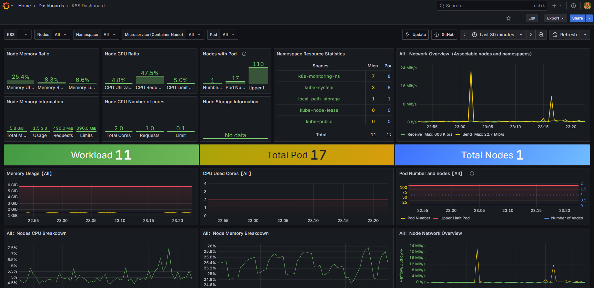
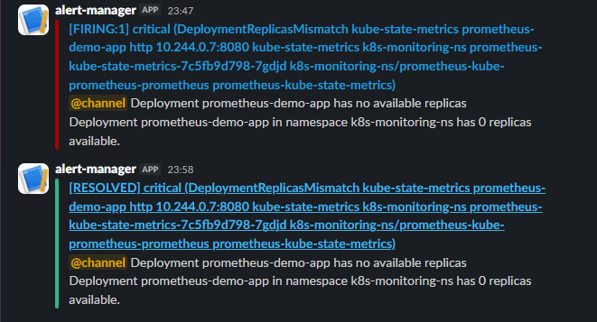
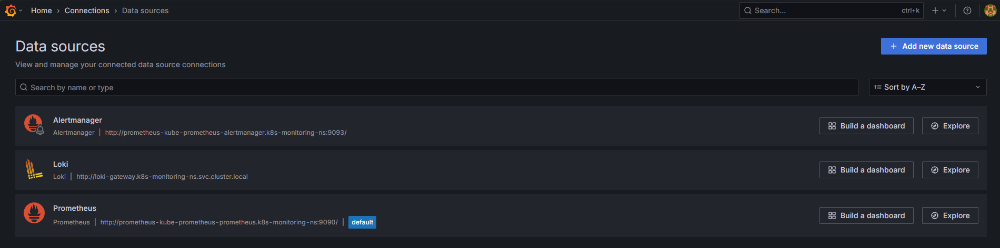
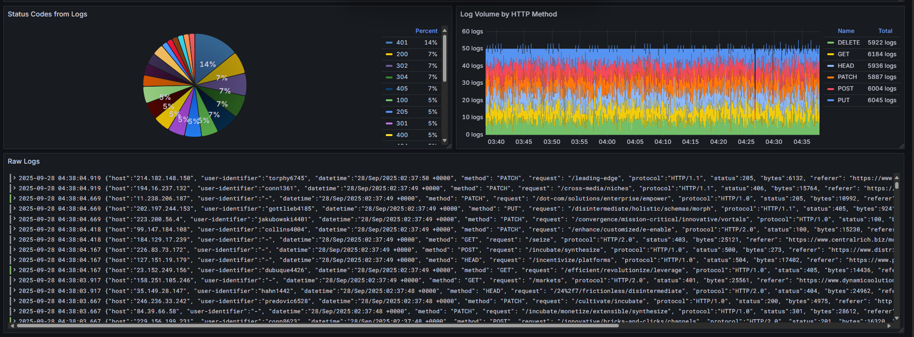

# Our Setup

By default kubernetes doesn't automatically ship cluster level metrics (deployments, pods, nodes, jobs) so we will have to deploy a **kube-state-metrics** container, which Exposes the **state of Kubernetes objects** (deployments, pods, nodes, jobs).

Every node should run a **node_exporter** as a **daemonSet** (pod that runs on every node in the cluster), such taht we won't need to remember to deploy one whenever we add a node to the cluster.

We will deploy **Prometheus** using **HELM**(a package manager for K8s) to make the process repeatable. The **Kube-Prometheus-Stack** HELM chart will be used. It makes use of the **Prometheus Operator**. A K8s operator is an application-specific controller that extends the K8s API to create/configure/manage instances of complex applications (the complete lifecycle for Prometheus in our case). 

The prometheus operator has several custom resources to aid the deployment and management of a Prometheues instance. (See Image below)


This makes life a lot easier as we will have a higher level abstraction of the underlying resources.

### Add the Chart

```bash
helm repo add prometheus-community https://prometheus-community.github.io/helm-charts

helm repo update

helm install prometheus prometheus-community/kube-prometheus-stack
#                 ^
#                 |
#    this name can be anything
```

We can edit the default configuratioin of the chart by editing the values:

```bash
helm show values prometheus-community/kube-prometheus-stack > prometheus-helm-values.yaml
# and after editing a value:
helm install prometheus prometheus-community/kube-prometheus-stack -f prometheus-helm-values.yaml
```

By default prometheus deploys the following:

```bash

NAME                                                         READY   STATUS    RESTARTS   AGE
pod/alertmanager-prometheus-kube-prometheus-alertmanager-0   2/2     Running   0          14m
pod/prometheus-grafana-674cf8cb44-l8479                      3/3     Running   0          14m
pod/prometheus-kube-prometheus-operator-6694cc948f-7xlh8     1/1     Running   0          14m
pod/prometheus-kube-state-metrics-7c5fb9d798-82n44           1/1     Running   0          14m
pod/prometheus-prometheus-kube-prometheus-prometheus-0       2/2     Running   0          14m
pod/prometheus-prometheus-node-exporter-zck8r                1/1     Running   0          14m

NAME                                              TYPE        CLUSTER-IP      EXTERNAL-IP   PORT(S)                      AGE
service/alertmanager-operated                     ClusterIP   None            <none>        9093/TCP,9094/TCP,9094/UDP   14m
service/prometheus-grafana                        ClusterIP   10.96.2.11      <none>        80/TCP                       14m
service/prometheus-kube-prometheus-alertmanager   ClusterIP   10.96.226.179   <none>        9093/TCP,8080/TCP            14m
service/prometheus-kube-prometheus-operator       ClusterIP   10.96.72.246    <none>        443/TCP                      14m
service/prometheus-kube-prometheus-prometheus     ClusterIP   10.96.37.230    <none>        9090/TCP,8080/TCP            14m
service/prometheus-kube-state-metrics             ClusterIP   10.96.112.1     <none>        8080/TCP                     14m
service/prometheus-operated                       ClusterIP   None            <none>        9090/TCP                     14m
service/prometheus-prometheus-node-exporter       ClusterIP   10.96.92.210    <none>        9100/TCP                     14m

NAME                                                 DESIRED   CURRENT   READY   UP-TO-DATE   AVAILABLE   NODE SELECTOR            AGE
daemonset.apps/prometheus-prometheus-node-exporter   1         1         1       1            1           kubernetes.io/os=linux   14m

NAME                                                  READY   UP-TO-DATE   AVAILABLE   AGE
deployment.apps/prometheus-grafana                    1/1     1            1           14m
deployment.apps/prometheus-kube-prometheus-operator   1/1     1            1           14m
deployment.apps/prometheus-kube-state-metrics         1/1     1            1           14m

NAME                                                             DESIRED   CURRENT   READY   AGE
replicaset.apps/prometheus-grafana-674cf8cb44                    1         1         1       14m
replicaset.apps/prometheus-kube-prometheus-operator-6694cc948f   1         1         1       14m
replicaset.apps/prometheus-kube-state-metrics-7c5fb9d798         1         1         1       14m

NAME                                                                    READY   AGE
statefulset.apps/alertmanager-prometheus-kube-prometheus-alertmanager   1/1     14m
statefulset.apps/prometheus-prometheus-kube-prometheus-prometheus       1/1     14m
```

Take note of a few things:

* All Services are of type **ClusterIP**.
* `deployment.apps/prometheus-grafana` - The chart also spins up a preconfigured **Grafana** instance.
* `deployment.apps/prometheus-kube-prometheus-operator` is the Prometheus operator we talked about.
* `deployment.apps/prometheus-kube-state-metrics` exposes object metrics (nodes, pods, deployments, jobs).
* `daemonset.apps/prometheus-prometheus-node-exporter` makes sure we have a node exporter on all modes.
* `pod/prometheus-prometheus-node-exporter-zck8r ` will be one per every node (we only have one node but if we had another we would have another e.g `pod/prometheus-prometheus-node-exporter-xntb2` )


### Connecting to Prometheus

We could setup an **Ingress** to access the prometheus service, but in this demo we will make use of port forwarding.

`kubectl port-forward` works for **both Pods and Services**

* **Pod:**
  You can forward directly to a Pod by its name:

  ```bash
  kubectl port-forward pod/my-pod 8080:80
  ```

  This connects your local port `8080` to port `80` inside the Pod.

* **Service:**
  You can also forward to a Service:

  ```bash
  kubectl port-forward svc/my-service 8080:80
  ```

  In this case, `kubectl` resolves the Service to one of its backing Pods and forwards traffic to it. (It doesn’t load-balance across Pods — just picks one.)

So:

* Pod = direct connection to that Pod.
* Service = convenience, so you don’t need to look up Pod names.

---

So we run:

```bash
kubectl get service
# then port forward the Prometheus service
kubectl port-forward svc/prometheus-kube-prometheus-prometheus 9090
```

### Deploying the application instance

We placed our `demo_app_deployment.yaml` and `demo_app_svc.yaml` in the `k8s` folder then ran:

```bash
kubectl create -f k8s/ # creates 2 pods and a service
# Followed up with:
task status
```

Nice, the app is now running in our cluster.

We will have to setup additional prometheus configs so that the app can be scrapped by prometheus.

The recommended way to set up monitoring in this stack, is to make use of **Service Monitors**.

### Setup App Metrics Scrapping

A **Service Monitor** defines a set of targets for prometheus to monitor and scrape.

That way we avoid touching the default configs directly, instead we will be using the CRD to append new targets for Prometheus to scrape.

A service monitor points to a **Service**.

   

The `service-monitor.yaml` file is added alongside the app deployment files in the `k8s/` folder.

```bash
task apply-app
# then
kubectl get servicemonitor # to confirm if our service monitor is deployed
# output:
NAME                                                 AGE
prometheus-demo-app-svc-monitor                      2m13s
```

Also confirm in the Prometheus web app at `/targets`:


You can also query `{job="prometheus-demo-app-svc"}`:


### Adding Rules

Prometheus also has a CRD for handling rules named `prometheusrule`.


The `prometheusrules.yaml` file is added alongside the app deployment files in the `k8s/` folder.

```bash
task apply-app
# then
kubectl get prometheusrule # to confirm if our service monitor is deployed
# output:
NAME                                                              AGE
prometheus-demo-app-rules                                         60s
```

Also confirm in the Prometheus web app at `/rules`:


### Adding Alert Manager Rules

First we need to note an important point when it comes to specifying custom values.yaml

Helm merges your custom `values.yaml` with the chart’s default values.  
It uses a **deep merge**, so you must preserve the full key path when overriding values.  

- If you only define part of the path, Helm will ignore it.  
- You must follow the parent hierarchy exactly as defined in the chart’s `values.yaml`.  
- Always check the chart’s defaults with:  

```bash
  helm show values <chart>
```

If you try to set this at the root:

```yaml
alertmanagerConfigSelector:
  matchLabels:
    resource: prometheus
```

…it will fail, because `alertmanagerConfigSelector` is **not** a root key.

In the **kube-prometheus-stack** chart, the correct path is under `prometheus.prometheusSpec`:

```yaml
prometheus:
  prometheusSpec:
    alertmanagerConfigSelector:
      matchLabels:
        resource: prometheus
```

* Helm only overrides keys at the correct hierarchy.
* Wrong placement = no effect.
* Always trace the full path from the chart’s default `values.yaml`.

### Continuing with our setup

Prometheus also has a CRD for handling alert manager rules named `AlertmangerConfig`.


By default this selector is not in prometheus' `values.yaml` so we have to add it.

```bash
task prom-helm-values
```

Then search for `alertmanagerConfigSelector`, copy the snippet and save in a custom values file as `k8s/prometheus-helm-values.yaml`:

```yaml
alertmanagerConfigSelector:
  matchLabels:
    resource: prometheus
```

Then apply:

```bash
task helm-upgrade-prom
```


The `alertmanager-config.yaml` file is added alongside the app deployment files in the `k8s/` folder.

```bash
task apply-app
# then
kubectl get alertmanagers.monitoring.coreos.com -o yaml # to confirm if our service monitor is deployed
# output:
# serach for:
...
    alertmanagerConfigSelector:
      matchLabels:
        resource: prometheus
...
# and
kubectl get alertmanagerconfig
# output:
NAME                               AGE
prometheus-demo-app-alert-config   7m59s
# then:
task port-fwd-alertm
# and visit /localhost:9093
```

!!!tip 
    When port fowarding, the port number is always the one exposed by the service or Pod or you can specify as `HOST:SVC/POD`

Also confirm in the Prometheus web app at `/rules`:


### Grafana Dashboards

The Helm chart already has pre-configured dashboards.

We port forward the Grafana UI:

```bash
task port-fwd-graf
```

!!!tip 
    When port fowarding, the port number is always the one exposed by the service or Pod or you can specify as `HOST:SVC/POD`

We then add other dashboards namely: `15661`.



We can also add instrumentation for our app and add to prometheus scrape config and also add relevant dashboards.

This confirms our setup is complete !

```bash
> task status
task: [status] kubectl get all -n k8s-monitoring-ns
[status] NAME                                                         READY   STATUS    RESTARTS      AGE
[status] pod/alertmanager-prometheus-kube-prometheus-alertmanager-0   2/2     Running   2 (58m ago)   116m
[status] pod/prometheus-demo-app-794dc7c997-bz9fp                     1/1     Running   1 (58m ago)   107m
[status] pod/prometheus-demo-app-794dc7c997-g4275                     1/1     Running   1 (58m ago)   107m
[status] pod/prometheus-grafana-674cf8cb44-v8vlb                      3/3     Running   3 (58m ago)   117m
[status] pod/prometheus-kube-prometheus-operator-7984bfd549-g9gnx     1/1     Running   2 (57m ago)   117m
[status] pod/prometheus-kube-state-metrics-7c5fb9d798-xwdpq           1/1     Running   2 (57m ago)   117m
[status] pod/prometheus-prometheus-kube-prometheus-prometheus-0       2/2     Running   2 (58m ago)   116m
[status] pod/prometheus-prometheus-node-exporter-scsd8                1/1     Running   1 (58m ago)   117m
[status]
[status] NAME                                              TYPE        CLUSTER-IP      EXTERNAL-IP   PORT(S)                      AGE
[status] service/alertmanager-operated                     ClusterIP   None            <none>        9093/TCP,9094/TCP,9094/UDP   116m
[status] service/prometheus-demo-app-svc                   ClusterIP   10.96.139.140   <none>        3000/TCP                     107m
[status] service/prometheus-grafana                        ClusterIP   10.96.199.255   <none>        80/TCP                       117m
[status] service/prometheus-kube-prometheus-alertmanager   ClusterIP   10.96.210.241   <none>        9093/TCP,8080/TCP            117m
[status] service/prometheus-kube-prometheus-operator       ClusterIP   10.96.75.79     <none>        443/TCP                      117m
[status] service/prometheus-kube-prometheus-prometheus     ClusterIP   10.96.219.164   <none>        9090/TCP,8080/TCP            117m
[status] service/prometheus-kube-state-metrics             ClusterIP   10.96.12.61     <none>        8080/TCP                     117m
[status] service/prometheus-operated                       ClusterIP   None            <none>        9090/TCP                     116m
[status] service/prometheus-prometheus-node-exporter       ClusterIP   10.96.96.156    <none>        9100/TCP                     117m
[status]
[status] NAME                                                 DESIRED   CURRENT   READY   UP-TO-DATE   AVAILABLE   NODE SELECTOR            AGE
[status] daemonset.apps/prometheus-prometheus-node-exporter   1         1         1       1            1           kubernetes.io/os=linux   117m
[status]
[status] NAME                                                  READY   UP-TO-DATE   AVAILABLE   AGE
[status] deployment.apps/prometheus-demo-app                   2/2     2            2           107m
[status] deployment.apps/prometheus-grafana                    1/1     1            1           117m
[status] deployment.apps/prometheus-kube-prometheus-operator   1/1     1            1           117m
[status] deployment.apps/prometheus-kube-state-metrics         1/1     1            1           117m
[status]
[status] NAME                                                             DESIRED   CURRENT   READY   AGE
[status] replicaset.apps/prometheus-demo-app-794dc7c997                   2         2         2       107m
[status] replicaset.apps/prometheus-grafana-674cf8cb44                    1         1         1       117m
[status] replicaset.apps/prometheus-kube-prometheus-operator-7984bfd549   1         1         1       117m
[status] replicaset.apps/prometheus-kube-state-metrics-7c5fb9d798         1         1         1       117m
[status]
[status] NAME                                                                    READY   AGE
[status] statefulset.apps/alertmanager-prometheus-kube-prometheus-alertmanager   1/1     116m
[status] statefulset.apps/prometheus-prometheus-kube-prometheus-prometheus       1/1     116m
```

---

### Setting up AlertManager with Slack

First head to [api.slack.com/apps](https://api.slack.com/apps)

Add a new app named `alert-manager` and add it to a workspace.

We already have a workspace named [devopssean](https://app.slack.com/client/T096B2LBJKY). 

in the features, enable an **Incoming Webhook** and select the channel to post to. In our case we have the [alert-manager channel.](https://app.slack.com/client/T096B2LBJKY/C09H1M75UG3)

!!! info
    Incoming webhooks are a simple way to post messages from external sources into Slack. They make use of normal HTTP requests with a JSON payload, which includes the message and a few other optional details. You can include message attachments to display richly-formatted messages.

    Adding incoming webhooks requires a bot user. If your app doesn't have a bot user, slack will add one for you.

    Each time your app is installed, a new Webhook URL will be generated.

If you want to test intergration run the curl command in the UI inside your terminal e.g:

```bash
curl -X POST -H 'Content-type: application/json' --data '{"text":"Alert Manager Curl Test!"}' <slack-channel-webhook>
```

Take note of the webhook URL.

We add that to the alertmanager-config.yaml under a slackConfig receiver, as raw string or more preferrably as a Secret.

In this demo we use a plain string secret.

To test the alert, shutdown the app instance by either deleting the whole thing or scaling the app's deployment down to 0 pods and then check the slack channel.



### Set up Loki

We wan't Logs for our application to also be shown in Grafana dashboards.

It will make it easier to diagonise spikes and dips in resource usage metrics.

Loki is part of the **Grafana Helm chart**. 

```bash
helm repo add grafana https://grafana.github.io/helm-charts
helm repo update
```

We then save a custom values to the `k8s/values` directory.

We only specify the sections we need to change.

* We chose `deployment: SingleBinary` because it deploys every single component that loki needs as a single binary. This deploymentonly allows a loki to process a few gigabytes of logs a day whilst others result in Terrabytes albeit with a much more complex deployment. The deployyment mode should always match the environment that you the cluster operates.
* Write, read and backend replicas are set to 0 as we only have a single deployment
* Storage is set to filesystem instead of a cloud storage option.
* Disabled caching and helm testing

```bash
kubens k8s-monitoring-ns
helm install loki grafana/loki -f k8s/values/graf-helm-values.yaml
```

!!! info
    During  `helm install`, it's important to always state the version of helm chart that you are using by making use of the `--version` flag. A repeatable way is to use a tool like `Terraform`

These are the current versions of the charts we used in this tutorial:

```bash
NAME           CHART                            APP VERSION
loki           loki-6.41.1                      3.5.5
prometheus     kube-prometheus-stack-77.11.1    v0.85.0
```

We then include a grafana section in the prometheus values file in the `k8s/values` directory, to include an additional data source named loki.

We apply the changes.

```bash
task helm-upgrade-all
```

Inside the grafana UI we head to the data sources section to confirm that loki is there.



### Generating Logs

We can make use of a fake log generator container `mingrammer/flog`.

In the repository we also have a Application deployment in `k8s/fake-logs.yaml` coupled with the fake log generator outputting the logs to a **PVC**, a promtail log collector mounted to the same **PVC** and a configMap to then send those over to loki.

For **testing on a single-node cluster**, this manifest is okay. It will:

* Generate fake JSON logs into a shared PVC.
* Have Promtail tail the log file, parse JSON, and push entries to Loki.
* Attach `http_method` and `http_status` as labels.
* Use an ephemeral `emptyDir` for positions, good enough for short tests.

Caveats you accept when testing this way:

* **Not production-ready**: multiple replicas or nodes will break because of the RWO PVC.
* **Data replay**: if Promtail restarts, it replays logs since positions are not persisted to durable storage.
* **Log source unrealistic**: real apps log to `stdout`, not a shared file.
* **Performance**: flog will generate constant noise. That’s fine for load testing Loki, not for validating app-level observability.

So: for verifying that your stack is wired correctly (Promtail → Loki → Grafana queries), this setup is good enough.

### Visualising in Grafana

We then import the `grafana/dashboards/fake-logs-dashboard.json` file to visualise in grafana.



And with that done, so is our setup !

---

