# Setting Things 

Let’s dive into setting up this monitoring stack on Kubernetes, step by step.

---

## 🛠 3 Ways to Monitor Your App in Kubernetes

### 1. **Basic container & node monitoring (built-in)**

Kubernetes already integrates with:

* **kubelet/cAdvisor** → container & pod-level resource usage (CPU, memory, network, filesystem).
* **Node Exporter** → node-level OS metrics.

✅ If you deploy Prometheus (via Helm or the Operator), these metrics are automatically discovered and scraped — no extra setup required.

---

### 2. **App-specific exporters (most common in K8s)**

Many apps expose metrics directly, or you deploy an **exporter sidecar or Service**:

* **Nginx** → [nginx-prometheus-exporter](https://github.com/nginxinc/nginx-prometheus-exporter)
* **Postgres** → [postgres\_exporter](https://github.com/prometheus-community/postgres_exporter)
* **MySQL** → [mysqld\_exporter](https://github.com/prometheus/mysqld_exporter)
* **Redis** → [redis\_exporter](https://github.com/oliver006/redis_exporter)

📌 Example: **Nginx Exporter Deployment**

```yaml
apiVersion: apps/v1
kind: Deployment
metadata:
  name: nginx
spec:
  replicas: 1
  selector:
    matchLabels:
      app: nginx
  template:
    metadata:
      labels:
        app: nginx
    spec:
      containers:
      - name: nginx
        image: nginx:latest
        ports:
        - containerPort: 80
      - name: nginx-exporter
        image: nginx/nginx-prometheus-exporter:0.11.0
        args:
          - -nginx.scrape-uri=http://127.0.0.1:80/stub_status
        ports:
        - containerPort: 9113
---
apiVersion: monitoring.coreos.com/v1
kind: ServiceMonitor
metadata:
  name: nginx-exporter
spec:
  selector:
    matchLabels:
      app: nginx
  endpoints:
  - port: 9113
```

The `ServiceMonitor` CRD (from the Prometheus Operator) ensures Prometheus automatically discovers and scrapes the exporter.

To list all available CRDs use:

```bash
kubectl get crd
```


---

### 3. **Custom metrics (for apps you write)**

If you’re building your own application, you can instrument it with OpenTelemetry or a Prometheus client library:

* Go → [prometheus/client\_golang](https://github.com/prometheus/client_golang)
* Python → [prometheus\_client](https://github.com/prometheus/client_python)
* Node.js → [prom-client](https://github.com/siimon/prom-client)

📌 Example: Python Flask app exposing `/metrics`

```python
from flask import Flask
from prometheus_client import Counter, generate_latest

app = Flask(__name__)
requests_total = Counter('app_requests_total', 'Total requests')

@app.route('/')
def hello():
    requests_total.inc()
    return "Hello, Kubernetes!"

@app.route('/metrics')
def metrics():
    return generate_latest(), 200, {'Content-Type': 'text/plain'}
```

Deploy the app with a Kubernetes `Deployment` and expose `/metrics`. Then define a `ServiceMonitor` to let Prometheus scrape it.

---

## 📌 Summary

* ✅ **Infra metrics** → kubelet/cAdvisor + Node Exporter.
* ✅ **App metrics** → Exporters (Nginx, DBs, etc.) or custom instrumentation.
* ✅ Prometheus scrapes everything; Grafana dashboards visualize it.

---

## 🔎 What OpenTelemetry Adds

* **Instrumentation SDKs** → for Go, Python, Java, Node.js, .NET, etc.
* Collects **application metrics**, **traces**, and optionally **logs**.
* Works via an **OpenTelemetry Collector** deployed as:

  * A **sidecar** (per pod)
  * A **DaemonSet** (per node)
  * A **Deployment** (central collector)

Backends supported:

* Prometheus (metrics)
* Jaeger / Tempo (traces)
* Loki / ELK (logs)
* Grafana Cloud or OTLP-compatible vendors

---

## 🛠 How It Works in Kubernetes

Right now you likely have:

* **Prometheus + Grafana** → metrics + visualization
* **kubelet/cAdvisor + Node Exporter** → infra metrics

If you add **OpenTelemetry for your app**:

1. Instrument your code with the OTel SDK.
2. Deploy an **OpenTelemetry Collector** (Deployment or DaemonSet).
3. Configure it to export metrics in Prometheus format (scrapable endpoint).

---

## ⚡ Example: OTel Collector in Kubernetes

📌 Deploy the collector:

```yaml
apiVersion: apps/v1
kind: Deployment
metadata:
  name: otel-collector
spec:
  replicas: 1
  selector:
    matchLabels:
      app: otel-collector
  template:
    metadata:
      labels:
        app: otel-collector
    spec:
      containers:
      - name: otel-collector
        image: otel/opentelemetry-collector-contrib:0.95.0
        args: ["--config=/etc/otel/otel-collector-config.yaml"]
        volumeMounts:
        - name: config
          mountPath: /etc/otel
      volumes:
      - name: config
        configMap:
          name: otel-collector-config
---
apiVersion: v1
kind: ConfigMap
metadata:
  name: otel-collector-config
data:
  otel-collector-config.yaml: |
    receivers:
      otlp:
        protocols:
          grpc:
          http:

    exporters:
      prometheus:
        endpoint: "0.0.0.0:9464"

    service:
      pipelines:
        metrics:
          receivers: [otlp]
          exporters: [prometheus]
---
apiVersion: monitoring.coreos.com/v1
kind: ServiceMonitor
metadata:
  name: otel-collector
spec:
  selector:
    matchLabels:
      app: otel-collector
  endpoints:
  - port: 9464
```

Now:

* Your app sends OTLP data to the Collector (`4317/4318`).
* The Collector exposes Prometheus metrics on `:9464`.
* Prometheus scrapes them via the `ServiceMonitor`.

---

## ✅ Why OTel is a Good Idea in Kubernetes

* **Cloud-native standard** → portable across Prometheus, Grafana, Jaeger, Tempo, etc.
* **Future-proof** → works with managed observability platforms (Datadog, New Relic, Grafana Cloud, etc.).
* **Full observability** → unifies **metrics, traces, and logs**, not just CPU/memory.

---

## Our Setup

By default kubernetes doesn't automatically ship cluster level metrics (deployments, pods, nodes, jobs) so we will have to deploy a **kube-state-metrics** container, which Exposes the **state of Kubernetes objects** (deployments, pods, nodes, jobs).

Every node should run a **node_exporter** as a **daemonSet** (pod that runs on every node in the cluster), such taht we won't need to remember to deploy one whenever we add a node to the cluster.

We will deploy **Prometheus** using **HELM**(a package manager for K8s) to make the process repeatable. The **Kube-Prometheus-Stack** HELM chart will be used. It makes use of the **Prometheus Operator**. A K8s operator is an application-specific controller that extends the K8s API to create/configure/manage instances of complex applications (the complete lifecycle for Prometheus in our case). 

The prometheus operator has several custom resources to aid the deployment and management of a Prometheues instance. (See Image below)

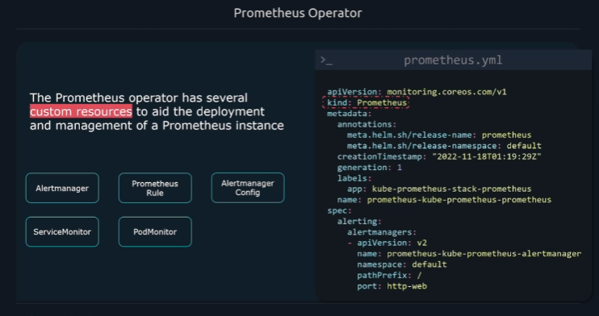

This makes life a lot easier as we will have a higher level abstraction of the underlying resources.

### Add the Chart

```bash
helm repo add prometheus-community https://prometheus-community.github.io/helm-charts

helm repo update

helm install prometheus prometheus-community/kube-prometheus-stack
#                 ^
#                 |
#    this name can be anything
```

We can edit the default configuratioin of the chart by editing the values:

```bash
helm show values prometheus-community/kube-prometheus-stack > prometheus-helm-values.yaml
# and after editing a value:
helm install prometheus prometheus-community/kube-prometheus-stack -f prometheus-helm-values.yaml
```

By default prometheus deploys the following:

```bash

NAME                                                         READY   STATUS    RESTARTS   AGE
pod/alertmanager-prometheus-kube-prometheus-alertmanager-0   2/2     Running   0          14m
pod/prometheus-grafana-674cf8cb44-l8479                      3/3     Running   0          14m
pod/prometheus-kube-prometheus-operator-6694cc948f-7xlh8     1/1     Running   0          14m
pod/prometheus-kube-state-metrics-7c5fb9d798-82n44           1/1     Running   0          14m
pod/prometheus-prometheus-kube-prometheus-prometheus-0       2/2     Running   0          14m
pod/prometheus-prometheus-node-exporter-zck8r                1/1     Running   0          14m

NAME                                              TYPE        CLUSTER-IP      EXTERNAL-IP   PORT(S)                      AGE
service/alertmanager-operated                     ClusterIP   None            <none>        9093/TCP,9094/TCP,9094/UDP   14m
service/prometheus-grafana                        ClusterIP   10.96.2.11      <none>        80/TCP                       14m
service/prometheus-kube-prometheus-alertmanager   ClusterIP   10.96.226.179   <none>        9093/TCP,8080/TCP            14m
service/prometheus-kube-prometheus-operator       ClusterIP   10.96.72.246    <none>        443/TCP                      14m
service/prometheus-kube-prometheus-prometheus     ClusterIP   10.96.37.230    <none>        9090/TCP,8080/TCP            14m
service/prometheus-kube-state-metrics             ClusterIP   10.96.112.1     <none>        8080/TCP                     14m
service/prometheus-operated                       ClusterIP   None            <none>        9090/TCP                     14m
service/prometheus-prometheus-node-exporter       ClusterIP   10.96.92.210    <none>        9100/TCP                     14m

NAME                                                 DESIRED   CURRENT   READY   UP-TO-DATE   AVAILABLE   NODE SELECTOR            AGE
daemonset.apps/prometheus-prometheus-node-exporter   1         1         1       1            1           kubernetes.io/os=linux   14m

NAME                                                  READY   UP-TO-DATE   AVAILABLE   AGE
deployment.apps/prometheus-grafana                    1/1     1            1           14m
deployment.apps/prometheus-kube-prometheus-operator   1/1     1            1           14m
deployment.apps/prometheus-kube-state-metrics         1/1     1            1           14m

NAME                                                             DESIRED   CURRENT   READY   AGE
replicaset.apps/prometheus-grafana-674cf8cb44                    1         1         1       14m
replicaset.apps/prometheus-kube-prometheus-operator-6694cc948f   1         1         1       14m
replicaset.apps/prometheus-kube-state-metrics-7c5fb9d798         1         1         1       14m

NAME                                                                    READY   AGE
statefulset.apps/alertmanager-prometheus-kube-prometheus-alertmanager   1/1     14m
statefulset.apps/prometheus-prometheus-kube-prometheus-prometheus       1/1     14m
```

Take note of a few things:

* All Services are of type **ClusterIP**.
* `deployment.apps/prometheus-grafana` - The chart also spins up a preconfigured **Grafana** instance.
* `deployment.apps/prometheus-kube-prometheus-operator` is the Prometheus operator we talked about.
* `deployment.apps/prometheus-kube-state-metrics` exposes object metrics (nodes, pods, deployments, jobs).
* `daemonset.apps/prometheus-prometheus-node-exporter` makes sure we have a node exporter on all modes.
* `pod/prometheus-prometheus-node-exporter-zck8r ` will be one per every node (we only have one node but if we had another we would have another e.g `pod/prometheus-prometheus-node-exporter-xntb2` )


### Connecting to Prometheus

We could setup an **Ingress** to access the prometheus service, but in this demo we will make use of port forwarding.

`kubectl port-forward` works for **both Pods and Services**

* **Pod:**
  You can forward directly to a Pod by its name:

  ```bash
  kubectl port-forward pod/my-pod 8080:80
  ```

  This connects your local port `8080` to port `80` inside the Pod.

* **Service:**
  You can also forward to a Service:

  ```bash
  kubectl port-forward svc/my-service 8080:80
  ```

  In this case, `kubectl` resolves the Service to one of its backing Pods and forwards traffic to it. (It doesn’t load-balance across Pods — just picks one.)

So:

* Pod = direct connection to that Pod.
* Service = convenience, so you don’t need to look up Pod names.

---

So we run:

```bash
kubectl get service
# then port forward the Prometheus service
kubectl port-forward svc/prometheus-kube-prometheus-prometheus 9090
```

### Deploying the application instance

We placed our `demo_app_deployment.yaml` and `demo_app_svc.yaml` in the `k8s` folder then ran:

```bash
kubectl create -f k8s/ # creates 2 pods and a service
# Followed up with:
task status
```

Nice, the app is now running in our cluster.

We will have to setup additional prometheus configs so that the app can be scrapped by prometheus.

The recommended way to set up monitoring in this stack, is to make use of **Service Monitors**.

### Setup App Metrics Scrapping

A **Service Monitor** defines a set of targets for prometheus to monitor and scrape.

That way we avoid touching the default configs directly, instead we will be using the CRD to append new targets for Prometheus to scrape.

A service monitor points to a **Service**.

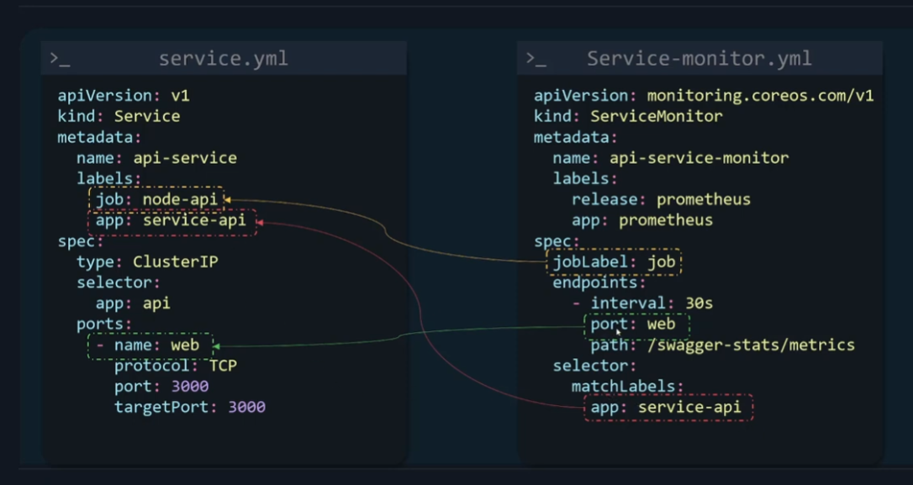 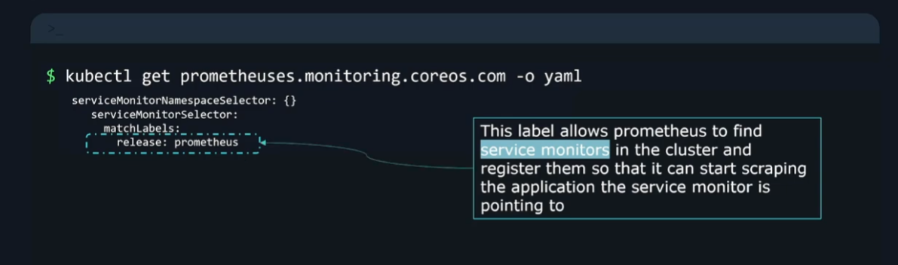  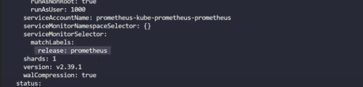

The `service-monitor.yaml` file is added alongside the app deployment files in the `k8s/` folder.

```bash
task apply-app
# then
kubectl get servicemonitor # to confirm if our service monitor is deployed
# output:
NAME                                                 AGE
prometheus-demo-app-svc-monitor                      2m13s
```

Also confirm in the Prometheus web app at `/targets`:

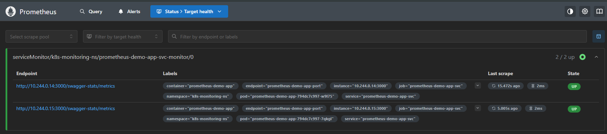

You can also query `{job="prometheus-demo-app-svc"}`:

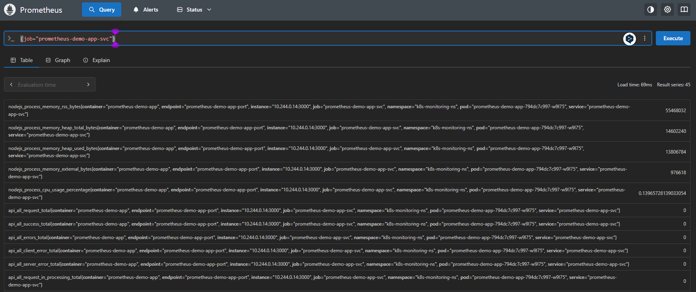

### Adding Rules

Prometheus also has a CRD for handling rules named `prometheusrule`.


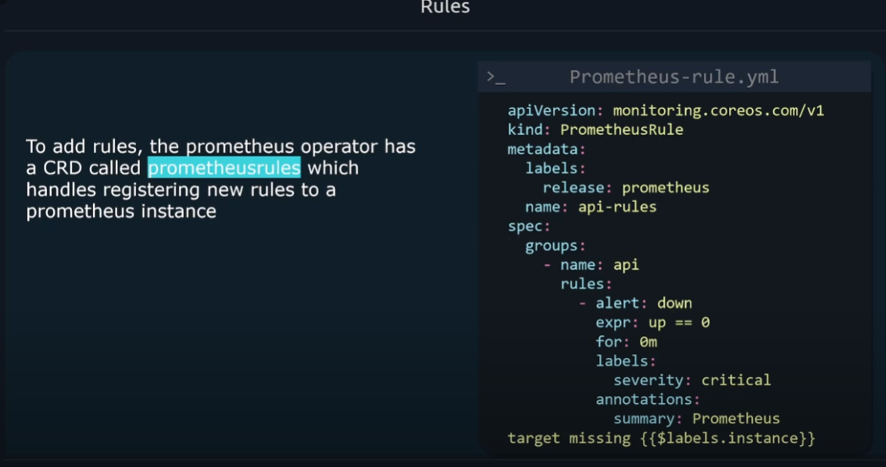

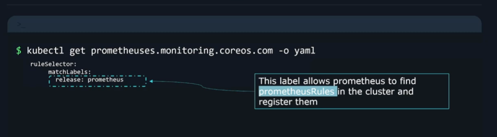

The `prometheusrules.yaml` file is added alongside the app deployment files in the `k8s/` folder.

```bash
task apply-app
# then
kubectl get prometheusrule # to confirm if our service monitor is deployed
# output:
NAME                                                              AGE
prometheus-demo-app-rules                                         60s
```

Also confirm in the Prometheus web app at `/rules`:

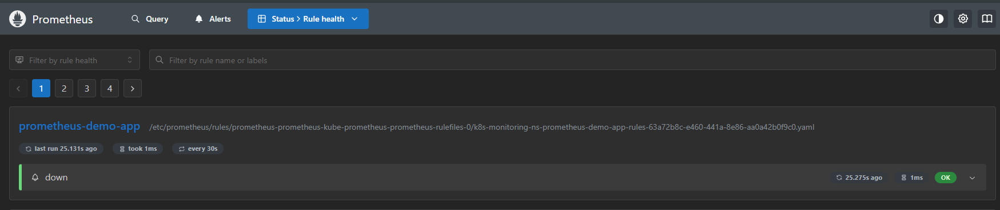

### Adding Alert Manager Rules

Prometheus also has a CRD for handling alert manager rules named `AlertmangerConfig`.

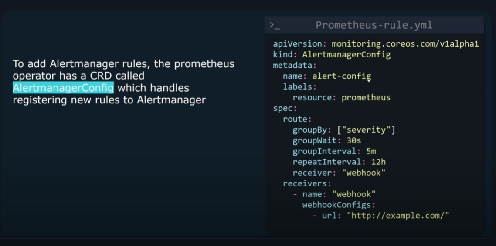

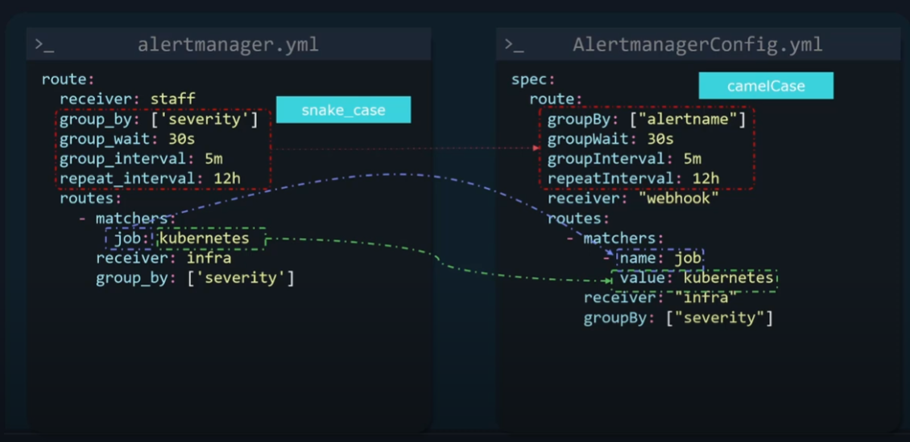

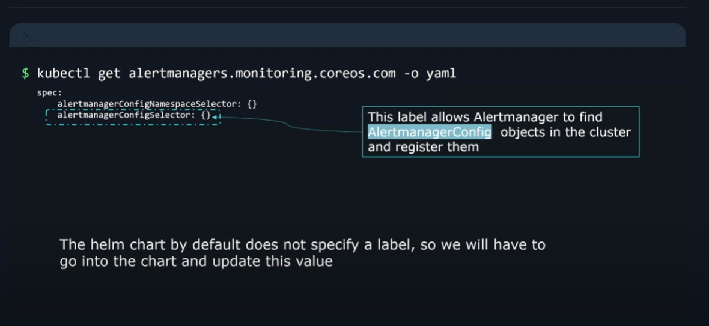

By default this selector is not in prometheus' `values.yaml` so we have to add it.

```bash
task prom-helm-values
```

Then edit the following:

```yaml
alertmanagerConfigSelector:
  matchLabels:
    resource: prometheus
```

Then apply:

```bash
task helm-upgrade-prom
```

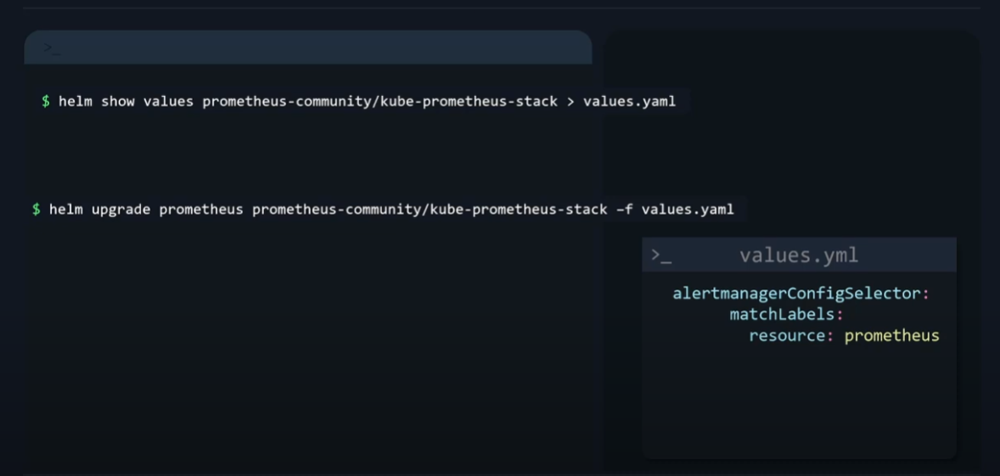

The `alertmanager-config.yaml` file is added alongside the app deployment files in the `k8s/` folder.

```bash
task apply-app
# then
kubectl get alertmanagers.monitoring.coreos.com -o yaml # to confirm if our service monitor is deployed
# output:
# serach for:
...
    alertmanagerConfigSelector:
      matchLabels:
        resource: prometheus
...
# and
kubectl get alertmanagerconfig
# output:
NAME                               AGE
prometheus-demo-app-alert-config   7m59s
# then:
task port-fwd-alertm
# and visit /localhost:9093
```

Also confirm in the Prometheus web app at `/rules`:

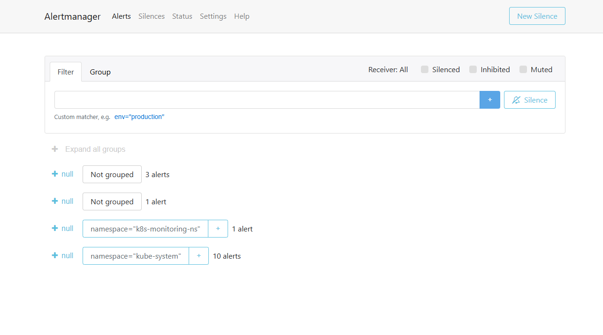

This confirms our setup is complete !

---