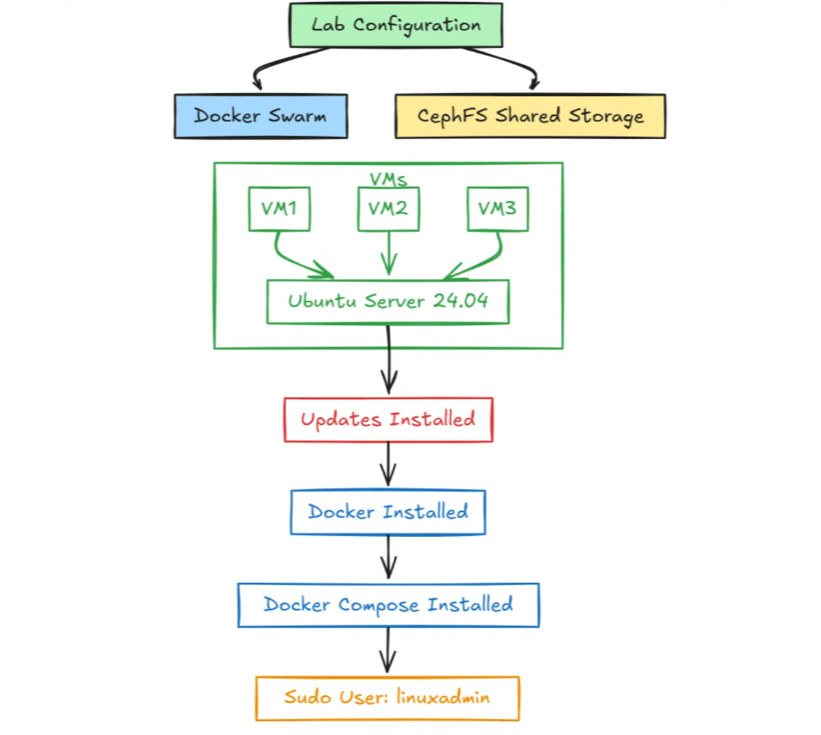

# Setting things up

Let's dive into setting this stack up, step by step.

Our effective folder structure is as below:

```bash
.
├── prometheus/ # prometheus config files
├── grafana/ # grafana config files
├── docker-compose.yaml # spins the prometheus and grafana containers
```

All files are fully commented.

## Docker Swarm setup

We first setup our swarm. Below is a reminder of what our ideal swarm looks like:



We won't have this for now as we will be testing locally.

## Monitoring your own app

We’ve already got the **infrastructure monitoring** stack:

* **cAdvisor** → monitors Docker containers (CPU, RAM, FS, network).
* **Node Exporter** → monitors host machine metrics.
* **Prometheus** → scrapes metrics.
* **Grafana** → visualizes everything.

Now the question is:
👉 How do we monitor **your app** running in Docker?

---

## 🛠 3 ways to monitor your app in this stack

### 1. **Basic container-level monitoring (already covered)**

If your app is just a Docker container (say Nginx, MySQL, etc.), then cAdvisor automatically collects:

* CPU usage
* Memory usage
* Network traffic
* Filesystem usage

✅ You get this “for free” already — no config changes needed.

---

### 2. **App-specific exporters (most common)**

Some apps expose their own Prometheus metrics, or you run an “exporter” alongside them:

* **Nginx** → [nginx-prometheus-exporter](https://github.com/nginxinc/nginx-prometheus-exporter)
* **Postgres** → [postgres\_exporter](https://github.com/prometheus-community/postgres_exporter)
* **MySQL** → [mysqld\_exporter](https://github.com/prometheus/mysqld_exporter)
* **Redis** → [redis\_exporter](https://github.com/oliver006/redis_exporter)

Example: monitoring an **Nginx container**

```yaml
services:
  nginx:
    image: nginx:latest
    ports:
      - "8081:80"

  nginx-exporter:
    image: nginx/nginx-prometheus-exporter:0.11.0
    command: -nginx.scrape-uri=http://nginx:80/stub_status
    ports:
      - "9113:9113"
```

Then in your `prometheus.yaml` add:

```yaml
  - job_name: 'nginx'
    static_configs:
      - targets: ['nginx-exporter:9113']
```

---

### 3. **Custom metrics (if you wrote the app)**

If you’re coding your own app, you can instrument it with Open Telemetry or a Prometheus client library:

* Go → [prometheus/client\_golang](https://github.com/prometheus/client_golang)
* Python → [prometheus\_client](https://github.com/prometheus/client_python)
* Node.js → [prom-client](https://github.com/siimon/prom-client)

Then your app exposes `/metrics`, which Prometheus scrapes.

Example (Python Flask app):

```python
from flask import Flask
from prometheus_client import Counter, generate_latest

app = Flask(__name__)
requests_total = Counter('app_requests_total', 'Total requests')

@app.route('/')
def hello():
    requests_total.inc()
    return "Hello, world!"

@app.route('/metrics')
def metrics():
    return generate_latest(), 200, {'Content-Type': 'text/plain'}
```

Run it in Docker, then Prometheus scrapes `http://myapp:5000/metrics`.

---

## 📌 Summary

* ✅ If you just want **resource monitoring** → cAdvisor + Node Exporter already do it.
* ✅ If you want **application metrics** → add exporters (Nginx, DB, etc.) or instrument your own app.
* ✅ Prometheus scrapes those metrics, and Grafana dashboards visualize them.

---


## 🔎 What OpenTelemetry gives you

* **Instrumentation libraries** for most languages (Python, Go, Java, Node.js, .NET, etc.).
* Collects **application metrics**, **traces**, and optionally **logs**.
* You run an **OpenTelemetry Collector** (agent) that receives this telemetry and forwards it to backends like:

  * Prometheus (metrics)
  * Jaeger/Tempo (traces)
  * Loki/ELK (logs)
  * Grafana/OTLP-compatible backends

---

## 🛠 How it works in your case

Right now you have:

* Prometheus + Grafana (metrics visualization)
* cAdvisor + Node Exporter (infra metrics)

If you want to add **OpenTelemetry for your app**:

1. Instrument your app with the OTel SDK for your language.
2. Run an **OpenTelemetry Collector** container in your stack.
3. Configure it to export metrics to Prometheus (or directly to Grafana if you later switch to Grafana Agent/Cloud).

---

## ⚡ Example: Adding OTel Collector

Extend your `docker-compose.yaml`:

```yaml
  otel-collector:
    image: otel/opentelemetry-collector-contrib:0.95.0
    command: ["--config=/etc/otel-collector-config.yaml"]
    volumes:
      - ./otel-collector-config.yaml:/etc/otel-collector-config.yaml
    ports:
      - "4317:4317"   # OTLP gRPC
      - "4318:4318"   # OTLP HTTP
    networks:
      - monitoring
```

Create `otel-collector-config.yaml`:

```yaml
receivers:
  otlp:
    protocols:
      grpc:
      http:

exporters:
  prometheus:
    endpoint: "0.0.0.0:9464"

service:
  pipelines:
    metrics:
      receivers: [otlp]
      exporters: [prometheus]
```

Now:

* Your app sends OTLP data to `otel-collector:4317`
* Collector exposes a Prometheus endpoint on `:9464`
* Add this to `prometheus.yaml`:

  ```yaml
  - job_name: 'otel-app'
    static_configs:
      - targets: ['otel-collector:9464']
  ```

---

## ✅ Why OTel is a good idea

* If you’re learning modern observability, OpenTelemetry is the **industry standard**.
* Works with Prometheus/Grafana, but also future-proofs you if you later use Jaeger, Tempo, or commercial backends (Datadog, New Relic, Grafana Cloud, etc.).
* Lets you monitor **custom app metrics + traces**, not just container resource usage.

---

## 🔎 Networks

* In Docker, **containers can only talk to each other if they share a network**.
* You already defined a custom network:

  ```yaml
  networks:
    monitoring:
  ```
* Any service you add with:

  ```yaml
  networks:
    - monitoring
  ```

  will be discoverable by name (DNS resolution inside the network).

👉 Example: Prometheus can scrape `cadvisor:8080` or `otel-collector:9464` because they’re all on `monitoring`.

---

## 🛠 Example: Adding an app to your stack

Say you want to run a Python app that exposes metrics:

```yaml
  myapp:
    build: ./myapp      # has a Dockerfile
    ports:
      - "5000:5000"     # expose app locally
    networks:
      - monitoring
    environment:
      - OTEL_EXPORTER_OTLP_ENDPOINT=http://otel-collector:4317
```

* This app is on the **`monitoring` network**.
* It can send metrics to `otel-collector`.
* Prometheus can scrape those metrics via the collector.

---

## 🔎 Do you *always* need the same compose file?

* For **local dev/lab setups**: yes, easiest is one compose file that runs monitoring + apps.
* In **production**: you might run monitoring stack separately, and just ensure apps join the **same network** (or expose metrics on a reachable endpoint).

---

## ✅ So the rules are:

1. Use **one compose file** for convenience when practicing locally.
2. Make sure your **app container joins the same network** (`monitoring`).
3. Add your app/exporter/collector to `prometheus.yaml` scrape configs.
4. Grafana just sees everything via Prometheus → dashboards light up.

---

## 🔎 Using `replicas` in Docker Compose v3

In your `docker-compose.yaml`, you can do this:

```yaml
  myapp:
    image: nginx:alpine
    deploy:
      replicas: 3
    networks:
      - monitoring
    ports:
      - "8081:80"
```

* `replicas: 3` → Docker will spin up 3 containers of `myapp`.
* Each replica has its own **internal hostname/endpoint**, but Prometheus can scrape them individually **if** you tell it to.

---

## 🔎 How Prometheus discovers replicas

By default in **Compose (non-swarm)**, replicas are given names like:

* `myapp_1`
* `myapp_2`
* `myapp_3`

Prometheus **cannot auto-discover them** unless you use Swarm or Kubernetes.
So in `prometheus.yaml`, you’d need to list them:

```yaml
scrape_configs:
  - job_name: 'myapp'
    static_configs:
      - targets:
          - 'myapp_1:80'
          - 'myapp_2:80'
          - 'myapp_3:80'
```

---

## 🔎 Alternative: Use Swarm mode

If you run your stack with **Swarm** (`docker stack deploy`), then Prometheus can scrape **tasks** behind the service name. For example:

```yaml
targets: ['tasks.myapp:80']
```

That will automatically resolve to all replicas.

---

## ✅ Practical takeaway

* For **local Compose testing**: yes, you can simulate multiple endpoints with `replicas`, but you’ll have to **list them manually** in Prometheus config.
* For **Swarm/Kubernetes**: you get **service discovery**, so Prometheus can scrape all replicas dynamically.

---

## 🐳 Docker Swarm + Monitoring


Now let’s go through the **Swarm approach** carefully, because it’s very relevant for our use-case (monitoring multiple replicas with Prometheus + Grafana).
With Swarm, you don’t just run containers, you run **services**. A service can have **replicas**, and Swarm automatically handles scaling, networking, and service discovery.

---

## 1. Initialize Swarm

On your local machine (or VM):

```bash
docker swarm init
```

This turns your Docker into a **Swarm manager**.
You can add workers with `docker swarm join`, but for testing, one node is enough.

---

## 2. Compose file differences

In **Swarm mode**, you deploy with:

```bash
docker stack deploy -c docker-compose.yaml monitoring
```

Key points:

* Must use `version: "3.x"` in your `docker-compose.yaml`.
* The `deploy` section (including `replicas`) **only works in Swarm**.
* Services run on an **overlay network**.

---

## 3. Example stack (monitoring + app replicas)

Here’s a simplified `docker-compose.yaml` for Swarm:

```yaml
version: "3.8"

networks:
  monitoring:
    driver: overlay

services:
  grafana:
    image: grafana/grafana:10.0.3
    ports:
      - "3000:3000"
    networks:
      - monitoring

  prometheus:
    image: prom/prometheus:v2.47.0
    ports:
      - "9090:9090"
    configs:
      - source: prometheus_config
        target: /etc/prometheus/prometheus.yaml
    networks:
      - monitoring

  cadvisor:
    image: gcr.io/cadvisor/cadvisor:v0.47.2
    deploy:
      mode: global   # one per node
    ports:
      - "8080:8080"
    volumes:
      - /:/rootfs:ro
      - /var/run:/var/run:ro
      - /sys:/sys:ro
      - /var/lib/docker/:/var/lib/docker:ro
    networks:
      - monitoring

  node-exporter:
    image: prom/node-exporter:v1.5.0
    deploy:
      mode: global   # one per node
    ports:
      - "9100:9100"
    volumes:
      - /proc:/host/proc:ro
      - /sys:/host/sys:ro
    command:
      - "--path.procfs=/host/proc"
      - "--path.sysfs=/host/sys"
    networks:
      - monitoring

  myapp:
    image: nginx:alpine
    deploy:
      replicas: 3   # run 3 containers
    ports:
      - "8081:80"
    networks:
      - monitoring

configs:
  prometheus_config:
    file: ./prometheus.yaml
```

---

## 4. Prometheus config for Swarm discovery

Unlike plain Compose, you don’t need to list every replica.
You can scrape **all tasks** of a service:

`prometheus.yaml`:

```yaml
global:
  scrape_interval: 15s

scrape_configs:
  - job_name: 'cadvisor'
    dns_sd_configs:
      - names: ['tasks.cadvisor']
        type: A
        port: 8080

  - job_name: 'node-exporter'
    dns_sd_configs:
      - names: ['tasks.node-exporter']
        type: A
        port: 9100

  - job_name: 'myapp'
    dns_sd_configs:
      - names: ['tasks.myapp']
        type: A
        port: 80
```

👉 `tasks.<service-name>` = DNS entry that resolves to **all replicas of that service**.

So if `myapp` has 3 replicas, Prometheus scrapes all 3 automatically.

---

## 5. Deploy the stack

```bash
docker stack deploy -c docker-compose.yaml monitoring
```

Check:

```bash
docker service ls
docker service ps myapp
```

---

## 6. Verify

* Open Grafana → `http://localhost:3000`
* Add Prometheus as a datasource → `http://prometheus:9090`
* Query `up{job="myapp"}` → you should see 3 active targets (1 per replica).
* Scale easily:

  ```bash
  docker service scale myapp=5
  ```

  → Prometheus will now scrape 5 endpoints (automatically, no config change needed).

---

## ✅ Why Swarm is better for monitoring replicas

* **Service discovery**: Prometheus automatically finds all replicas via DNS (`tasks.<service>`).
* **Scaling**: Add/remove replicas with one command, Prometheus adjusts.
* **Global services**: For node-level exporters like cAdvisor and Node Exporter, `deploy.mode: global` ensures 1 container per node.

---

⚡ **Bottom line:**
In Swarm, Prometheus + Grafana can automatically discover **all replicas** of your app or exporters. You don’t have to hardcode each replica like in plain Compose. This makes it very close to real-world HA setups.

---

## Our Setup

## Final Files

## 1. `docker-compose.yaml`

Use this Swarm-ready compose (note: `container_name` is removed because Swarm manages names):

```yaml
version: "3.8"

# --------------------------
# NETWORKS
# --------------------------
networks:
  monitoring:
    driver: overlay               # Overlay is required for multi-node Swarm networks.
                                  # Services on this network can talk to each other using DNS names.


# --------------------------
# VOLUMES
# --------------------------
volumes:
  grafana_data:                             # Docker-managed volume for Grafana data
  prometheus_data:                          # Docker-managed volume for Prometheus TSDB

# --------------------------
# CONFIGS
# --------------------------
configs:
  prometheus_config:
    file: ./prometheus/prometheus.yaml   # External Prometheus config file mounted into the container.

# --------------------------
# SERVICES
# --------------------------
services:

  # --------------------------
  # GRAFANA (Visualization UI)
  # --------------------------
  grafana:
    image: grafana/grafana:10.0.3        # Stable Grafana release.
    restart: always                      # Restart if it crashes.
    ports:
      - "3000:3000"                      # Expose Grafana UI at http://<host>:3000
    environment:
      - GF_PANELS_DISABLE_SANITIZE_HTML=true   # Allow richer HTML in dashboards.
      - GF_SECURITY_ADMIN_USER=${GRAFANA_USER:-admin}       # Admin username (default: admin).
      - GF_SECURITY_ADMIN_PASSWORD=${GRAFANA_PASSWORD:-admin} # Admin password (default: admin).
      - GF_USERS_ALLOW_SIGN_UP=false     # Prevent users from self-signup.
    volumes:
      - grafana_data:/var/lib/grafana   # Persist Grafana data (dashboards, configs, users).
    networks:
      - monitoring
    deploy:
      replicas: 1                        # Single Grafana instance is usually enough.

  # --------------------------
  # PROMETHEUS (Time-series DB)
  # --------------------------
  prometheus:
    image: prom/prometheus:v2.47.0       # Stable Prometheus release.
    restart: always
    ports:
      - "9090:9090"                      # Expose Prometheus UI at http://<host>:9090
    command:
      - "--config.file=/etc/prometheus/prometheus.yaml" # Path to config inside container.
      - "--log.level=warn"                           # Reduce noise (options: debug, info, warn, error).
      - "--storage.tsdb.path=/prometheus"            # Persistent storage path inside container.
      - "--storage.tsdb.retention.time=7d"           # Retain metrics for 7 days.
    volumes:
      - prometheus_data:/prometheus                     # Persist time-series database to host.
    configs:
      - source: prometheus_config                    # Load Prometheus config (scrape jobs).
        target: /etc/prometheus/prometheus.yaml
    networks:
      - monitoring
    deploy:
      replicas: 1                                    # Single Prometheus is fine for testing/labs.

  # --------------------------
  # CADVISOR (Container Metrics)
  # --------------------------
  cadvisor:
    image: gcr.io/cadvisor/cadvisor:v0.47.2          # Container-level metrics collector.
    command: -logtostderr -docker_only
    ports:
      - "8080:8080"                                  # Expose cAdvisor UI at http://<host>:8080 (optional).
    volumes:                                         # Mounts required to read container stats.
      - /:/rootfs:ro
      - /var/run:/var/run:ro
      - /sys:/sys:ro
      - /var/lib/docker/:/var/lib/docker:ro
      - /dev/disk:/dev/disk:ro
    networks:
      - monitoring
    deploy:
      mode: global                                   # Run one cAdvisor per Swarm node automatically.

  # --------------------------
  # NODE EXPORTER (Host Metrics)
  # --------------------------
  node-exporter:
    image: prom/node-exporter:v1.5.0                 # Host-level metrics collector.
    ports:
      - "9100:9100"                                  # Expose node-exporter metrics at /metrics
    command:                                         # Override defaults for containerized use.
      - "--path.sysfs=/host/sys"
      - "--path.procfs=/host/proc"
      - "--collector.filesystem.ignored-mount-points=^/(sys|proc|dev|host|etc)($$|/)"
      - "--no-collector.ipvs"
    volumes:                                         # Mount host /proc and /sys for metrics.
      - /proc:/host/proc:ro
      - /sys:/host/sys:ro
    networks:
      - monitoring
    deploy:
      mode: global                                   # Run one node-exporter per Swarm node automatically.


  # --------------------------
  # NGINX EXPORTER (1 per cluster)
  # --------------------------
  nginx-exporter:
    image: nginx/nginx-prometheus-exporter:0.11.0
    command:
      - -nginx.scrape-uri=http://nginx-app:80/stub_status
    ports:
      - "9113:9113"                # Metrics endpoint → http://localhost:9113/metrics
    networks:
      - monitoring
    deploy:
      replicas: 1


  # --------------------------
  # SAMPLE APP (Replace with yours)
  # --------------------------
  nginx-app:
    image: nginx:alpine
    ports:
      - "8081:80"        # external port for testing in browser
    networks:
      - monitoring
    volumes:
      - ./nginx/default.conf:/etc/nginx/conf.d/default.conf:ro
    deploy:
      replicas: 1        # run 3 replicas
      restart_policy:
        condition: on-failure

```

---

## 2. `prometheus/prometheus.yaml`

```yaml
# -------------------------------
# GLOBAL CONFIGURATION
# -------------------------------
global:
  # How often Prometheus scrapes all targets.
  # Default is 1m, but 30s gives higher resolution (more data points).
  scrape_interval: 30s

  # How often Prometheus evaluates alerting/recording rules.
  # Should usually match scrape_interval unless you need faster alerting.
  evaluation_interval: 30s

# -------------------------------
# SCRAPE CONFIGURATIONS
# -------------------------------
scrape_configs:

  # -------------------------------
  # NODE EXPORTER JOB
  # -------------------------------
  - job_name: 'node-exporter'
    # In Swarm mode, each service gets DNS entries like "tasks.<service-name>".
    # "tasks.node-exporter" resolves to all running replicas (1 per node in this case).
    dns_sd_configs:
      - names: ['tasks.node-exporter']  # Service name to resolve.
        type: A                         # DNS record type (A = IPv4 addresses).
        port: 9100                      # Port where node-exporter exposes /metrics.

  # -------------------------------
  # CADVISOR JOB
  # -------------------------------
  - job_name: 'cadvisor'
    # Same trick: "tasks.cadvisor" resolves to all replicas of cadvisor.
    # Since cadvisor runs in "global" mode, that means 1 per node.
    dns_sd_configs:
      - names: ['tasks.cadvisor']
        type: A
        port: 8080                      # cAdvisor default metrics port.

  # -------------------------------
  # PROMETHEUS SELF-MONITORING
  # -------------------------------
  - job_name: 'prometheus'
    # Prometheus exposes its own metrics at /metrics (port 9090).
    # Scraping itself lets you monitor its performance (scrape durations, TSDB health, memory, etc.).
    static_configs:
      - targets: ["prometheus:9090"]    # "prometheus" resolves to the Prometheus service inside the Swarm overlay network.


  # --------------------------
  # SAMPLE APP EXPORTER (Replace with yours)
  # --------------------------
  - job_name: 'nginx'
    dns_sd_configs:
      - names: ['tasks.nginx-exporter']
        type: A
        port: 9113
```

👉 Notice:

* Instead of hardcoding `10.1.149.x` IPs, we use **`tasks.<service>`** DNS for Swarm service discovery.
* This way, Prometheus automatically finds all replicas on all nodes.

---

## 🛠 Step-by-Step Setup

### 1. Initialize Swarm

On your manager node (your single machine is enough for practice):

```bash
docker swarm init
```

### 2. Create directories

On the manager:

```bash
mkdir -p monitoring/grafana/grafana-volume
mkdir -p monitoring/prometheus
```

Copy the two files:

* `docker-compose.yaml` → `monitoring/docker-compose.yaml`
* `prometheus.yaml` → `monitoring/prometheus/prometheus.yaml`

### 3. Deploy the stack

From the `monitoring/` directory:

```bash
docker stack deploy -c docker-compose.yaml monitoring
```

### 4. Verify

```bash
docker stack ls
docker service ls
docker service ps monitoring_prometheus
docker service ps monitoring_cadvisor
```

### 5. Access dashboards

* Grafana → [http://localhost:3000](http://localhost:3000) (`admin/admin`)
* Prometheus → [http://localhost:9090](http://localhost:9090)
* Query `up` in Prometheus → you’ll see node-exporter + cadvisor for all swarm nodes.

### 6. Import Grafana dashboards

* Add Prometheus as a datasource → `http://prometheus:9090`.
* Import dashboards:

  * **Node Exporter Full (ID: 1860)**
  * **Docker & cAdvisor (ID: 893)**

---

## ✅ End Result

* **Node Exporter** (global service) → 1 instance per node.
* **cAdvisor** (global service) → 1 instance per node.
* Prometheus scrapes all automatically via DNS.
* Grafana visualizes with ready-made dashboards.

---

⚡ Now you can add **any app** as a Swarm service, and Prometheus can scrape it with the same `tasks.<service>` trick.

---

## Validation

Run:

```bash
docker service ls
```

If all the services are finally **running cleanly** we should see

```
monitoring_cadvisor         global       1/1  
monitoring_grafana          replicated   1/1  
monitoring_nginx-app        replicated   1/1  
monitoring_nginx-exporter   replicated   1/1  
monitoring_node-exporter    global       1/1  
monitoring_prometheus       replicated   1/1  
```

That means:

* ✅ Grafana is up (`http://localhost:3000`)
* ✅ Prometheus is up (`http://localhost:9090`)
* ✅ Node Exporter is running per node (`:9100`)
* ✅ cAdvisor is running per node (`:8080`)
* ✅ Nginx app is reachable (`http://localhost:8081`)
* ✅ Nginx Prometheus Exporter is running (`http://localhost:9113/metrics`)

---

## 🔎 Next steps (to confirm everything)

1. **Check Nginx `stub_status`:**

   ```bash
   curl http://localhost:8081/stub_status
   ```

   You should see output like:

   ```
   Active connections: 1
   server accepts handled requests
    3 3 3
   Reading: 0 Writing: 1 Waiting: 0
   ```

2. **Check Nginx Exporter metrics:**

   ```bash
   curl http://localhost:9113/metrics | grep nginx
   ```

   Should show metrics like:

   ```
   nginx_http_requests_total{host="...",}  10
   nginx_connections_active  1
   nginx_connections_accepted 3
   ```

3. **Check Prometheus targets:**
   Open [http://localhost:9090/targets](http://localhost:9090/targets)
   You should see:

   * `node-exporter` targets (one per node)
   * `cadvisor` targets (one per node)
   * `prometheus` itself
   * `nginx` exporter target (`9113`)

4. **Import Grafana dashboards:**

   * Prometheus datasource: `http://prometheus:9090`
   * Useful dashboards:

     * Node Exporter Full → **1860**
     * Docker & cAdvisor → **893**
     * Nginx Prometheus Exporter → **12708**

---

⚡ If all those checks succeed, your **full monitoring stack** is good to go: infra + containers + Nginx app.

---

## ✅ Automating Grafana Datasource & Dashboard Setup

Grafana supports *provisioning* via config files. This means you can pre-bake datasources and dashboards so that Grafana comes up ready to use — no manual setup.

---

## 1. Provision the Prometheus datasource

Create `./grafana/provisioning/datasources/datasource.yaml`:

```yaml
apiVersion: 1                # Required: API version for Grafana provisioning configs.

datasources:
  - name: Prometheus         # Friendly name of the datasource (shown in Grafana).
    type: prometheus         # The datasource plugin type (Prometheus in this case).
    access: proxy            # Grafana proxies queries to Prometheus (recommended).
    url: http://prometheus:9090   # Internal DNS name of Prometheus service in Swarm.
    isDefault: true          # Marks this datasource as the default one.

```

---

## 2. Provision dashboards

Create `./grafana/provisioning/dashboards/dashboard.yaml`:

```yaml
apiVersion: 1                # Provisioning config schema version.

providers:
  - name: 'default'          # Provider name (arbitrary, but must be unique).
    orgId: 1                 # Organization ID (Grafana default org = 1).
    folder: ''               # Put dashboards into the root folder.
    type: file               # Provision from local files.
    disableDeletion: false   # Allow Grafana UI users to delete dashboards.
    editable: true           # Allow edits in the UI (won’t overwrite files).
    updateIntervalSeconds: 10  # Grafana checks every 10s for updated JSON files.
    options:
      path: /etc/grafana/dashboards   # Directory where dashboards JSONs will live inside the container.
```

---

## 3. Download dashboard JSONs (from Grafana.com IDs)

Example: say you want 5 dashboards (replace with the IDs you need):

```bash
# Node Exporter Full (ID 1860, rev 27)
curl -L https://grafana.com/api/dashboards/1860/revisions/27/download \
  -o ./grafana/dashboards/node-exporter.json

# NGINX (ID 12708, rev 1)
curl -L https://grafana.com/api/dashboards/12708/revisions/1/download \
  -o ./grafana/dashboards/nginx.json

```

After this, your structure looks like:

```
grafana/
  provisioning/
    datasources/
      datasource.yml         # Preconfigured Prometheus datasource
    dashboards/
      dashboard.yml          # Dashboard provisioning config
  dashboards/
    node-exporter.json       # Downloaded dashboards
    swarm.json
    nginx.json
```

---

## 4. Update the Grafana service in your stack file

```yaml
  grafana:
    ...
    volumes:
      - grafana_data:/var/lib/grafana

     # Mount provisioning configs into the container (datasources + dashboards).
      - ./grafana/provisioning:/etc/grafana/provisioning

      # Mount the dashboards directory with JSON files.
      - ./grafana/dashboards:/etc/grafana/dashboards
    ...
```

---

## 5. Deploy

Now when you run:

```bash
docker stack deploy -c docker-compose.yaml monitoring
```

Grafana will come up with:

* **Prometheus datasource** ready to use.
* **2 dashboards preloaded** (Node Exporter, Nginx).
* Fully repeatable in any environment (dev, staging, prod).

---

⚖️ **Best Practice Tip:**
We keep the JSON dashboards version-controlled in our repo so we know exactly which revisions are deployed. We update manually to newer dashboard versions.

---
