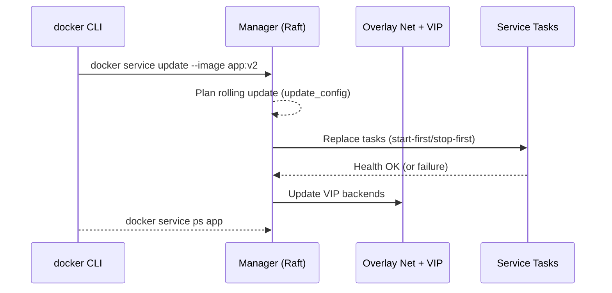

# Docker Swarm

## 🐳 What is Docker Swarm?

Docker Swarm (aka **Swarm mode**) is Docker Engine’s **built-in container orchestrator**.
It turns a group of Docker hosts into a **fault-tolerant cluster**, letting you run containers as **services** with rolling updates, self-healing, service discovery, and secure networking—using the same Docker CLI you already know.

👉 If Docker is how you **run a container**, Swarm is how you **run containers in production** across multiple machines.

---

## 🧐 Why Do We Need Swarm?

Modern apps need **scale, resilience, and zero-downtime updates**:

* Keep N replicas running—**auto-replace** failed ones.
* **Distribute** workloads across nodes.
* **Expose** services behind cluster IP + load balancing.
* **Update** safely (canary/rolling) and **roll back** on failure.
* **Secure** inter-node comms (mTLS) and handle **secrets**.

Swarm delivers these with **simple, Docker-native** workflows.

---

## 🔧 How Swarm Works (Core Ideas)

* **Node** — a Docker host in the cluster.

  * **Manager** nodes maintain **Raft** state & schedule tasks.
  * **Worker** nodes run **tasks** (container instances).
* **Service** — desired state (image, replicas, ports, constraints).

  * **Task** — one running container for a service.
  * **Modes** — `replicated` (N copies) or `global` (1 per node).
* **Overlay networks** — multi-host virtual networks with built-in **service discovery** (`DNS`), VIP load-balancing, optional **encryption**.
* **Routing Mesh** — publishes ports **on every node**, forwards to healthy tasks.
* **Secrets & Configs** — securely distribute small files to services.
* **Stacks** — app bundles defined with **Compose v3** (`docker stack`).

---

### 🔗 Architecture Overview

```text
+-------------------+           +-------------------+           +-------------------+
|   Manager Node    |  mTLS     |   Manager Node    |  mTLS     |   Manager Node    |
|  - Raft consensus |<--------->|  - Scheduling     |<--------->|  - CA/Cert rotate |
+---------+---------+           +---------+---------+           +---------+---------+
          |                                 |                               |
          v                                 v                               v
   +------+-------+                  +------+-------+                +------+-------+
   |  Worker Node |                  |  Worker Node |                |  Worker Node |
   |  Tasks/Pods  |                  |  Tasks/Pods  |                |  Tasks/Pods  |
   +------+-------+                  +------+-------+                +------+-------+
          \___________________ Overlay Networks (VXLAN, optional encryption) ______/
```

---

## 🔄 Control & Data Flow



---

## 🧰 Quickstart

### 1) Initialize a Swarm (first manager)

```bash
# on node A
docker swarm init --advertise-addr <MANAGER_IP>
```

Grab the printed **join token**.

### 2) Join more nodes

```bash
# on nodes B, C ...
docker swarm join --token <worker-token> <MANAGER_IP>:2377

# (optional) join more managers
docker swarm join --token <manager-token> <MANAGER_IP>:2377
```

### 3) Create a service

```bash
docker service create --name web --replicas 3 -p 80:80 nginx:alpine
docker service ls
docker service ps web
```

### 4) Scale / Update / Roll back

```bash
docker service scale web=6
docker service update --image nginx:1.27 --update-order start-first web
docker service rollback web
```

---

## 🧱 Stacks with Compose (v3+)

### docker-compose.yml

```yaml
version: "3.9"               # Specifies the Compose file format version (3.9 supports the latest Swarm features).

services:                    # Defines the services (containers) that will run in this stack.
  api:                       # First service: the "api" service.
    image: ghcr.io/acme/api:1.2.3   # Uses a prebuilt image from GitHub Container Registry, version 1.2.3.
    ports:                   # Maps container ports to the host / cluster.
      - target: 8080         # The port inside the container.
        published: 8080      # The port exposed on the host or ingress load balancer.
        protocol: tcp        # Communication protocol (TCP).
        mode: ingress        # Port publishing mode:
                             # - ingress: load-balanced across nodes in the swarm.
                             # - host: directly bound to the host's interface.
    networks: [appnet]       # Connects this service to the "appnet" network.
    deploy:                  # Swarm-specific deployment configuration.
      replicas: 4            # Runs 4 container replicas of the "api" service.
      update_config:         # Strategy for rolling updates.
        parallelism: 1       # Update one container at a time.
        order: start-first   # Start the new task before stopping the old one (minimizes downtime).
        delay: 10s           # Wait 10 seconds between updating tasks.
        failure_action: rollback # Roll back to the previous version if the update fails.
      rollback_config:       # Strategy for rolling back.
        parallelism: 2       # Roll back two tasks at the same time.
      restart_policy:        # Policy for restarting failed containers.
        condition: on-failure # Only restart when the container exits with an error.
        delay: 3s            # Wait 3 seconds before attempting a restart.
        max_attempts: 3      # Retry up to 3 times before giving up.
      resources:             # Resource allocation settings.
        limits:              # Hard limits the container cannot exceed.
          cpus: "1.0"        # Maximum 1 CPU core.
          memory: 512M       # Maximum 512 MB of RAM.
        reservations:        # Guaranteed minimum resources.
          cpus: "0.25"       # Reserve at least 0.25 CPU cores.
          memory: 128M       # Reserve at least 128 MB of RAM.
      placement:             # Rules for scheduling service tasks.
        constraints:         # Hard rules: must match or task won’t be placed.
          - node.role == worker       # Only run on worker nodes (not managers).
          - node.labels.zone == eu-central # Only run in nodes labeled as "eu-central".
        preferences:         # Soft rules: Swarm will try to balance tasks accordingly.
          - spread: node.labels.az   # Spread containers evenly across availability zones.

  worker:                    # Second service: the "worker" service.
    image: ghcr.io/acme/worker:2.0   # Uses a different image for worker tasks.
    deploy:                  # Deployment configuration.
      mode: global           # Runs exactly one container on every available node.
    networks: [appnet]       # Connects workers to the same "appnet" network.

networks:                    # Defines custom networks for communication.
  appnet:                    # Overlay network used by both services.
    driver: overlay          # Overlay networks span multiple nodes in a Swarm.
    attachable: true         # Allows standalone containers to connect to this network.

```

Deploy:

```bash
docker stack deploy -c docker-compose.yml acme
docker stack ls
docker stack services acme
docker stack ps acme
docker stack rm acme
```

## 🔹 Running `docker stack deploy` multiple times

When you run:

```bash
docker stack deploy -c docker-compose.yml monitoring
```

* Docker **compares the new stack file** with the **existing deployed services** in the `monitoring` stack.
* Any **changes** in the compose file (image tag, environment, configs, volumes, networks, etc.) will cause Docker Swarm to **update the service(s)**.
* Any **unchanged services** will remain running as they are.

---

### ✅ Scenarios

1. **No changes in the file**

   * Swarm does nothing (idempotent).
   * Services stay running, volumes unchanged, no restart.

2. **Service definition changed** (e.g., new image tag, different environment vars, config mounts)

   * Swarm will **roll out an update** for that service:

     * Stops old tasks.
     * Starts new tasks with updated definition.
   * Update strategy (rolling update, restart policy, etc.) applies.

3. **New service added**

   * Swarm creates it and attaches it to the stack.

4. **Service removed from file**

   * Swarm removes it from the running stack.

5. **Configs or secrets changed**

   * They get new versions (`config-XYZ`) and services referencing them are updated.

---

### 🔹 Volumes

* **Named volumes** (like `grafana_data:` or `prometheus_data:` in your file) are **persistent**.
* Running `docker stack deploy` won’t wipe them. Grafana dashboards, Prometheus TSDB, etc. stay intact.

---

### 🔹 Networks

* Overlay networks defined in the stack are reused.
* If they already exist, Swarm just attaches new/updated services to them.

---

### ⚠️ Important notes

* If you change **ports mapping** (e.g., `3000:3000 → 8080:3000`), the service will be recreated and exposed differently.
* If you remove `grafana_data` volume from the spec, **existing data is not deleted**, but the container won’t mount it anymore.
* If you deploy with the same stack name but a **different compose file structure**, Swarm will reconcile everything to match the new definition (adds, removes, updates).

---

## ⚖️ Summary

* `docker stack deploy` is **safe and repeatable**.
* Running it multiple times with the same file = **no effect**.
* Running it with changes = **services updated accordingly**.
* Data in named volumes persists across deploys.

Great 👍 Let’s build a **safe update workflow** for your monitoring stack (Prometheus + Grafana + exporters). The main goal is:

* Upgrade services (Grafana, Prometheus, exporters)
* Apply changes to configs/dashboards
* Keep persistent data (Grafana DB, Prometheus TSDB) safe

---

# 🔹 Safe Workflow for Updating a Swarm Stack

### 1. Use **named volumes** for persistent data

You already have these in your stack:

```yaml
volumes:
  grafana_data:
  prometheus_data:
```

* `grafana_data` keeps users, orgs, API keys, preferences.
* `prometheus_data` keeps metrics history.
* These volumes survive `docker stack deploy` updates.

⚠️ Never replace them with **bind mounts** unless you know exactly how you want to manage filesystem permissions and upgrades.

---

### 2. Version your configs and dashboards

* Keep `prometheus.yml` and all Grafana provisioning files in Git.
* Commit dashboard JSONs with pinned revisions from Grafana.com.
* Treat them as **immutable artifacts** — no editing live inside containers.

---

### 3. Safely update the stack

Run:

```bash
docker stack deploy -c docker-compose.yml monitoring
```

Swarm will:

* Compare current services with updated spec.
* Restart only what changed.
* Keep volumes intact.

---

### 4. Roll out updates without downtime

If you want smooth upgrades (especially for Grafana/Prometheus), use a rolling update strategy:

```yaml
    deploy:
      replicas: 1
      update_config:
        parallelism: 1
        delay: 10s
        order: start-first   # start new before stopping old
      restart_policy:
        condition: on-failure
```

`order: start-first` ensures Prometheus/Grafana keep running while updates roll out.

---

### 5. Back up before big changes

For extra safety:

**Grafana data (users, prefs, API keys, custom dashboards):**

```bash
docker run --rm -v grafana_data:/data alpine tar czf - /data > grafana_backup_$(date +%F).tar.gz
```

**Prometheus TSDB:**

```bash
docker run --rm -v prometheus_data:/data alpine tar czf - /data > prometheus_backup_$(date +%F).tar.gz
```

---

### 6. Upgrade images explicitly

* Pin images to known versions (e.g., `grafana/grafana:10.0.3`)
* When you want to upgrade, change the tag in `docker-compose.yml`:

```yaml
    image: grafana/grafana:10.1.2
```

* Redeploy with `docker stack deploy`.
* Swarm will do a rolling update with data volumes untouched.

---

### 7. Apply new files/configs e.g

* Add/update JSON files under `./grafana/dashboards/`.
* Update `prometheus.yml` or provisioning YAMLs if needed.
* Commit changes to Git.
* Run `docker stack deploy -c docker-compose.yml monitoring`.
* Grafana will auto-load updated dashboards (within \~10s).

---

# ⚖️ Summary Workflow

1. Store **configs + dashboards in Git**
2. Use **named volumes** for persistence
3. Before upgrades → **backup volumes**
4. Update `docker-compose.yml` → new image tags, new configs
5. Run `docker stack deploy -c docker-compose.yml monitoring`
6. Swarm applies changes safely, volumes persist, dashboards auto-provision

---

## 🌐 Networking in Swarm

* **Service Discovery**: each service gets DNS (`tasks.<name>`) and a **VIP** (virtual IP).
* **Load Balancing**: VIP distributes L4 traffic across healthy tasks.
* **Routing Mesh (ingress)**:

  * `-p 80:80` exposes on **all nodes**; any node forwards to a task.
  * Use `mode: host` (or CLI `--publish mode=host`) to expose **only on the node** where a task runs.
* **Overlay Networks**:

  * Create: `docker network create -d overlay --attachable appnet`
  * **Encrypt** overlay: `docker network create -d overlay --opt encrypted secure-net`

**Ports to open between nodes**

* `2377/tcp` (cluster management), `7946/tcp+udp` (gossip), `4789/udp` (VXLAN).
* Published service ports (your choice).

---

## 🔒 Security Model

* **Mutual TLS** between nodes by default (built-in **CA**, automatic cert rotation).
* **Raft log** on managers is encrypted; back up the state.
* **Auto-lock** (optional): requires unlock key on daemon restart (`docker swarm update --autolock=true`).
* **Secrets & Configs**:

  * Create: `docker secret create db_pass -` then paste.
  * Mounted in containers at **`/run/secrets/<name>`** (tmpfs).
  * Configs similar, mounted read-only (often under `/`).
  * Keep <small>—ideal for creds, certs, small config files.

---

## 🔁 Updates, Health & Self-Healing

* **Rolling updates** with `update_config` (parallelism, delay, failure\_action).
* **Update order**: `start-first` (zero-downtime) or `stop-first`.
* **Healthchecks** in your Dockerfile/Compose gate promotions.
* **Restart policies** (`on-failure`, `any`, `none`).
* **Automatic rescheduling** of failed tasks to healthy nodes.

---

## 📦 Persistent Storage

Containers are ephemeral; tasks may move. Use:

* **Remote/shared volumes** (e.g., NFS, SMB, Ceph, Portworx, etc.) via volume plugins.
* Or **pin** stateful services with **constraints** to labeled nodes that host the data.
* Avoid default **local** volumes for movable services unless you accept data locality.

---

## 📈 Logs & Metrics

* `docker service logs <svc>` (depends on chosen **logging driver**).
* Drivers: `json-file`, `journald`, `syslog`, `gelf`, `fluentd`, `awslogs`, etc.
* Node/cluster events: `docker events` and `docker inspect` for deep dives.

---

## 🗺️ Placement & Scheduling

* **Constraints** (hard rules): `node.role == worker`, `node.labels.disk == ssd`.

  * Label nodes: `docker node update --label-add disk=ssd <node>`
* **Preferences** (soft rules): spread by `node.labels.az` to balance failure domains.
* **Resources**: set **reservations/limits** so the scheduler makes good decisions.

---

## 🧪 Service Types

* **Replicated** — run N copies across the cluster.
* **Global** — run 1 copy per eligible node (great for agents/daemons).
* **DNS round-robin** — skip VIP with `endpoint_mode: dnsrr` (hand control to app-level LB).

---

## 🧭 Operations Playbook

**Managers & quorum**

* Use **odd number** of managers: 3/5/7.
* Tolerates `⌊(N-1)/2⌋` failures (e.g., 3 managers → tolerate 1 down).
* Avoid running workloads on managers; set `availability drain`.

**Upgrades**

```bash
docker node update --availability drain <node>
# upgrade Docker, reboot, etc.
docker node update --availability active <node>
```

**Backups**

```bash
# On a manager (and when cluster is healthy):
# Save /var/lib/docker/swarm (Raft) while engine is stopped or via documented snapshot method.
```

**Common checks**

```bash
docker node ls
docker node ps <node>
docker service ps <svc> --no-trunc
docker service inspect <svc> --pretty
docker network inspect <net>
```

---

## ⚠️ Limitations & Watch-Outs

* No built-in **horizontal auto-scaling** (need external tooling).
* **Stateful** workloads require deliberate storage design.
* **Routing Mesh** is L4 only; advanced L7 needs a proxy (Traefik, Nginx, HAProxy).
* Smaller ecosystem vs Kubernetes; fewer controllers/operators.
* Cross-cloud WAN clusters can be finicky (latency, firewalls, MTU).

---

## 🥊 Swarm vs Compose vs Kubernetes

| Use Case                | Compose (single host) | **Swarm**               | Kubernetes     |
| ----------------------- | --------------------- | ----------------------- | -------------- |
| Scope                   | Dev, single VM        | Small–mid prod clusters | Mid–large prod |
| HA & Scheduling         | ❌                     | ✅ (simple)              | ✅ (rich)       |
| Rolling updates         | ⚠️ (limited)          | ✅                       | ✅              |
| Auto-scaling            | ❌                     | ❌                       | ✅              |
| Ecosystem/Extensibility | Low                   | Medium                  | High           |
| Complexity              | Low                   | **Low–Med**             | High           |

---

## 🔐 Example: Secrets + Encrypted Overlay

```bash
# network with encryption
docker network create -d overlay --opt encrypted prod-net

# secret
printf 's3cr3tP@ss' | docker secret create db_password -

# compose snippet
cat > stack.yml <<'YAML'
version: "3.9"
services:
  db:
    image: postgres:16
    networks: [prod-net]
    secrets: [db_password]
    environment:
      POSTGRES_PASSWORD_FILE: /run/secrets/db_password
    deploy:
      placement:
        constraints: [ "node.labels.role == db" ]
      restart_policy: { condition: on-failure }
networks:
  prod-net: { driver: overlay }
secrets:
  db_password: { external: true }
YAML

docker stack deploy -c stack.yml data
```

---

## 🧾 Swarm Cheat Sheet

### Cluster

```bash
docker swarm init | join | leave --force
docker node ls | inspect | update --label-add team=payments <node>
docker node update --availability drain|active <node>
docker node inspect <NODE> --pretty          # Inspect node details
docker node update --availability drain <NODE>   # Drain node (no new tasks scheduled)
docker node update --availability active <NODE>  # Reactivate node
docker node ps <NODE>                        # Show tasks running on a node
```

### Services

```bash
docker service create --name api --replicas 3 -p 8080:8080 ghcr.io/acme/api:1.0
docker service ls | ps api | logs -f api
docker service scale api=8
docker service update --image ghcr.io/acme/api:1.1 --update-order start-first api
docker service rollback api
```

### Stacks

```bash
docker stack deploy -c docker-compose.yml app
docker stack services app
docker stack ps app
docker stack rm app
```

### Networks & Secrets

```bash
docker network create -d overlay --attachable appnet
docker secret create tls_key key.pem
docker config create app_conf app.ini
```

---

## 🧪 Common Patterns

* **Blue-green**: run `app_v1` and `app_v2` with different published ports; swap LB.
* **Canary**: temporarily scale a `:next` version to 5–10% of replicas via constraints.
* **Node pinning**: place GPU jobs with `node.labels.gpu == true`.
* **Sidecar**: run log shippers or metrics collectors as global services.

---

## 🧯 Troubleshooting Tips

* Task flapping? Check **healthchecks** & `restart_policy`.
* No connectivity? Verify **firewall ports** `2377`, `7946`, `4789` and MTU.
* VIP oddities? Try `endpoint_mode: dnsrr` or `--publish mode=host`.
* Overlay issues? Ensure consistent **subnet** ranges and `iptables` not blocking VXLAN.
* Quorum lost? **Do not** force-new-cluster casually; restore from backup.

---

## 🎯 Final Takeaway

Docker Swarm gives you **simple, secure, Docker-native orchestration**:

* ✅ Easy to learn (Docker CLI/Compose).
* ✅ Built-in **mTLS**, **service discovery**, **rolling updates**, **self-healing**.
* ✅ Great fit for small–medium clusters and teams prioritizing **simplicity**.

Design storage thoughtfully, keep **odd manager counts**, and use **stacks** + **overlay networks** to ship reliable apps with minimal overhead.

# 🐳 Cheat Sheet

```bash
# Show overall swarm status
docker info

# Initialize Swarm on the first node
docker swarm init

# Get join token for workers
docker swarm join-token worker

# Get join token for managers
docker swarm join-token manager

# Join a worker/manager node to the cluster
docker swarm join --token <TOKEN> <MANAGER-IP>:2377

# Promote a worker to manager
docker node promote <NODE HOST NAME>

# Demote a manager to worker
docker node demote <NODE HOST NAME>

# NODE HOST NAME is found using the node ls command after joining the swarm
```

---

# 📦 Stack Deployment

```bash
# Deploy the stack (monitoring here is the stack name)
docker stack deploy -c docker-compose.yml monitoring

# List stacks
docker stack ls

# List services in the stack
docker stack services monitoring

# List running tasks (replicas) for a service
docker service ps monitoring_prometheus
```

---

# ⚙️ Service Management

```bash
# Scale a service (e.g., run 5 replicas of nginx-app)
docker service scale monitoring_nginx-app=5

# Update a service (e.g., rolling restart)
docker service update --force monitoring_prometheus

# Remove a service
docker service rm monitoring_nginx-app
```

---

# 🐳 Container & Node Debugging

```bash
# List all swarm nodes
docker node ls

# Inspect details about a node
docker node inspect <NODE-ID> --pretty

# Show running containers on this node
docker ps

# Exec into a running container
docker exec -it <CONTAINER-ID> sh

# Show logs from a service (aggregates all tasks)
docker service logs monitoring_prometheus

# Show logs from one container
docker logs <CONTAINER-ID>
```

---

# 📊 Prometheus & Grafana

```bash
# Access Prometheus UI
http://localhost:9090

# Access Grafana UI
http://localhost:3000  (default admin/admin if not changed)

# Prometheus test query
up

# Check which targets are being scraped
http://localhost:9090/targets
```

---

# 🛠 Prometheus Config Reload

Prometheus doesn’t auto-reload config in Swarm unless restarted:

```bash
# Force service to reload config (rolling update)
docker service update --force monitoring_prometheus
```

---

# 🧹 Cleanup

```bash
# Remove the whole stack
docker stack rm monitoring

# Leave the swarm (on workers)
docker swarm leave

# Leave the swarm (on manager, forcefully)
docker swarm leave --force
```

---

⚡ With just these commands you can:

* Stand up your monitoring stack
* Scale apps
* Debug targets in Prometheus
* Import Grafana dashboards

---